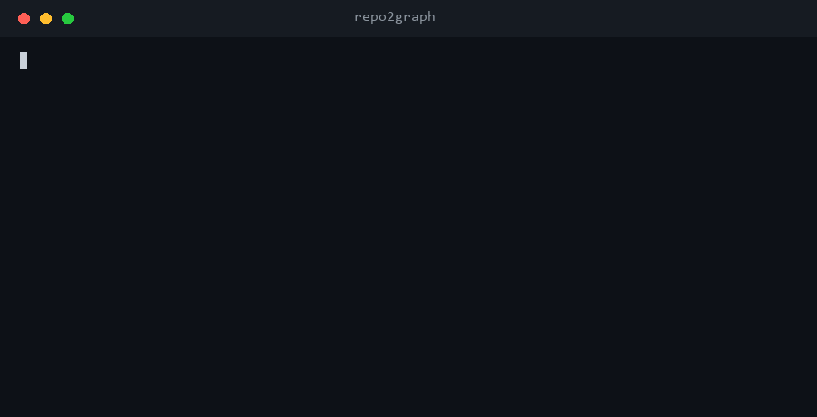
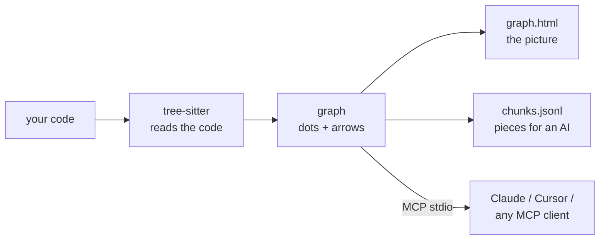
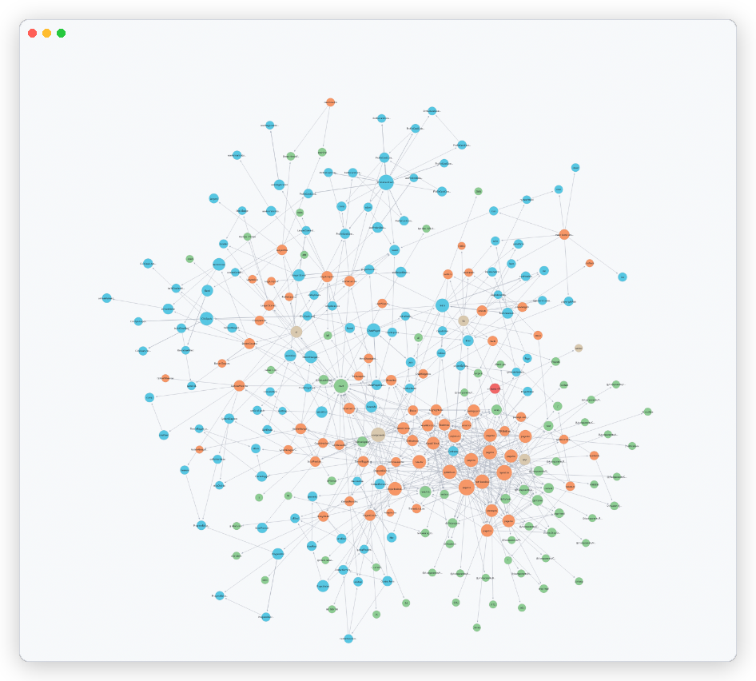
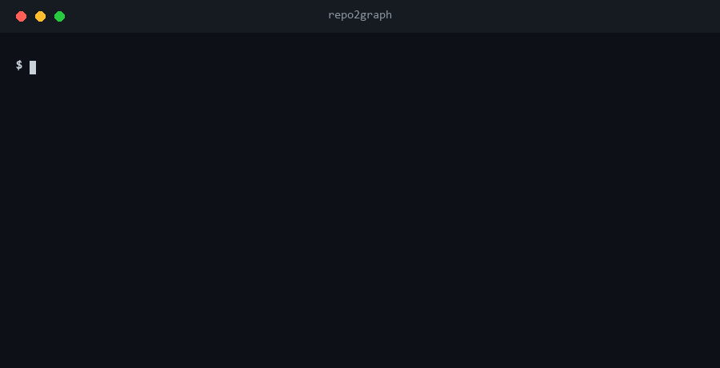
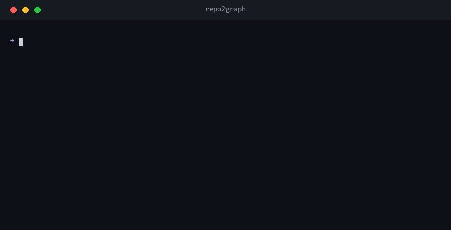

<div align="center">

# repo2graph

**AST-driven code graphs & zero-dependency GraphRAG for AI coding agents and humans**

<p align="center">
  <a href="README.md">English</a> ·
  <a href="docs/i18n/README_zh-CN.md">简体中文</a> ·
  <a href="docs/i18n/README_ja.md">日本語</a> ·
  <a href="docs/i18n/README_fr.md">Français</a> ·
  <a href="docs/i18n/README_es.md">Español</a> ·
  <a href="docs/i18n/README_de.md">Deutsch</a>
</p>

<table align="center">
<tr>
<th align="center">📦&nbsp; Package</th>
<th align="center">🩺&nbsp; Health</th>
<th align="center">🗂️&nbsp; Listed on</th>
</tr>
<tr>
<td align="center" valign="top">
<a href="https://pypi.org/project/repo2graph/"></a><br />
<a href="https://pypi.org/project/repo2graph/"></a><br />
<a href="LICENSE"></a>
</td>
<td align="center" valign="top">
<a href="https://github.com/Srinivasan-78/repo2graph/actions/workflows/ci.yml"></a><br />
<a href="https://github.com/Srinivasan-78/repo2graph/actions/workflows/dependency-audit.yml"></a><br />
<a href="https://github.com/Srinivasan-78/repo2graph/actions/workflows/provenance.yml"></a>
</td>
<td align="center" valign="top">
<a href="https://glama.ai/mcp/servers/Srinivasan-78/repo2graph"></a><br />
<a href="https://mcpservers.org/servers/srinivasan-78/repo2graph"></a><br />
<a href="https://registry.modelcontextprotocol.io/v0/servers?search=repo2graph"></a>
</td>
</tr>
</table>

<p align="center">
  <a href="https://github.com/Srinivasan-78/repo2graph/stargazers"></a>
</p>

<p align="center">
  
</p>

<p align="center">
  <a href="#-what-is-repo2graph">What is it</a> ·
  <a href="#install">Quickstart</a> ·
  <a href="#mcp-server">MCP setup</a> ·
  <a href="#-how-it-compares">Compare</a> ·
  <a href="#-see-it-on-real-repositories">Benchmarks</a> ·
  <a href="#-architecture--token-economics">Architecture</a> ·
  <a href="docs/README.md">Docs</a> ·
  <a href="#-contributing--community">Contributing</a>
</p>

</div>

<!-- mcp-name: io.github.Srinivasan-78/repo2graph -->

---

## ⚡ What is repo2graph?

When an AI coding agent searches a codebase with grep or plain keyword matching, it either dumps
whole matching files into context — burning the token budget and losing structure — or misses the
implementation entirely because it used different words than the search query.

**repo2graph** parses source with [tree-sitter](https://tree-sitter.github.io/tree-sitter/) into a
graph of real code relationships — `CALLS`, `IMPORTS`, `INHERITS`, `DEFINES`, `CO_CHANGE` — and
serves that graph to agents over the **Model Context Protocol**, or packs it into a budget-bounded
markdown context for any LLM. Every returned block carries an exact `[cite: path:start-end]`
anchor, so answers are traceable back to source instead of paraphrased from a guess.



No project setup, no language server, no build step — point it at a folder and it works.

<p align="center">
  
</p>

| Interactive canvas, zoomed | Filter & inspector controls |
| :---: | :---: |
|  |  |

`graph.html` is one self-contained file — no server, no internet, drag to pan, scroll to zoom,
click a node to inspect its code and neighbours.

<a id="install"></a>

## 🚀 Three ways to run repo2graph

Same graph, same chunk format, same `.r2g` output — pick the interface for where you're
standing right now.

<table>
<tr>
<th align="center">🐍&nbsp; Python / CLI</th>
<th align="center">⚙️&nbsp; GitHub Action</th>
<th align="center">🔌&nbsp; MCP server</th>
</tr>
<tr>
<td valign="top">

Local dev, scripting, ad-hoc questions from a terminal.

**[Jump in ↓](#python-cli)**

</td>
<td valign="top">

A fresh graph committed next to your code on every push, zero Python setup.

**[Jump in ↓](#github-action)**

</td>
<td valign="top">

Give Claude, Cursor or any MCP client live, cited access to the codebase.

**[Jump in ↓](#mcp-server)**

</td>
</tr>
</table>

<a id="python-cli"></a>

### 🐍 1. Python / CLI

Requires Python 3.10+. Run via [uv](https://docs.astral.sh/uv/), no install step:

```bash
uvx repo2graph build . -o .r2g && open .r2g/human/graph.html
```

Or install it properly:

```bash
pip install repo2graph
repo2graph build /path/to/project -o .r2g --git-history 200
repo2graph query "how does routing match a path" -o .r2g
```

<p align="center">
  
</p>

One pass over this repository — 195 files, 2,552 nodes, 11,118 edges — takes about three seconds
and needs no configuration file, no language server and no API key. Ask it something, and the
answer comes back as source you can check, not a summary you have to trust:

<p align="center">
  
</p>

Full flag tables, budget accounting and the Python API: **[docs/cli.md](docs/cli.md)** ·
**[docs/python-api.md](docs/python-api.md)**.

<a id="github-action"></a>

### ⚙️ 2. GitHub Action

Published on the [GitHub Marketplace](https://github.com/marketplace/actions/repo2graph) — one
step, no Python setup on the runner:

```yaml
- uses: actions/checkout@v4
  with: { fetch-depth: 0 }   # full history, so CO_CHANGE edges are meaningful

- uses: Srinivasan-78/repo2graph@v1
  with:
    path: .                  # or: repo: some-org/other-repo
    git-history: "500"       # commits scanned for CO_CHANGE edges (0 = skip)
    artifact-name: repo-graph
```

`@v1` follows every 1.x release; pin an exact tag (`@v1.6.0`) to upgrade by hand instead. It never
calls an LLM — `--answer` is deliberately not exposed — and it writes a job-summary table (hub
files, CO_CHANGE hotspots, the graph delta since the last build) straight from the artifacts, so
the shape of the map shows up in the run without downloading anything.

Also pack a cited context for a fixed question, and push the map to a browsable branch:

```yaml
- uses: Srinivasan-78/repo2graph@v1
  with:
    query: "how does auth middleware validate a token"
    commit-branch: graph     # force-pushed; this repo's own /graph branch is built this way
```

All inputs/outputs, private-repo tokens and the vector-embedding step:
**[docs/github-action.md](docs/github-action.md)**.

<a id="mcp-server"></a>

### 🔌 3. MCP server

`repo2graph-mcp` is a stdio MCP server. It builds its own index on the first call if one doesn't
exist yet — nothing to run ahead of time.

**Claude Code**

```bash
claude mcp add repo2graph -- uvx --from "repo2graph[mcp]" repo2graph-mcp /path/to/project
```

**Claude Desktop** (`claude_desktop_config.json`) and **Cursor** (`.cursor/mcp.json`) — same block:

```json
{
  "mcpServers": {
    "repo2graph": {
      "command": "uvx",
      "args": ["--from", "repo2graph[mcp]", "repo2graph-mcp", "/path/to/project"]
    }
  }
}
```

Any other stdio-based MCP client (Windsurf, Zed, generic clients) takes the same `command`/`args`
pair — see **[docs/mcp.md](docs/mcp.md)** for config file locations per platform and client.

<p align="center">
  
</p>

That is the hop grep cannot do: one symbol in, and its definer, its callers and its callees come
back with file and line — the relationship, not a text match that happens to contain the name.

## ✨ Key features

| | |
|---|---|
| **Deterministic graph, not embeddings-only search** | Callers, callees, imports and class hierarchies resolved from the actual AST — not a nearest-neighbour guess. |
| **Hybrid retrieval** | BM25 + graph-neighbour expansion by default; optional dense vector fusion (`repo2graph embed`) with zero required extra dependencies. |
| **Hard token ceilings, enforced twice** | `pack_context()`'s budget bounds the *entire* rendered markdown, not just chunk text — and the MCP server clamps and re-measures before returning. |
| <a id="languages"></a>**16 grammars, full treatment** | Python, JS, TS, TSX, Go, Rust, Java, Ruby, C, C++, C#, PHP, Kotlin, Swift, Scala and Bash get functions/classes/calls — 28 file extensions in all. Everything else still appears as files on the map. |
| **CI-native** | Published as a GitHub Action — commit a fresh graph next to your code on every push. |
| **Local by default** | `build`, `query`, `rag`, and the MCP server make zero network calls. The one opt-in exception (`rag --answer`) prints the provider + hostname before sending anything. |
| **Export to real graph tooling** | `graph.graphml` (yEd, Gephi, NetworkX) and `graph.cypher` (Neo4j, Memgraph) come out of every build, no extra step. |

## 🆚 How it compares

Several tools build a graph out of a codebase. The thing that separates them is what comes *back*
when you ask a question — a picture, a subgraph, or the code itself.

| | repo2graph | [Graphify](https://github.com/Graphify-Labs/graphify) | [Code Graph](https://community.obsidian.md/plugins/code-graph) (Obsidian) | grep / embedding RAG |
|---|---|---|---|---|
| **What a query returns** | the source, packed — every block headed `[cite: path:start-end]` | a scoped subgraph, a path, or a concept explanation to traverse | a force-directed picture to read | matching lines, or nearest-neighbour chunks |
| **How hits are ranked** | BM25 seeds, then k-hop graph expansion; optional dense fusion | graph traversal (explicitly not a vector index) | n/a — it is a view | lexical only, or vectors only |
| **Token budget** | hard cap on the *whole* pack, re-measured before returning (12k ceiling over MCP) | not a packing layer | n/a | usually unbounded |
| **Edges from git history** | `CO_CHANGE`, from `--git-history` | — | — | — |
| **Runs with no assistant, no model, no account** | yes — CLI, MCP, or the GitHub Action | code pass is local; the docs/media pass uses a model | needs Obsidian desktop 1.7.2+ | varies |
| **Corpus** | code in 16 parsed grammars, every other file as text | code in ~40 languages, plus docs, PDFs, images, video | TS/TSX/JS/Python parsed, imports-only for 8 more | anything |

**Reach for [Graphify](https://github.com/Graphify-Labs/graphify)** when the graph itself is the
product: community detection, shortest path between two concepts, and your PDFs and design docs in
the same graph as the code.
**Reach for the [Obsidian plugin](https://community.obsidian.md/plugins/code-graph)** when a human
wants to *read* the graph beside their notes.
**Reach for repo2graph** when an agent needs cited source inside a fixed token budget, when it has
to run in CI with no model and no account, or when "which files keep changing together" is part of
the answer.

Longer version, with the trade-offs each choice implies: **[docs/comparison.md](docs/comparison.md)**.

## 🛠️ MCP tools exposed

Five tools. Three answer questions about the code; two report on the server itself.

| Tool | Arguments | What comes back |
|---|---|---|
| `repo_map` | none | Languages, hub files, and top entry points. Stable across calls — read this first. |
| `repo_search` | `query`, optional `k` (default 8, max 50), `hops` (default 1, max 4), `budget_tokens` (default 6000, max 12000) | Seed chunks plus graph neighbours, each block headed `[cite: path:start-end]`. |
| `repo_neighbours` | `node_id`, optional `hops` (default 1, max 4), `limit` (default 20, max 50) | One graph hop from a symbol/file/dir id: callers, callees, base classes, defining file. |
| `repo_cache_stats` | none | Result-cache counters: `hits`, `misses`, `size`, `max_size`, `ttl_s`, `evictions`, `hit_rate`. Never itself cached. |
| `repo_build_status` | `task_id` | Progress of a background `--async-build`: `building`, `ready`, `failed` or `unknown`, with `progress_pct` and `eta_s`. |

The three content tools exclude secrets unconditionally — no flag turns that off — and every
numeric argument is clamped in the handler, so a caller cannot widen a bound by asking. Full
contract, argument ceilings and client configs: **[docs/mcp.md](docs/mcp.md)**. Running it
shared, over HTTP, with bearer or OIDC auth and an audit log:
**[docs/ENTERPRISE_DEPLOYMENT.md](docs/ENTERPRISE_DEPLOYMENT.md)**.

## 📐 Architecture & token economics

- **Nodes**: `repo`, `dir`, `file`, `symbol` (function/method/class/struct/trait/interface/type),
  `module` (external dependency), `external` (an unresolved call target).
- **Edges**: `CONTAINS`, `DEFINES`, `IMPORTS`, `CALLS` (carries `count` + `confidence`),
  `CALLS_EXTERNAL`, `INHERITS`, `CO_CHANGE` (from `--git-history`, requires 3+ co-edits).
- **Call resolution is name-based, not type-based** — a deliberate trade-off that keeps repo2graph
  language-agnostic and setup-free. Ambiguous calls fan out to up to 5 candidate edges at
  `confidence = 1/n`; filter to `confidence == 1.0` when you need certainty over recall.
- **Two budget models, on purpose**: `Index.retrieve()`'s `budget_chars` bounds only the chunks'
  own text (a back-compat surface); `Index.pack_context()`'s `budget_chars` bounds the *entire*
  rendered markdown — citation headers, separators, everything. New retrieval code should be built
  on `pack_context()`.
- **Chunking**: roughly one chunk per function/class, cut at ~4000 characters with 8 lines of
  overlap so nothing is lost at a seam; each chunk's header names its callers and callees, which is
  what makes graph-expanded retrieval better than plain top-k text search.

Full breakdown of every node/edge kind and the chunk schema: **[docs/reference.md](docs/reference.md)**.
The pipeline, the Python API, and where the graph guesses (and why): **[TECHNICAL.md](TECHNICAL.md)**.

## 📊 See it on real repositories

Not a toy demo — five real, large, public repositories, each indexed at a pinned commit, with the
generated graph committed and the exact reproduction command recorded. Every number is measured,
from [`benchmarks/results.json`](benchmarks/results.json), not estimated.

| Repository | Language(s) | Scope | Nodes | Edges |
|---|---|---|---:|---:|
| [Kubernetes](https://github.com/kubernetes/kubernetes) | Go | scoped (controllers, scheduler, API server) | 14,451 | 110,246 |
| [TensorFlow](https://github.com/tensorflow/tensorflow) | C++ / Python | scoped (Python/C++ boundary) | 21,380 | 115,984 |
| [Django](https://github.com/django/django) | Python | full repository | 55,810 | 303,339 |
| [VS Code](https://github.com/microsoft/vscode) | TypeScript | scoped (`src/vs/`) | 113,080 | 656,158 |
| [Linux kernel](https://github.com/torvalds/linux) | C | scoped (extreme-scale) | 136,219 | 256,413 |

See **[examples/README.md](examples/README.md)** for the full index and reproduction commands,
**[docs/benchmarks.md](docs/benchmarks.md)** for methodology, and
**[docs/limitations.md](docs/limitations.md)** for what running against five real repositories
actually surfaced (parse-error rates on macro-heavy C/C++, call-name ambiguity, cross-language
resolution limits).

## 📖 CLI & server reference

| Command | Does |
|---|---|
| `repo2graph build <path> -o .r2g [--git-history N]` | Parse a local repo into a graph + chunks. |
| `repo2graph github <owner/repo> -o <dir>` | Fetch, build, and clean up — no local clone needed. |
| `repo2graph query "<question>" -o .r2g` | Lexical search + one-hop graph expansion. |
| `repo2graph rag "<question>" -o .r2g [--vectors] [--answer]` | Budget-bounded GraphRAG pack; `--answer` sends it to an LLM (opt-in, network). |
| `repo2graph embed -o .r2g [--verify-rag]` | Compute/verify dense vectors for hybrid search. |
| `repo2graph map -o .r2g [--viz-nodes N]` | Regenerate `graph.html` with a different node cap. |
| `repo2graph stats -o .r2g [--format text]` | Node/edge/function counts for an existing index; `--format text` for a quality summary. |
| `repo2graph doctor [path]` | Diagnose environment, dependencies, permissions, and index integrity. |
| `repo2graph explain-path <path> [-r <repo>]` | Say whether a path would be indexed, and which precedence rule decided. |
| `repo2graph-mcp <path> [--no-auto-build] [--async-build]` | stdio MCP server over `.r2g`. |

**Environment variables** (only read by `rag --answer`, in this precedence order):
`GEMINI_API_KEY` → `OPENAI_API_KEY` → `ANTHROPIC_API_KEY` → `OLLAMA_HOST`. `--model` overrides the
provider's best-effort default. No other command makes a network call or reads these. Full flag
tables and budget accounting: **[docs/cli.md](docs/cli.md)**.

## 🔐 Security

- **Secure-by-default secret exclusion**: `build`, `github`, auto-building `query`/`rag`, GitHub Action, and MCP exclude credential files (`.env*`, private keys, certificates, tokens, `.ssh`, `.aws`, `.gnupg`) automatically. Use `--include-secrets` only if you explicitly choose to index them.
- **Content-aware secret scanning**: Chunks are scanned for high-entropy tokens, cloud API keys (AWS, OpenAI, Google, Slack, GitHub), JWTs, DB URLs, and private keys. Inline matches undergo line-preserving redaction (`--secret-policy redact-match|exclude-file|warn-only|off`).
- **Sanitized logs and events**: Audit logs and structured event sinks enforce cycle detection, container size limits, recursion depth ceilings, and scrub URL basic-auth credentials.
- **Local by default**: `build`, `query`, `rag`, and the MCP server make no network calls. `rag --answer` is the one opt-in exception — it sends the assembled pack to an LLM provider and prints the provider + hostname before doing so. Details: **[.github/SECURITY.md](.github/SECURITY.md)**.

## 🤝 Contributing & community

```bash
git clone https://github.com/Srinivasan-78/repo2graph
cd repo2graph
python3 -m venv .venv && .venv/bin/pip install -e ".[dev]"
make lint test   # or: ruff check . && pytest
```

- **[.github/CONTRIBUTING.md](.github/CONTRIBUTING.md)** — full local dev setup, code style, and
  the registry/Glama release process.
- **[docs/BACKLOG.md](docs/BACKLOG.md)** — deliberately deferred work and why; the closest thing to
  a roadmap, plus a "good first issues" section.
- **[AGENTS.md](AGENTS.md)** — this codebase's non-obvious conventions (Windows encoding, text
  slicing, the two budget models) before editing `repo2graph/`.
- **[CODE_OF_CONDUCT.md](CODE_OF_CONDUCT.md)** — Contributor Covenant v2.1.
- Found a bug or have a feature idea? [Open an issue](https://github.com/Srinivasan-78/repo2graph/issues/new/choose).

## License

MIT. See [LICENSE](LICENSE).

---

<div align="center">

Found repo2graph useful? [Star the repo](https://github.com/Srinivasan-78/repo2graph) — it's the
easiest way to help other people find it.

</div>
