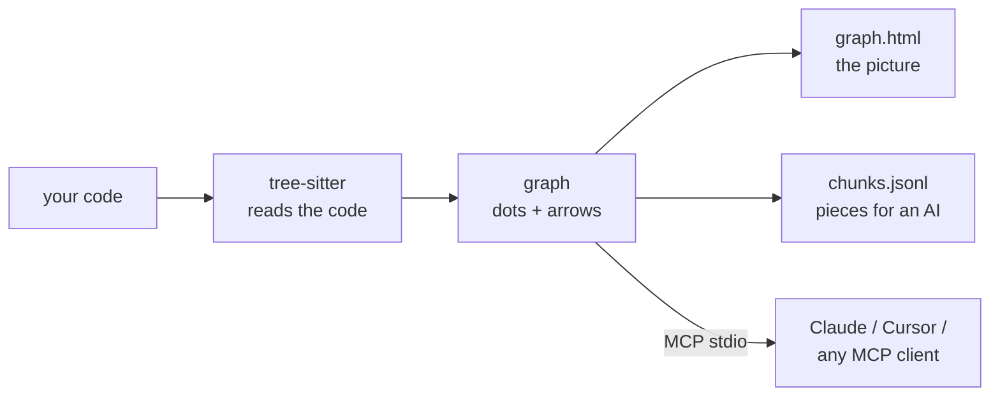

<div align="center">

# repo2graph

**AST-driven code graphs & zero-dependency GraphRAG for AI coding agents and humans**

<p align="center">
  <a href="README.md">English</a> ·
  <a href="docs/i18n/README_zh-CN.md">简体中文</a> ·
  <a href="docs/i18n/README_ja.md">日本語</a> ·
  <a href="docs/i18n/README_fr.md">Français</a> ·
  <a href="docs/i18n/README_es.md">Español</a> ·
  <a href="docs/i18n/README_de.md">Deutsch</a>
</p>

<p align="center">
  <a href="https://glama.ai/mcp/servers/Srinivasan-78/repo2graph"></a>
  <a href="https://pypi.org/project/repo2graph/"></a>
  <a href="https://pypi.org/project/repo2graph/"></a>
  <a href="LICENSE"></a>
  <a href="https://github.com/Srinivasan-78/repo2graph/actions/workflows/ci.yml"></a>
  
  <a href="https://github.com/Srinivasan-78/repo2graph/stargazers"></a>
</p>

<p align="center">
  
</p>

<p align="center">
  <a href="#-what-is-repo2graph">What is it</a> ·
  <a href="#-quickstart-under-30-seconds">Quickstart</a> ·
  <a href="#-mcp-client-configuration">MCP setup</a> ·
  <a href="#-see-it-on-real-repositories">Benchmarks</a> ·
  <a href="#-architecture--token-economics">Architecture</a> ·
  <a href="docs/README.md">Docs</a> ·
  <a href="#-contributing--community">Contributing</a>
</p>

</div>

<!-- mcp-name: io.github.Srinivasan-78/repo2graph -->

---

## ⚡ What is repo2graph?

When an AI coding agent searches a codebase with grep or plain keyword matching, it either dumps
whole matching files into context — burning the token budget and losing structure — or misses the
implementation entirely because it used different words than the search query.

**repo2graph** parses source with [tree-sitter](https://tree-sitter.github.io/tree-sitter/) into a
graph of real code relationships — `CALLS`, `IMPORTS`, `INHERITS`, `DEFINES`, `CO_CHANGE` — and
serves that graph to agents over the **Model Context Protocol**, or packs it into a budget-bounded
markdown context for any LLM. Every returned block carries an exact `[cite: path:start-end]`
anchor, so answers are traceable back to source instead of paraphrased from a guess.



No project setup, no language server, no build step — point it at a folder and it works.

<p align="center">
  
</p>

| Interactive canvas, zoomed | Filter & inspector controls |
| :---: | :---: |
|  |  |

`graph.html` is one self-contained file — no server, no internet, drag to pan, scroll to zoom,
click a node to inspect its code and neighbours.

## 🚀 Quickstart (under 30 seconds)

Requires Python 3.10+. Run via [uv](https://docs.astral.sh/uv/), no install step:

```bash
uvx repo2graph build . -o .r2g && open .r2g/human/graph.html
```

Or install it properly:

```bash
pip install repo2graph
repo2graph build /path/to/project -o .r2g --git-history 200
repo2graph query "how does routing match a path" -o .r2g
```

## 🔌 MCP client configuration

`repo2graph-mcp` is a stdio MCP server. It builds its own index on the first call if one doesn't
exist yet — nothing to run ahead of time.

**Claude Code**

```bash
claude mcp add repo2graph -- uvx --from "repo2graph[mcp]" repo2graph-mcp /path/to/project
```

**Claude Desktop** (`claude_desktop_config.json`) and **Cursor** (`.cursor/mcp.json`) — same block:

```json
{
  "mcpServers": {
    "repo2graph": {
      "command": "uvx",
      "args": ["--from", "repo2graph[mcp]", "repo2graph-mcp", "/path/to/project"]
    }
  }
}
```

Any other stdio-based MCP client (Windsurf, Zed, generic clients) takes the same `command`/`args`
pair — see **[docs/mcp.md](docs/mcp.md)** for config file locations per platform and client.

## ✨ Key features

| | |
|---|---|
| **Deterministic graph, not embeddings-only search** | Callers, callees, imports and class hierarchies resolved from the actual AST — not a nearest-neighbour guess. |
| **Hybrid retrieval** | BM25 + graph-neighbour expansion by default; optional dense vector fusion (`repo2graph embed`) with zero required extra dependencies. |
| **Hard token ceilings, enforced twice** | `pack_context()`'s budget bounds the *entire* rendered markdown, not just chunk text — and the MCP server clamps and re-measures before returning. |
| **15 languages, full treatment** | Python, JS/TS/TSX, Go, Rust, Java, Ruby, C, C++, C#, PHP, Kotlin, Swift, Scala, Bash get functions/classes/calls. Everything else still appears as files on the map. |
| **CI-native** | Published as a GitHub Action — commit a fresh graph next to your code on every push. |
| **Local by default** | `build`, `query`, `rag`, and the MCP server make zero network calls. The one opt-in exception (`rag --answer`) prints the provider + hostname before sending anything. |
| **Export to real graph tooling** | `graph.graphml` (yEd, Gephi, NetworkX) and `graph.cypher` (Neo4j, Memgraph) come out of every build, no extra step. |

## 🛠️ MCP tools exposed

| Tool | Arguments | What comes back |
|---|---|---|
| `repo_map` | none | Languages, hub files, and top entry points. Stable across calls — read this first. |
| `repo_search` | `query`, optional `k` (default 8, max 50), `hops` (default 1, max 4), `budget_tokens` (default 6000, max 12000) | Seed chunks plus graph neighbours, each block headed `[cite: path:start-end]`. |
| `repo_neighbours` | `node_id`, optional `hops` (max 4), `limit` (default 20, max 50) | One graph hop from a symbol/file/dir id: callers, callees, base classes, defining file. |

Secrets are excluded unconditionally on every tool call — no flag turns that off. Full contract,
including the two diagnostic tools (`repo_cache_stats`, `repo_build_status`) added for long-running
server deployments: **[docs/mcp.md](docs/mcp.md)**.

## 📐 Architecture & token economics

- **Nodes**: `repo`, `dir`, `file`, `symbol` (function/method/class/struct/trait/interface/type),
  `module` (external dependency), `external` (an unresolved call target).
- **Edges**: `CONTAINS`, `DEFINES`, `IMPORTS`, `CALLS` (carries `count` + `confidence`),
  `CALLS_EXTERNAL`, `INHERITS`, `CO_CHANGE` (from `--git-history`, requires 3+ co-edits).
- **Call resolution is name-based, not type-based** — a deliberate trade-off that keeps repo2graph
  language-agnostic and setup-free. Ambiguous calls fan out to up to 5 candidate edges at
  `confidence = 1/n`; filter to `confidence == 1.0` when you need certainty over recall.
- **Two budget models, on purpose**: `Index.retrieve()`'s `budget_chars` bounds only the chunks'
  own text (a back-compat surface); `Index.pack_context()`'s `budget_chars` bounds the *entire*
  rendered markdown — citation headers, separators, everything. New retrieval code should be built
  on `pack_context()`.
- **Chunking**: roughly one chunk per function/class, cut at ~4000 characters with 8 lines of
  overlap so nothing is lost at a seam; each chunk's header names its callers and callees, which is
  what makes graph-expanded retrieval better than plain top-k text search.

Full breakdown of every node/edge kind and the chunk schema: **[docs/reference.md](docs/reference.md)**.
The pipeline, the Python API, and where the graph guesses (and why): **[TECHNICAL.md](TECHNICAL.md)**.

## 📊 See it on real repositories

Not a toy demo — five real, large, public repositories, each indexed at a pinned commit, with the
generated graph committed and the exact reproduction command recorded. Every number is measured,
from [`benchmarks/results.json`](benchmarks/results.json), not estimated.

| Repository | Language(s) | Scope | Nodes | Edges |
|---|---|---|---:|---:|
| [Kubernetes](https://github.com/kubernetes/kubernetes) | Go | scoped (controllers, scheduler, API server) | 14,197 | 83,525 |
| [TensorFlow](https://github.com/tensorflow/tensorflow) | C++ / Python | scoped (Python/C++ boundary) | 20,641 | 96,013 |
| [Django](https://github.com/django/django) | Python | full repository | 54,544 | 228,461 |
| [VS Code](https://github.com/microsoft/vscode) | TypeScript | scoped (`src/vs/`) | 113,115 | 431,453 |
| [Linux kernel](https://github.com/torvalds/linux) | C | scoped (extreme-scale) | 136,182 | 257,655 |

See **[examples/README.md](examples/README.md)** for the full index and reproduction commands,
**[docs/benchmarks.md](docs/benchmarks.md)** for methodology, and
**[docs/limitations.md](docs/limitations.md)** for what running against five real repositories
actually surfaced (parse-error rates on macro-heavy C/C++, call-name ambiguity, cross-language
resolution limits).

## 📖 CLI & server reference

| Command | Does |
|---|---|
| `repo2graph build <path> -o .r2g [--git-history N]` | Parse a local repo into a graph + chunks. |
| `repo2graph github <owner/repo> -o <dir>` | Fetch, build, and clean up — no local clone needed. |
| `repo2graph query "<question>" -o .r2g` | Lexical search + one-hop graph expansion. |
| `repo2graph rag "<question>" -o .r2g [--vectors] [--answer]` | Budget-bounded GraphRAG pack; `--answer` sends it to an LLM (opt-in, network). |
| `repo2graph embed -o .r2g [--verify-rag]` | Compute/verify dense vectors for hybrid search. |
| `repo2graph map -o .r2g [--viz-nodes N]` | Regenerate `graph.html` with a different node cap. |
| `repo2graph stats -o .r2g` | Node/edge/function counts for an existing index. |
| `repo2graph-mcp <path> [--no-auto-build] [--async-build]` | stdio MCP server over `.r2g`. |

**Environment variables** (only read by `rag --answer`, in this precedence order):
`GEMINI_API_KEY` → `OPENAI_API_KEY` → `ANTHROPIC_API_KEY` → `OLLAMA_HOST`. `--model` overrides the
provider's best-effort default. No other command makes a network call or reads these. Full flag
tables and budget accounting: **[docs/cli.md](docs/cli.md)**.

## 🔐 Security

`build`, `query`, `rag`, and the MCP server make no network calls. `rag --answer` is the one
opt-in exception — it sends the assembled pack to an LLM provider and prints the provider +
hostname before doing so. The MCP server excludes credential-shaped files unconditionally, with no
flag to turn that off. Details: **[SECURITY.md](SECURITY.md)**.

## 🤝 Contributing & community

```bash
git clone https://github.com/Srinivasan-78/repo2graph
cd repo2graph
python3 -m venv .venv && .venv/bin/pip install -e ".[dev]"
make lint test   # or: ruff check . && pytest
```

- **[.github/CONTRIBUTING.md](.github/CONTRIBUTING.md)** — full local dev setup, code style, and
  the registry/Glama release process.
- **[docs/BACKLOG.md](docs/BACKLOG.md)** — deliberately deferred work and why; the closest thing to
  a roadmap, plus a "good first issues" section.
- **[AGENTS.md](AGENTS.md)** — this codebase's non-obvious conventions (Windows encoding, text
  slicing, the two budget models) before editing `repo2graph/`.
- **[CODE_OF_CONDUCT.md](CODE_OF_CONDUCT.md)** — Contributor Covenant v2.1.
- Found a bug or have a feature idea? [Open an issue](https://github.com/Srinivasan-78/repo2graph/issues/new/choose).

## License

MIT. See [LICENSE](LICENSE).

---

<div align="center">

Found repo2graph useful? [Star the repo](https://github.com/Srinivasan-78/repo2graph) — it's the
easiest way to help other people find it.

</div>
