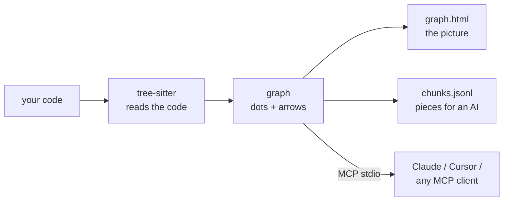

<div align="center">

# repo2graph

**Give coding agents trustworthy, cited answers about unfamiliar codebases.**

Ask a repository a question; get back the actual source that answers it, every block stamped with
the file and line range it came from.

<p align="center">
  <a href="README.md">English</a> ·
  <a href="docs/i18n/README_zh-CN.md">简体中文</a> ·
  <a href="docs/i18n/README_ja.md">日本語</a> ·
  <a href="docs/i18n/README_fr.md">Français</a> ·
  <a href="docs/i18n/README_es.md">Español</a> ·
  <a href="docs/i18n/README_de.md">Deutsch</a>
</p>

<table align="center">
<tr>
<th align="center">📦&nbsp; Package</th>
<th align="center">🩺&nbsp; Health</th>
<th align="center">🗂️&nbsp; Listed on</th>
</tr>
<tr>
<td align="center" valign="top">
<a href="https://pypi.org/project/repo2graph/"></a><br />
<a href="https://pypi.org/project/repo2graph/"></a><br />
<a href="LICENSE"></a>
</td>
<td align="center" valign="top">
<a href="https://github.com/Srinivasan-78/repo2graph/actions/workflows/ci.yml"></a><br />
<a href="https://github.com/Srinivasan-78/repo2graph/actions/workflows/dependency-audit.yml"></a><br />
<a href="https://github.com/Srinivasan-78/repo2graph/actions/workflows/provenance.yml"></a>
</td>
<td align="center" valign="top">
<a href="https://glama.ai/mcp/servers/Srinivasan-78/repo2graph"></a><br />
<a href="https://mcpservers.org/servers/srinivasan-78/repo2graph"></a><br />
<a href="https://registry.modelcontextprotocol.io/v0/servers?search=repo2graph"></a><br />
<a href="https://aiagentslisting.com/mcp/repo2graph"></a>
</td>
</tr>
</table>

<p align="center">
  <a href="https://github.com/Srinivasan-78/repo2graph/stargazers"></a>
</p>

<p align="center">
  
</p>

<p align="center">
  <a href="#-what-is-repo2graph">What is it</a> ·
  <a href="#who-its-for">Who it's for</a> ·
  <a href="#vs-grep">vs. grep</a> ·
  <a href="#install">Quickstart</a> ·
  <a href="#mcp-server">MCP setup</a> ·
  <a href="#does-and-doesnt">What it won't do</a> ·
  <a href="#-see-it-on-real-repositories">Benchmarks</a> ·
  <a href="#-architecture--token-economics">Architecture</a> ·
  <a href="docs/README.md">Docs</a> ·
  <a href="#-contributing--community">Contributing</a>
</p>

</div>

<!-- mcp-name: io.github.Srinivasan-78/repo2graph -->

---

## ⚡ What is repo2graph?

An agent dropped into a codebase it has never seen has two bad options. Grep for a word and it
either floods its context with whole matching files, or finds nothing because the code spells the
idea differently than you did. Guess from training data and it writes something confident and
wrong. Either way you cannot tell which of the two just happened.

**repo2graph answers questions about a repository with the repository's own source.** Ask "how
does a request get authenticated" and you get back the function that does it, the functions that
call it and the ones it calls — each block headed `[cite: path:start-end]`, so every claim in the
answer is one click from the line it came from. If the answer is wrong, the citation shows you
where it went wrong. That is the whole point.

It gets there by reading the code rather than searching it: one parse pass records who calls whom,
who imports what, and which class extends which, and retrieval follows those links instead of
matching more text. The result is served straight into Claude Code, Cursor or any
**Model Context Protocol** client, or packed into a markdown context with a hard token ceiling for
any other LLM.



No project setup, no language server, no build step — point it at a folder and it works.

<p align="center">
  
</p>

| Interactive canvas, zoomed | Filter & inspector controls |
| :---: | :---: |
|  |  |

`graph.html` is one self-contained file — no server, no internet, drag to pan, scroll to zoom,
click a node to inspect its code and neighbours.

<a id="who-its-for"></a>

## 👥 Who it's for

<table>
<tr>
<td valign="top" width="50%">

### 🧭 Joining a new codebase

**The problem:** week one goes on reading files to find out which ones matter.

Build once, open the map, and start from the hub files instead of the root directory. Then ask
whole questions — *"how does a request get from the router to the handler"* — and read the answer
as source, with the callers and callees already attached.

```bash
uvx repo2graph build . -o .r2g
open .r2g/human/graph.html
repo2graph rag "how does routing work" -o .r2g
```

</td>
<td valign="top" width="50%">

### 🤖 Driving a coding agent

**The problem:** the agent greps, pulls in three whole files, and still edits the wrong one.

Point Claude Code, Cursor or any MCP client at the repo. The agent gets cited blocks under a hard
12k-token ceiling instead of raw file dumps, and can walk from a symbol to its callers in one hop.
Secrets are excluded from agent replies unconditionally — no flag turns that off.

```bash
claude mcp add repo2graph -- \
  uvx --from "repo2graph[mcp]" repo2graph-mcp .
```

</td>
</tr>
<tr>
<td valign="top" width="50%">

### 🔍 Reviewing a pull request

**The problem:** the diff is 40 lines; the blast radius is unknown.

Ask the graph what touches the changed symbol — callers, importers, subclasses — and what the
repository's own history says usually changes alongside it (`CO_CHANGE`, mined from git). That
last one catches the test file or the config the diff forgot.

```bash
repo2graph build . -o .r2g --git-history 500
repo2graph explain node "sym:src/auth.py::verify" -o .r2g
```

</td>
<td valign="top" width="50%">

### 🌱 Maintaining a project

**The problem:** every new contributor asks the same "where do I start" question.

Commit a fresh graph on every push with the GitHub Action, and publish `graph.html` to a branch
contributors can browse. The job summary reports hub files, co-change hotspots and the graph delta
since the last build, so architectural drift shows up in the run.

```yaml
- uses: Srinivasan-78/repo2graph@v2
  with: { git-history: "500", commit-branch: graph }
```

</td>
</tr>
</table>

<a id="vs-grep"></a>

## 🔎 Why repo2graph instead of grep or vector search?

Both of those are still in the box — `repo2graph` seeds every query with BM25, and dense vectors
are an opt-in fusion. The difference is what happens *after* the first match.

| | **grep / ripgrep** | **Embedding search** | **repo2graph** |
|---|---|---|---|
| **Finds** | the exact string | text that reads similarly | the symbol, then everything wired to it |
| **Different words than the code uses** | returns nothing | handles it | BM25 seeds, then graph hops reach code the query never named |
| **"What calls this?"** | can't answer — a match in a comment ranks like the definition | can't answer — neighbours aren't in the embedding | `CALLS` edges, with direction and a `confidence` score |
| **"What breaks if I change this?"** | you read every hit by hand | not represented | callers, importers and subclasses in one hop |
| **What comes back** | matching lines, or whole files an agent then dumps into context | top-k similar chunks, callers unretrieved | the source that answers it, each block headed `[cite: path:start-end]` |
| **Token cost** | unbounded — the agent decides how much file to read | unbounded | hard ceiling on the *whole* pack, re-measured before it returns |
| **"Which files keep changing together?"** | — | — | `CO_CHANGE`, mined from git history |
| **Setup** | none | index build + an embedding model (~90 MB) | one parse pass, no model, no API key, no language server |
| **Ranking is explainable** | n/a | a cosine number | `repo2graph explain retrieval "<q>"` names the seed and the edge that pulled each block in |

**Use grep when** you want every occurrence of a literal string — a config key, an error message,
a TODO. repo2graph has no special knowledge of string literals and will not beat it.
**Use repo2graph when** the question is about relationships: what calls this, what breaks if I
change it, how does data get from A to B. Longer version: **[docs/why-graph.md](docs/why-graph.md)**.

<a id="install"></a>

## 🚀 Four ways to run repo2graph

Same graph, same chunk format, same `.r2g` output — pick the interface for where you're
standing right now.

<table>
<tr>
<th align="center">🐍&nbsp; Python / CLI</th>
<th align="center">⚙️&nbsp; GitHub Action</th>
<th align="center">🔌&nbsp; MCP server</th>
<th align="center">🐳&nbsp; Docker</th>
</tr>
<tr>
<td valign="top">

Local dev, scripting, ad-hoc questions from a terminal.

**[Jump in ↓](#python-cli)**

</td>
<td valign="top">

A fresh graph committed next to your code on every push, zero Python setup.

**[Jump in ↓](#github-action)**

</td>
<td valign="top">

Give Claude, Cursor or any MCP client live, cited access to the codebase.

**[Jump in ↓](#mcp-server)**

</td>
<td valign="top">

Enterprise-ready, read-only, non-root container deployment.

**[Jump in ↓](#docker)**

</td>
</tr>
</table>

<a id="python-cli"></a>

### 🐍 1. Python / CLI

Requires Python 3.10+. Run via [uv](https://docs.astral.sh/uv/), no install step:

```bash
uvx repo2graph build . -o .r2g && open .r2g/human/graph.html
```

Or install it properly:

```bash
pip install repo2graph
repo2graph build /path/to/project -o .r2g --git-history 200
repo2graph query "how does routing match a path" -o .r2g
```

<p align="center">
  
</p>

One pass over this repository — 195 files, 2,552 nodes, 11,118 edges — takes about three seconds
and needs no configuration file, no language server and no API key. Ask it something, and the
answer comes back as source you can check, not a summary you have to trust:

<p align="center">
  
</p>

Full flag tables, budget accounting and the Python API: **[docs/cli.md](docs/cli.md)** ·
**[docs/python-api.md](docs/python-api.md)**.

<a id="github-action"></a>

### ⚙️ 2. GitHub Action

Published on the [GitHub Marketplace](https://github.com/marketplace/actions/repo2graph) — one
step, no Python setup on the runner:

```yaml
- uses: actions/checkout@v4
  with: { fetch-depth: 0 }   # full history, so CO_CHANGE edges are meaningful

- uses: Srinivasan-78/repo2graph@v2
  with:
    path: .                  # or: repo: some-org/other-repo
    git-history: "500"       # commits scanned for CO_CHANGE edges (0 = skip)
    artifact-name: repo-graph
```

`@v2` follows every 2.x release; pin an exact tag (`@v2.0.0`) to upgrade by hand instead. It never
calls an LLM — `--answer` is deliberately not exposed — and it writes a job-summary table (hub
files, CO_CHANGE hotspots, the graph delta since the last build) straight from the artifacts, so
the shape of the map shows up in the run without downloading anything.

Also pack a cited context for a fixed question, and push the map to a browsable branch:

```yaml
- uses: Srinivasan-78/repo2graph@v2
  with:
    query: "how does auth middleware validate a token"
    commit-branch: graph     # force-pushed; this repo's own /graph branch is built this way
```

All inputs/outputs, private-repo tokens and the vector-embedding step:
**[docs/github-action.md](docs/github-action.md)**.

<a id="mcp-server"></a>

### 🔌 3. MCP server

`repo2graph-mcp` is a stdio MCP server. It builds its own index on the first call if one doesn't
exist yet — nothing to run ahead of time.

**Claude Code**

```bash
claude mcp add repo2graph -- uvx --from "repo2graph[mcp]" repo2graph-mcp /path/to/project
```

**Claude Desktop** (`claude_desktop_config.json`) and **Cursor** (`.cursor/mcp.json`) — same block:

```json
{
  "mcpServers": {
    "repo2graph": {
      "command": "uvx",
      "args": ["--from", "repo2graph[mcp]", "repo2graph-mcp", "/path/to/project"]
    }
  }
}
```

Any other stdio-based MCP client (Windsurf, Zed, generic clients) takes the same `command`/`args`
pair — see **[docs/mcp.md](docs/mcp.md)** for config file locations per platform and client.

<p align="center">
  
</p>

That is the hop grep cannot do: one symbol in, and its definer, its callers and its callees come
back with file and line — the relationship, not a text match that happens to contain the name.

<a id="docker"></a>

### 🐳 4. Docker

For enterprise and shared deployments, an official `Dockerfile` is provided. It's a multi-stage build running as a non-root user (10000:10000), fully compatible with a read-only root filesystem and dropped capabilities.

```bash
docker build -t repo2graph .
docker run --rm \
  --read-only \
  --cap-drop=ALL \
  --security-opt=no-new-privileges \
  --network=none \
  -v /path/to/repo:/repo:ro \
  -v repo2graph-index:/repo/.r2g \
  repo2graph build /repo -o /repo/.r2g
```

See **[docs/ENTERPRISE_DEPLOYMENT.md](docs/ENTERPRISE_DEPLOYMENT.md)** for full container hardening and HTTP server instructions, and **[docs/deployment-security.md](docs/deployment-security.md)** for the trust boundary and supported/not-recommended verdict per deployment shape — including whether HTTP without TLS is safe (short answer: only on loopback) and a worked hardened reverse-proxy example.

## ✨ Key features

| | |
|---|---|
| **Deterministic graph, not embeddings-only search** | Callers, callees, imports and class hierarchies resolved from the actual AST — not a nearest-neighbour guess. |
| **Hybrid retrieval** | BM25 + graph-neighbour expansion by default; optional dense vector fusion (`repo2graph embed`) with zero required extra dependencies. |
| **Hard token ceilings, enforced twice** | `pack_context()`'s budget bounds the *entire* rendered markdown, not just chunk text — and the MCP server clamps and re-measures before returning. |
| <a id="languages"></a>**17 grammars, full treatment** | Python, JS, TS, TSX, Go, Rust, Java, Ruby, C, C++, C#, PHP, Kotlin, Swift, Scala, Bash and Lua get functions/classes/calls — 29 file extensions in all. Everything else still appears as files on the map. |
| **CI-native** | Published as a GitHub Action — commit a fresh graph next to your code on every push. |
| **Local by default** | `build`, `query`, `rag` and the MCP server over stdio make zero network calls — asserted by socket-level tests. `rag --answer` is the only path that ever sends your code anywhere, and it prints the provider + hostname first. No telemetry. |
| **Export to real graph tooling** | `graph.graphml` (yEd, Gephi, NetworkX) and `graph.cypher` (Neo4j, Memgraph) come out of every build, no extra step. |

<a id="does-and-doesnt"></a>

## ⚖️ What it does — and what it does not

A retrieval tool that oversells itself is worse than no retrieval tool, because you stop checking
its answers. So, plainly:

**It does**

- Return the **source that answers a question**, cited to `path:start-end`, inside a token budget
  it enforces rather than requests.
- Resolve **callers, callees, imports and class hierarchies** from a real parse of the code, and
  let you walk them in either direction from any symbol.
- Mine **`CO_CHANGE`** from git history — the files that keep being edited together, which no
  parser can tell you.
- Run **entirely locally**, with no model, no account and no network call, in the CLI, in CI and
  over MCP.
- Degrade **gracefully**: an unparsed language still appears as file nodes and is still
  retrievable as text; a missing vector index falls back to BM25 rather than failing.

**It does not**

| Limitation | What that means in practice |
|---|---|
| **Resolve calls by type** | Calls are matched by *name*, with same-class / same-file / import scoping to break ties. When scoping can't isolate one target, the call fans out to up to 5 candidate edges at `confidence = 1/n`, flagged `ambiguous`. Filter to `confidence == 1.0` when you need certainty over recall — 4.6%–21% of `CALLS` edges are ambiguous across [our five benchmark repos](docs/limitations.md#call-name-ambiguity-scales-with-symbol-reuse-conventions-not-repository-size). |
| **See dynamic dispatch** | A string-keyed lookup, a plugin registry, `getattr`-style dispatch, a virtual call resolved at runtime — none of it is written down as syntax, so no edge is drawn. **No arrow does not prove no call.** |
| **See reflection or computed imports** | `importlib.import_module(name)`, Java reflection, a dynamic `import()` with a computed specifier. Nothing literal to resolve, so nothing to link. |
| **Follow dependency injection to the implementation** | A DI container wires an interface to a concrete class at runtime. The call site names the interface method, so the edge lands on the declaration (or fans out across every same-named implementation), never on the class the container actually injected. Walk `INHERITS` to enumerate the candidates. |
| **Distinguish generated code** | A `.pb.go`, a bundled `.js`, a codegen'd client — all indexed exactly like hand-written code, with no marker. They can dominate a symbol count without representing a line anyone maintains. Exclude them with `--exclude`. |
| **Notice that your files changed** | The index is a snapshot of the tree you built it from. Nothing watches the filesystem: edit a file and the graph keeps describing the old one. Rebuild (`build --incremental` re-parses only what moved), or let the GitHub Action rebuild on every push. `repo2graph doctor` checks index *integrity* and vector drift — not whether your working tree moved on. |
| **Cross a language boundary** | Python calling into C++ through generated bindings becomes a `CALLS_EXTERNAL` edge, not a link to the C++ function. That is a structural limit of source-only analysis, not a matching bug. |
| **Parse macro-heavy C/C++ cleanly** | tree-sitter emits `ERROR` nodes around unexpanded macros; a `cpp` preprocessor fallback recovers some. Expect a non-trivial `parse_errors` count in `stats.json` and read it as a floor on missed symbols. |

Every one of these is measured, not asserted — the rates, the repositories they were measured on,
and the reproduction commands are in **[docs/limitations.md](docs/limitations.md)**.

## 🆚 How it compares to other graph tools

Several tools build a graph out of a codebase. The thing that separates them is what comes *back*
when you ask a question — a picture, a subgraph, or the code itself.

| | repo2graph | [Graphify](https://github.com/Graphify-Labs/graphify) | [Code Graph](https://community.obsidian.md/plugins/code-graph) (Obsidian) | grep / embedding RAG |
|---|---|---|---|---|
| **What a query returns** | the source, packed — every block headed `[cite: path:start-end]` | a scoped subgraph, a path, or a concept explanation to traverse | a force-directed picture to read | matching lines, or nearest-neighbour chunks |
| **How hits are ranked** | BM25 seeds, then k-hop graph expansion; optional dense fusion | graph traversal (explicitly not a vector index) | n/a — it is a view | lexical only, or vectors only |
| **Token budget** | hard cap on the *whole* pack, re-measured before returning (12k ceiling over MCP) | not a packing layer | n/a | usually unbounded |
| **Edges from git history** | `CO_CHANGE`, from `--git-history` | — | — | — |
| **Runs with no assistant, no model, no account** | yes — CLI, MCP, or the GitHub Action | code pass is local; the docs/media pass uses a model | needs Obsidian desktop 1.7.2+ | varies |
| **Corpus** | code in 17 parsed grammars, every other file as text | code in ~40 languages, plus docs, PDFs, images, video | TS/TSX/JS/Python parsed, imports-only for 8 more | anything |

**Reach for [Graphify](https://github.com/Graphify-Labs/graphify)** when the graph itself is the
product: community detection, shortest path between two concepts, and your PDFs and design docs in
the same graph as the code.
**Reach for the [Obsidian plugin](https://community.obsidian.md/plugins/code-graph)** when a human
wants to *read* the graph beside their notes.
**Reach for repo2graph** when an agent needs cited source inside a fixed token budget, when it has
to run in CI with no model and no account, or when "which files keep changing together" is part of
the answer.

Longer version, with the trade-offs each choice implies: **[docs/comparison.md](docs/comparison.md)**.

## 🛠️ MCP tools exposed

Five tools. Three answer questions about the code; two report on the server itself.

| Tool | Arguments | What comes back |
|---|---|---|
| `repo_map` | none | Languages, hub files, and top entry points. Stable across calls — read this first. |
| `repo_search` | `query`, optional `k` (default 8, max 50), `hops` (default 1, max 4), `budget_tokens` (default 6000, max 12000) | Seed chunks plus graph neighbours, each block headed `[cite: path:start-end]`. |
| `repo_neighbours` | `node_id`, optional `hops` (default 1, max 4), `limit` (default 20, max 50) | One graph hop from a symbol/file/dir id: callers, callees, base classes, defining file. |
| `repo_cache_stats` | none | Result-cache counters: `hits`, `misses`, `size`, `max_size`, `ttl_s`, `evictions`, `hit_rate`. Never itself cached. |
| `repo_build_status` | `task_id` | Progress of a background `--async-build`: `building`, `ready`, `failed` or `unknown`, with `progress_pct` and `eta_s`. |

The three content tools exclude secrets unconditionally — no flag turns that off — and every
numeric argument is clamped in the handler, so a caller cannot widen a bound by asking. Full
contract, argument ceilings and client configs: **[docs/mcp.md](docs/mcp.md)**. Running it
shared, over HTTP, with bearer or OIDC auth and an audit log:
**[docs/ENTERPRISE_DEPLOYMENT.md](docs/ENTERPRISE_DEPLOYMENT.md)**.

## 📐 Architecture & token economics

The retrieval layer is a **GraphRAG** pipeline: [tree-sitter](https://tree-sitter.github.io/tree-sitter/)
parses the source into a typed graph, BM25 picks the seed chunks, and the graph — not further text
similarity — decides what else is worth spending the budget on. Optional dense vectors
(`repo2graph embed`) fuse into the seed ranking; nothing downstream requires them.

- **Nodes**: `repo`, `dir`, `file`, `symbol` (function/method/class/struct/trait/interface/type),
  `module` (external dependency), `external` (an unresolved call target).
- **Edges**: `CONTAINS`, `DEFINES`, `IMPORTS`, `CALLS` (carries `count` + `confidence`),
  `CALLS_EXTERNAL`, `INHERITS`, `CO_CHANGE` (from `--git-history`, requires 3+ co-edits).
- **Call resolution is name-based, not type-based** — a deliberate trade-off that keeps repo2graph
  language-agnostic and setup-free. Ambiguous calls fan out to up to 5 candidate edges at
  `confidence = 1/n`; filter to `confidence == 1.0` when you need certainty over recall.
- **Two budget models, on purpose**: `Index.retrieve()`'s `budget_chars` bounds only the chunks'
  own text (a back-compat surface); `Index.pack_context()`'s `budget_chars` bounds the *entire*
  rendered markdown — citation headers, separators, everything. New retrieval code should be built
  on `pack_context()`.
- **Chunking**: roughly one chunk per function/class, cut at ~4000 characters with 8 lines of
  overlap so nothing is lost at a seam; each chunk's header names its callers and callees, which is
  what makes graph-expanded retrieval better than plain top-k text search.

Full breakdown of every node/edge kind and the chunk schema: **[docs/reference.md](docs/reference.md)**.
The pipeline, the Python API, and where the graph guesses (and why): **[TECHNICAL.md](TECHNICAL.md)**.

## 📊 See it on real repositories

Not a toy demo — five real, large, public repositories, each indexed at a pinned commit, with the
generated graph committed and the exact reproduction command recorded. Every number is measured,
from [`benchmarks/results.json`](benchmarks/results.json), not estimated.

| Repository | Language(s) | Scope | Nodes | Edges |
|---|---|---|---:|---:|
| [Kubernetes](https://github.com/kubernetes/kubernetes) | Go | scoped (controllers, scheduler, API server) | 14,451 | 110,246 |
| [TensorFlow](https://github.com/tensorflow/tensorflow) | C++ / Python | scoped (Python/C++ boundary) | 21,380 | 115,984 |
| [Django](https://github.com/django/django) | Python | full repository | 55,810 | 303,339 |
| [VS Code](https://github.com/microsoft/vscode) | TypeScript | scoped (`src/vs/`) | 113,080 | 656,158 |
| [Linux kernel](https://github.com/torvalds/linux) | C | scoped (extreme-scale) | 136,219 | 256,413 |

See **[examples/README.md](examples/README.md)** for the full index and reproduction commands,
**[docs/benchmarks.md](docs/benchmarks.md)** for methodology, and
**[docs/limitations.md](docs/limitations.md)** for what running against five real repositories
actually surfaced (parse-error rates on macro-heavy C/C++, call-name ambiguity, cross-language
resolution limits).

## 📖 CLI & server reference

| Command | Does |
|---|---|
| `repo2graph build <path> -o .r2g [--git-history N]` | Parse a local repo into a graph + chunks. |
| `repo2graph github <owner/repo> -o <dir>` | Fetch, build, and clean up — no local clone needed. |
| `repo2graph query "<question>" -o .r2g` | Lexical search + one-hop graph expansion. |
| `repo2graph rag "<question>" -o .r2g [--vectors] [--answer]` | Budget-bounded GraphRAG pack; `--answer` sends it to an LLM (opt-in, network). |
| `repo2graph embed -o .r2g [--verify-rag]` | Compute/verify dense vectors for hybrid search. |
| `repo2graph map -o .r2g [--viz-nodes N]` | Regenerate `graph.html` with a different node cap. |
| `repo2graph stats -o .r2g [--format text]` | Node/edge/function counts for an existing index; `--format text` for a quality summary. |
| `repo2graph doctor [path]` | Diagnose environment, dependencies, permissions, and index integrity. |
| `repo2graph explain-path <path> [-r <repo>]` | Say whether a path would be indexed, and which precedence rule decided. |
| `repo2graph explain <edge|node|retrieval>` | Explain graph edges, node metadata, and retrieval ranking decisions. |
| `repo2graph completion [shell]` | Print shell tab completion setup script (`bash`, `zsh`, `fish`). |
| `repo2graph-mcp <path> [--no-auto-build] [--async-build]` | stdio MCP server over `.r2g`. |

**Environment variables** (only read by `rag --answer`, in this precedence order):
`GEMINI_API_KEY` → `OPENAI_API_KEY` → `ANTHROPIC_API_KEY` → `OLLAMA_HOST`. `--model` overrides the
provider's best-effort default. No other command makes a network call or reads these. Full flag
tables and budget accounting: **[docs/cli.md](docs/cli.md)**.

## 🔐 Security

- **Secure-by-default secret exclusion**: `build`, `github`, auto-building `query`/`rag`, the GitHub Action and MCP all skip credential files automatically — `.env*`, private keys, certificates, `.ssh`, `.aws`, `.gnupg`, `.kube`, `credentials/`, `secrets/` and more. `--include-secrets` opts out; **the MCP tools have no equivalent**, because an agent returning `.env` is a different problem from a human choosing to read it.
- **Content-aware secret scanning**: Chunks are scanned for high-entropy tokens, cloud API keys (AWS, OpenAI, Google, Slack, GitHub), JWTs, DB URLs and private keys. Matches are redacted line-preservingly (`--secret-policy redact-match|exclude-file|warn-only|off`).
- **Sanitized logs and events**: Audit logs and structured event sinks enforce cycle detection, container size limits, recursion depth ceilings, and scrub URL basic-auth credentials.
- **Local by default, and only one path ever sends your code**: `build`, `query`, `rag`, `map`, `stats` and the MCP server over stdio open no socket at all — asserted by socket-level tests, not just by reading the code. Four commands *can* reach the network, and only the first sends anything of yours: `rag --answer` (uploads the pack; prints provider + hostname first), `repo2graph github` (clones), `repo2graph embed` (downloads an embedding model once), and `repo2graph-mcp --auth-oidc-issuer` (fetches public keys). **No telemetry of any kind, and no setting to turn off.**

Where every byte goes and how to delete it: **[docs/PRIVACY.md](docs/PRIVACY.md)**. What an attacker
could try, and what is out of scope: **[docs/THREAT_MODEL.md](docs/THREAT_MODEL.md)**. Hardened
configurations to copy: **[docs/secure-configuration.md](docs/secure-configuration.md)**. Reporting
a vulnerability: **[.github/SECURITY.md](.github/SECURITY.md)**.

## 🤝 Contributing & community

```bash
git clone https://github.com/Srinivasan-78/repo2graph
cd repo2graph
python3 -m venv .venv && .venv/bin/pip install -e ".[dev]"
make lint format-check typecheck test    # the four gates CI runs
```

Branch from **`develop`** and open the PR against it — `main` is the release branch. `make lint`
alone is only `ruff check .`; `ruff format --check .` is a **separate** gate and the one people
miss.

- **[docs/good-first-issues.md](docs/good-first-issues.md)** — seven starter tasks, each with a
  file and line to start from, acceptance criteria, and the catch that makes it harder than it
  looks.
- **[.github/CONTRIBUTING.md](.github/CONTRIBUTING.md)** — local setup, the CI gates, the branch
  model, the test house style, and the registry/Glama release process.
- **[docs/ARCHITECTURE.md](docs/ARCHITECTURE.md)** — the module map: what each module owns, which
  way dependencies run, and where a change of each kind goes.
- **[docs/BACKLOG.md](docs/BACKLOG.md)** — deliberately deferred work and why; the closest thing to
  a roadmap.
- **[AGENTS.md](AGENTS.md)** — this codebase's non-obvious conventions (Windows encoding, text
  slicing, the two budget models) before editing `repo2graph/`.
- **[POSITIONING.md](POSITIONING.md)** — what repo2graph claims, what it deliberately does not
  claim, and the copy for every outward-facing surface. Read it before changing any of them.
- **[CODE_OF_CONDUCT.md](CODE_OF_CONDUCT.md)** — Contributor Covenant v2.1.
- Found a bug or have a feature idea? [Open an issue](https://github.com/Srinivasan-78/repo2graph/issues/new/choose).

## License

MIT. See [LICENSE](LICENSE).

---

<div align="center">

Found repo2graph useful? [Star the repo](https://github.com/Srinivasan-78/repo2graph) — it's the
easiest way to help other people find it.

</div>
