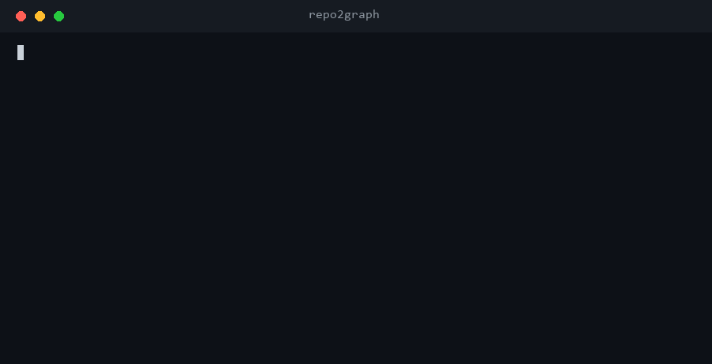

<div align="center">

# repo2graph

**Cited, token-bounded answers about a codebase, for coding agents and CI.**

[](https://pypi.org/project/repo2graph/)
[](https://github.com/Srinivasan-78/repo2graph/actions/workflows/ci.yml)
[](LICENSE)



</div>

<!-- mcp-name: io.github.Srinivasan-78/repo2graph -->

Ask a repository a question and get back the source that answers it. Every block is headed
`[cite: path:start-end]`, and the whole reply fits under a token ceiling that the tool enforces.
One tree-sitter pass records who calls whom, who imports what, and which files keep changing
together in git. Retrieval starts from BM25 matches and follows those links.

It needs no model, no API key, no language server and no database. Building, querying and the
MCP server make no network calls; the only exceptions are `rag --answer` (opt-in, sends the pack
to an LLM) and `repo2graph github` (clones a repository). Parsers are part of that promise:
`tree-sitter-language-pack` is pinned below 1.0 so every grammar arrives compiled into the
installed wheel, rather than being downloaded on first parse — see
[SECURITY.md](.github/SECURITY.md#why-this-is-safe-for-enterprise-use). Use it from the CLI, as an MCP server in Claude Code or Cursor, or as a GitHub Action.

## Try it

```bash
uvx repo2graph demo                                   # bundled example repo, five questions answered
uvx repo2graph build . -o .r2g                        # index your own code
uvx repo2graph rag "how does routing work" -o .r2g    # a cited, budget-bounded context pack
```

Give an agent the same thing over MCP:

```bash
claude mcp add repo2graph -- uvx --from "repo2graph[mcp]" repo2graph-mcp .
```

Cursor, Claude Desktop and other clients: [docs/mcp.md](docs/mcp.md). Step-by-step with expected
output: [`demo` in docs/cli.md](docs/cli.md#demo--the-first-command-to-run).

## Is it better than grep?

**For single-file lexical queries, no: grep is the better tool.**
We measured it on 35 questions about Flask, requests, FastAPI and Hono, scored against the definitions that answer them, held to the same token budget ([method, full tables and diagnosis](benchmarks/real/README.md); raw rows in [benchmarks/real/results.json](benchmarks/real/results.json)):

| Budget | repo2graph (2.x default) | repo2graph-cite (opt-in) | grep, then read around hits |
|---:|---:|---:|---:|
| 2,000 tokens | 30% | 30% (1,856 tokens) | **35%** (1,962 tokens) |
| 4,000 tokens | 37% | **41%** (3,685 tokens) | **61%** (3,873 tokens) |
| 8,000 tokens | 48% | **52%** (5,460 tokens) | **72%** (7,652 tokens) |

On purely lexical questions where the evidence sits in a single file, text search is grep's optimum. In default full-body expansion, graph neighbours can displace direct lexical hits. With citation-mode neighbours (`--neighbours=cite`), neighbours cost ~15 tokens of signature metadata rather than full chunk bodies, serving as a navigation index that matches or beats BM25 recall at lower token cost (5,460 vs 5,561 mean tokens at 8k).

### Where repo2graph wins: cross-file structural questions

grep structurally cannot traverse dependency edges, compute reverse call closures, or follow cross-module delegation. On our structural benchmark across the same four repositories ([benchmarks/real/tasks_structural.json](benchmarks/real/tasks_structural.json), where evidence provably spans cross-file graph edges):

| Budget | repo2graph | repo2graph-cite | repo2graph-bm25 | ripgrep |
|---:|---:|---:|---:|---:|
| 2,000 tokens | 20% | 10% | 20% | 20% |
| 4,000 tokens | **70%** | 30% | 50% | 20% |
| 8,000 tokens | **80%** | 30% | 50% | 70% |

Graph expansion adds 20–30 pp over lexical search alone at 4k and 8k tokens. Against grep the margin is **+50 pp at 4,000 tokens**, but **+10 pp at 8,000 and nothing at 2,000** — give grep enough budget and it closes most of the gap. Citation mode, which wins the lexical table above, is the *worst* retriever here: a signature locates a cross-file answer without containing it. There is no single best setting. This is 10 tasks, so one task is 10 pp; treat every cell as ±1 task.

### Where repo2graph wins for agents: multi-turn loops

In simulated agent workflows (`search` → `read` → `answer`, via `scripts/agent_eval.py`). No model is in the loop — the "agent" is a deterministic policy over real ripgrep and a real index:

| Task set | Method | Success | Mean turns | Mean tokens | Precision per read |
|---|---|---:|---:|---:|---:|
| Structural (10) | repo2graph | **70%** | **3.3** | 4,006 | 2.4% |
| Structural (10) | ripgrep | 10% | 6.0 | **1,879** | **11.0%** |
| General (35) | repo2graph | **54%** | **1.9** | 7,133 | 2.4% |
| General (35) | ripgrep | 20% | 3.6 | **939** | **37.8%** |

More answers in fewer turns, and it is not cheap: 2.1× ripgrep's tokens on the structural set and 7.6× on the general one, at a fraction of its precision per read. repo2graph buys recall with context; the budget-matched comparison is the single-shot tables above.

What it does do that grep doesn't:

- **Relationships in one hop.** `repo_neighbours` returns a symbol's callers, callees, base
  classes and defining file, each with a line number. Every edge carries a `confidence`: a name
  that could mean several definitions is marked `ambiguous` and priced at `1/n`, not guessed.
- **A hard ceiling.** The pack is measured, clamped and re-measured before it's returned
  (12k tokens max over MCP), so an agent can't flood its own context through this tool.
- **PR blast radius in CI.** `repo2graph impact` reports what a diff touches: callers,
  importers, subclasses, and the files git history says usually change alongside it
  (`CO_CHANGE`).

How it compares with Serena, Aider's repo map, CodeGraphContext, code-graph-rag, Sourcegraph,
Cursor's index and Claude Code's own search, including when to use those instead:
**[docs/comparison.md](docs/comparison.md)**.

## Five questions to start with

| Ask your repo | What the graph adds |
|---|---|
| `Where is authentication enforced?` | the guard itself, plus the routes that call it |
| `What calls <function>?` | CALLS edges into it, each with a confidence score |
| `What tests cover <module>?` | IMPORTS edges from the test module back to the code under test |
| `What would be affected by changing <api>?` | the definition, then its direct callers from the CALLS edges into it (explain node) |
| `Trace <a request> from route to persistence.` | the handler and its callees one hop at a time, each block cited to file and line |

## GitHub Action

```yaml
- uses: actions/checkout@v4
  with: { fetch-depth: 0 }   # full history, so CO_CHANGE edges are meaningful

- uses: Srinivasan-78/repo2graph@v2
  with:
    git-history: "500"
    commit-branch: graph     # optional: publish graph.html to a browsable branch
```

`@v2` follows every 2.x release; pin an exact tag (`@v2.2.0`) to upgrade by hand. The Action never
calls an LLM. Inputs, outputs and the PR-impact workflow: [docs/cli.md](docs/cli.md).

## Commands

| Command | Does |
|---|---|
| `repo2graph build <path> -o .r2g` | Parse a repo into a graph and chunks (`--incremental`, `--git-history N`) |
| `repo2graph query "<q>" -o .r2g` | BM25 search plus one graph hop |
| `repo2graph rag "<q>" -o .r2g` | Budget-bounded, cited context pack (`--answer` sends it to an LLM: opt-in, the only path that sends code anywhere) |
| `repo2graph impact -i .r2g --base main` | Blast radius of a diff |
| `repo2graph explain <edge\|node\|retrieval>` | Why an edge exists, or why a block was retrieved |
| `repo2graph github <owner/repo> -o <dir>` | Fetch, build and clean up without a local clone |
| `repo2graph demo` | Index a bundled example and answer the five questions above |
| `repo2graph map`, `repo2graph stats`, `repo2graph index-status`, `repo2graph embed` | Re-render `graph.html`, report counts and freshness, add optional dense vectors |
| `repo2graph doctor`, `repo2graph bug-report`, `repo2graph explain-path`, `repo2graph completion` | Diagnose setup, build a privacy-safe bug bundle, say why a path is (not) indexed, shell completion |
| `repo2graph-mcp <path>` | stdio MCP server: `repo_map`, `repo_search`, `repo_neighbours`, `repo_impact`, and two status tools |

Full flags: [docs/cli.md](docs/cli.md). Python API: [docs/python-api.md](docs/python-api.md).

## What it can't do

- **Resolve calls by type.** Calls are matched by name, scoped by class, file, imports and
  directory. `x.get()` on a receiver of unknown type is recorded as a low-confidence guess, not a
  fact. For exact references, use a language-server tool.
- **See dynamic dispatch, reflection or computed imports.** A missing edge doesn't prove that no
  call exists.
- **Cross language boundaries** (Python calling C++ through bindings).
- **Rebuild itself when files change.** `index-status` reports staleness; rebuild with
  `build --incremental`.

<a id="languages"></a>Symbols, calls and classes are extracted for Python, JS, TS, TSX, Go, Rust, Java, Ruby, C, C++,
C#, PHP, Kotlin, Swift, Scala, Bash and Lua. Every other file is still indexed as text. The
specific cases that defeat it — reflection dispatch, string-keyed registries, barrel re-exports —
are pinned as known failures in the
[synthetic regression suite](benchmarks/corpus/README.md#known-failure-cases-it-pins).

## Status

The 2.x CLI, MCP tools and output schema follow semver: breaking changes wait for 3.0. Default paths run locally, send no telemetry and exclude secrets from agent replies
unconditionally ([what never leaves your machine](.github/SECURITY.md#what-never-leaves-your-machine),
[how credential files are excluded](.github/SECURITY.md#how-credential-files-are-excluded),
[reporting a vulnerability](.github/SECURITY.md#reporting-a-vulnerability)). A Docker image for
read-only, non-root deployments is described in
[.github/SECURITY.md](.github/SECURITY.md#container-deployment).

## Contributing

```bash
git clone https://github.com/Srinivasan-78/repo2graph && cd repo2graph
python3 -m venv .venv && .venv/bin/pip install -e ".[dev]"
make lint format-check typecheck test
```

Branch from `develop`. Start with [.github/CONTRIBUTING.md](.github/CONTRIBUTING.md) and
[docs/architecture.md](docs/architecture.md). The most useful contribution right now is new
questions for the [retrieval benchmark](benchmarks/real/README.md), especially on repositories
you know well. All docs: [architecture](docs/architecture.md), [CLI](docs/cli.md),
[MCP](docs/mcp.md), [Python API](docs/python-api.md), [comparison](docs/comparison.md).

MIT licensed.
