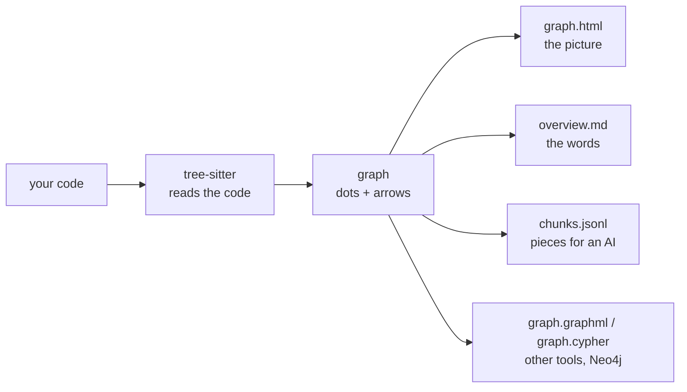

# Technical details

[README.md](README.md) covers what repo2graph does and how to run it. This page covers how it
actually works — the pipeline, the graph model, where it guesses, and the Python API. It assumes
you've already read the README.

## How it works, in three steps



1. **It reads the code.** It uses tree-sitter, the same incremental parser code editors use for
   syntax highlighting. So it understands real code structure instead of guessing from words. It
   needs no setup and works on a project it has never seen — no build step, no language server, no
   project-specific config.
2. **It builds the map.** Folders, files, functions, classes and imports become nodes. `CONTAINS`,
   `DEFINES`, `CALLS`, `IMPORTS`, `INHERITS` become edges. `CALLS` resolution is name-based (see
   "Where it guesses, and why" below) — there is no type checker or language-specific symbol
   resolver behind it, by design: that's what keeps it language-agnostic and setup-free.
3. **It cuts the code into small pieces (chunks).** Roughly one piece per function or class. Each
   chunk carries a header naming who calls it, what it calls, and its docstring — that header is
   what makes graph-expanded retrieval useful: a chunk isn't just its own text, it's its own text
   plus a map of its immediate neighbourhood.

**No graph library is involved.** Degree counting, force-directed layout, and GraphML/Cypher
generation are all pure Python — no NetworkX, no vendored graph library with its own dependency
tree. The only two required third-party packages, for the whole core pipeline, are `tree-sitter`
and `tree-sitter-language-pack` — both parsers, nothing else. `sentence-transformers`/`numpy` (the
`rag` extra) and the MCP SDK (the `mcp` extra) are optional and never import unless you ask for
them; see [SECURITY.md](SECURITY.md) for why that boundary is treated as load-bearing,
not incidental.

## Where it guesses, and why

The map is good, but it's built without a type checker or a per-language symbol table, which is a
deliberate trade-off — the alternative is a project-specific setup step per language, which is
exactly what repo2graph exists to avoid. That trade-off shows up in a few specific, bounded ways:

- **`CALLS` is matched by name, not by type.** If two functions in the codebase share a name,
  repo2graph draws up to 5 possible `CALLS` edges from a call site and gives each one
  `confidence = 1/n`. A single unambiguous match gets `confidence = 1.0`. If your use of the graph
  needs certainty rather than a ranked guess, filter to `confidence == 1.0` edges only.
- **Import resolution is per-language**, matching each language's actual module/package
  conventions (relative imports, package `__init__`-style re-exports, Go's module paths, and so
  on) rather than one generic heuristic applied everywhere. The full per-language breakdown is in
  [docs/reference.md#where-it-guesses](docs/reference.md#where-it-guesses).
- **No arrow does not prove no call.** Code that decides at runtime which function to invoke
  (dynamic dispatch via a string, a plugin registry, `getattr`-style dispatch) is invisible to a
  static reader like this one — there is no execution trace here, only what tree-sitter can parse
  and what name resolution can infer from it.
- **Some files never become graph nodes at all:** non-text files, anything over 1.5 MB, and the
  usual vendor/build directories are skipped during discovery; `.gitignore` is respected in a git
  checkout. See [docs/reference.md](docs/reference.md) for the exact skip list.

`Index.pack_context()`'s `min_confidence` gate only applies to `CALLS` edges — `IMPORTS`, `DEFINES`
and `INHERITS` records carry no `confidence` key at all (they're structural facts, not name-match
guesses), and the gate is written so it can never silently drop them.

## Using it from Python

Everything the CLI does is also a plain library call. `build()` returns a `Graph`; `dump_all()`
writes whichever output formats you ask for; `Index` is the same retrieval object the CLI, the
GitHub Action, and the MCP server all call internally — there's exactly one implementation of
retrieval in this codebase, not one per surface.

```python
from pathlib import Path
from repo2graph import build, iter_chunks
from repo2graph.export import dump_all
from repo2graph.query import Index

g = build(Path("."), git_history=200)
dump_all(g, chunks=iter_chunks(g), outdir=Path(".r2g"),
         formats={"jsonl", "overview", "html"}, viz_nodes=300)

pack = Index(".r2g").pack_context("how does session auth work?", k=8, hops=1,
                                  budget_chars=24000)
print(pack["markdown"])
```

Two budget models coexist on purpose and are easy to conflate: `Index.retrieve()`'s `budget_chars`
bounds only the returned chunks' own text; `Index.pack_context()`'s `budget_chars` bounds the
*entire* rendered markdown — headers, separators, and all. They're pinned apart by design, not by
oversight; new retrieval surfaces should be built on `pack_context()`.

Streaming exports one artifact at a time, expanding your own externally-sourced vector hits through
the same graph traversal, and loading the graph straight into Neo4j via `graph.cypher`:
**[docs/python-api.md](docs/python-api.md)**.

## The output layout, in full

```
.r2g/
├── human/   overview.md   graph.html   graph.graphml
└── agent/   overview.md   manifest.json   chunks.jsonl
              nodes.jsonl   edges.jsonl   graph.cypher   stats.json
```

The split exists because people and programs want different things from the same graph:
`human/graph.html` is a self-contained, zero-dependency interactive picture; `agent/manifest.json`
is a machine-readable instruction sheet describing every other file, every node/edge kind, and the
id scheme, so a program needs nothing else to make sense of the directory. `agent/chunks.jsonl` is
the retrieval unit — each entry already carries its graph neighbourhood in its header, which is
what makes graph-expanded answers better than a plain top-k text search. If you push chunks into an
external vector database, keep each chunk's `node_id`: that's the handle that lets a search hit jump
back onto the graph.

Every file, every node and edge kind, and the exact chunk schema:
**[docs/reference.md](docs/reference.md)**.

## Further reading

- [docs/cli.md](docs/cli.md) — full CLI flag tables, budget accounting, retrieval internals.
- [docs/mcp.md](docs/mcp.md) — the MCP server's contract: the three tools, client configs, the
  bounds it enforces that the CLI leaves to you.
- [docs/reference.md](docs/reference.md) — every artifact, every node/edge kind, the chunk format,
  the full "where it guesses" per-language breakdown.
- [docs/python-api.md](docs/python-api.md) — the Python API in full: streaming exports, expanding
  external vector hits, Neo4j loading.
- [docs/github-action.md](docs/github-action.md) — GitHub Action inputs and outputs.
