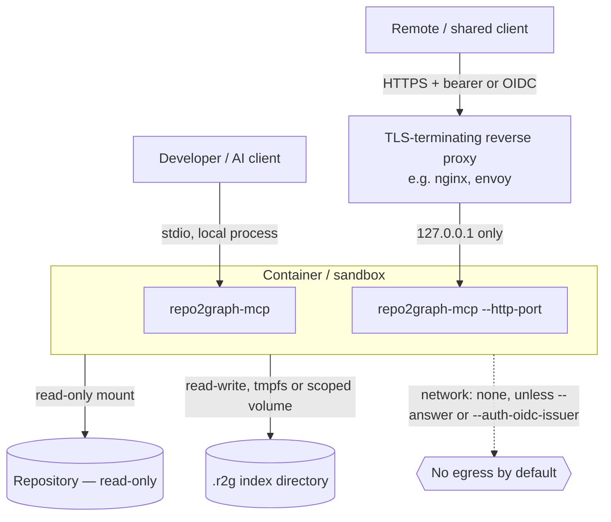

# Enterprise deployment

How to run repo2graph — the CLI, the GitHub Action, or the MCP server — inside an organization
where the repositories being indexed contain proprietary code. This is guidance for the operator
who deploys the tool, not a claim that any single configuration makes it "fully secure" — see
`docs/SECURITY-AUDIT.md`'s closing section for what the tool does and does not protect against.

## Recommended architecture



Two supported shapes, both real:

1. **Local, stdio, single developer.** The most common case — `uvx --from "repo2graph[mcp]"
   repo2graph-mcp /path/to/project`, spawned by the AI client as a child process. No network
   listener exists at all; the client owns the pipe. This is the shape `docs/mcp.md` documents.
2. **Shared, HTTP, multiple callers.** `--http-port` with `--auth-token` or `--auth-oidc-issuer`.
   The server refuses to bind beyond loopback with no auth configured
   (`http_server.py:426-430`) — this is enforced at startup, not a configuration you have to
   remember to set. Put a TLS-terminating reverse proxy in front for anything crossing a network
   boundary; the built-in HTTP server does not terminate TLS itself.

## Container hardening

If you run `repo2graph-mcp` in a container (recommended for the HTTP-shared shape), you can build the official `Dockerfile` provided in this repository, which is already configured for these requirements:

```bash
docker build -t your-repo2graph-image .
docker run --rm \
  --read-only \
  --cap-drop=ALL \
  --security-opt=no-new-privileges \
  --network=none \
  -v /path/to/repo:/repo:ro \
  -v repo2graph-index:/repo/.r2g \
  --user 10000:10000 \
  your-repo2graph-image \
  repo2graph-mcp /repo --no-auto-build
```

Notes on each flag, specific to what this codebase actually needs:

- **`--read-only` + a writable volume for `.r2g` only.** repo2graph writes exactly one directory —
  the index output directory — and nothing else. Mount the repository itself read-only
  (`-v ...:ro`); the container's root filesystem can be fully read-only as long as `.r2g` (or
  wherever `-o` points) has a writable mount.
- **`--network=none`** is correct for the default configuration (no `--answer`, no
  `--auth-oidc-issuer`). If you need `--answer`, you need egress to whichever LLM provider you
  configure — scope that with an explicit allowlist at the network layer (this codebase makes no
  attempt at SSRF protection or destination allowlisting itself; see "What this does not do"
  below), not by opening `--network=none` off. If you use `--auth-oidc-issuer`, you need egress to
  that one issuer's JWKS endpoint only.
- **`--cap-drop=ALL` / `--security-opt=no-new-privileges` / non-root user.** repo2graph needs no
  Linux capability — it does not bind privileged ports, does not need raw sockets, does not fork
  privileged subprocesses. Nothing in the codebase requires running as root.
- **No host Docker socket, no credential mounts.** Never mount `/var/run/docker.sock` or a
  credentials directory (`~/.aws`, `~/.ssh`) into this container — the tool has no legitimate use
  for either, and `docs/SECURITY-AUDIT.md`'s secret-exclusion guarantee only covers what's *inside*
  the repository tree it's told to index, not what an operator additionally mounts in.
- **`--no-auto-build`** if you'd rather control exactly when indexing happens rather than let the
  first tool call trigger it — useful in a shared deployment where you don't want an arbitrary
  caller's first request to be the one that pays the indexing cost.

Kubernetes is not required merely because this is an enterprise environment. A single container
per repository (or a small pool behind the reverse-proxy shape above) is the right size for what
this tool does; nothing here needs a scheduler, a service mesh, or a Kubernetes-specific security
context beyond the equivalent pod `securityContext` fields (`runAsNonRoot`, `readOnlyRootFilesystem`,
`allowPrivilegeEscalation: false`, `capabilities.drop: [ALL]`) matching the Docker flags above.

## Recommended package deployment model

Do not run production infrastructure on an unpinned `uvx repo2graph`, where "unpinned" means no
version constraint — `uvx` always resolves and fetches at invocation time, so an unpinned command
line can silently pick up a new release between one run and the next.

```
PyPI (repo2graph==X.Y.Z, verified via pip-audit / your SCA tool)
  ↓
Internal artifact repository (Artifactory, Nexus, a private PyPI mirror)
  ↓
Approved package, version-pinned
  ↓
Developer environment / CI runner
```

Concretely:

```bash
# Pin explicitly, everywhere this matters:
uvx --from "repo2graph[mcp]==1.6.0" repo2graph-mcp /path/to/project

# Or, mirrored internally:
pip install --index-url https://pypi.internal.example.com/simple/ "repo2graph[mcp]==1.6.0"
```

`uv.lock` is committed in this repository specifically so that anyone building from source gets the
exact dependency graph that was reviewed — mirror that discipline in your own deployment: pin
`repo2graph` itself, and let your SCA tool (see `docs/SECURITY-AUDIT.md`'s CI/CD findings — this
repo's own `dependency-audit.yml` runs `pip-audit --strict`) gate upgrades rather than floating on
whatever the latest release happens to be.

## What this does not do

Being explicit about the boundary, per §53 of the brief:

- **Sandboxing the MCP server does not protect against a compromised host.** If the machine running
  the container is already compromised, no application-layer or container-layer control here
  changes that — this is a statement about defense in depth, not a claim that containment is total.
- **No general SSRF protection or destination allowlisting** on the `--answer` or
  `--auth-oidc-issuer` network paths. Both constrain redirects, which is narrower than an
  allowlist and not a substitute for one. `--auth-oidc-issuer` requires `https` on every hop,
  caps redirects at 3 (`auth.py:411`), and requires `jwks_uri` to share the configured issuer's
  scheme and host (`auth.py:250-258`), so the JWKS fetch cannot be downgraded or relocated.
  `--answer` keeps a provider redirect on the same origin and refuses an https-to-http
  downgrade (`answer.py:407`), because the request carries your API key in a header that
  CPython would otherwise forward to whatever host the redirect names. Neither path restricts
  where *you* point it. If your threat model requires egress allowlisting, enforce it at the
  network layer (an egress proxy, a Kubernetes `NetworkPolicy`), not by assuming the
  application does it.
- **No secret-scanning of arbitrary repository content beyond the path-shape and audit-log-value
  denylists documented in `docs/SECURITY-AUDIT.md`.** A `.env` file is excluded by path; a
  credential accidentally committed inside `app_config.py` with an unremarkable variable name is
  not caught by anything repo2graph does — this is inherent to path/shape-based detection, not a
  bug to fix, and is exactly why `docs/PRIVACY.md` and `.github/SECURITY.md` avoid claiming complete
  secret protection.

## Enterprise deployment checklist

- [ ] `repo2graph` version pinned in every environment that runs it (see above).
- [ ] If using `--http-port`: TLS-terminating proxy in front, `--auth-token` or
      `--auth-oidc-issuer` configured (the server refuses an unsafe bind otherwise, but verify your
      proxy doesn't accidentally expose the unauthenticated loopback port).
- [ ] Container runs `--read-only --cap-drop=ALL --security-opt=no-new-privileges`, non-root,
      with only the index-output directory writable.
- [ ] `--network=none` unless `--answer` or `--auth-oidc-issuer` is in use; if either is, egress is
      scoped at the network layer to the specific destination, not left open.
- [ ] `--audit-log` enabled and shipped to your SIEM if you need a record of who queried what,
      per `docs/PRIVACY.md`'s description of what that log does and doesn't contain.
- [ ] Your own SCA/dependency-scanning pipeline gates upgrades of `repo2graph` and its extras,
      rather than floating `uvx repo2graph` with no version pin.
