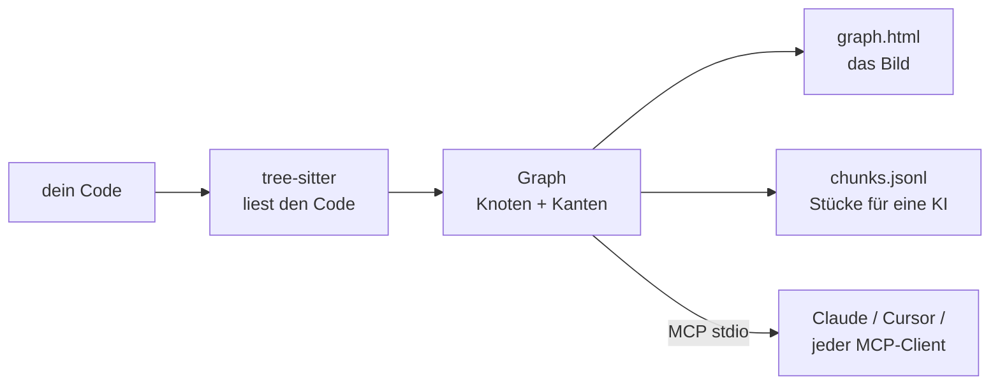

<div align="center">

# repo2graph

**AST-gesteuerte Code-Graphen & abhängigkeitsfreies GraphRAG für KI-Coding-Agenten und Menschen**

<p align="center">
  <a href="../../README.md">English</a> ·
  <a href="README_zh-CN.md">简体中文</a> ·
  <a href="README_ja.md">日本語</a> ·
  <a href="README_fr.md">Français</a> ·
  <a href="README_es.md">Español</a> ·
  <a href="README_de.md">Deutsch</a>
</p>

<table align="center">
<tr>
<th align="center">📦&nbsp; Paket</th>
<th align="center">🩺&nbsp; Zustand</th>
<th align="center">🗂️&nbsp; Gelistet bei</th>
</tr>
<tr>
<td align="center" valign="top">
<a href="https://pypi.org/project/repo2graph/"></a><br />
<a href="https://pypi.org/project/repo2graph/"></a><br />
<a href="../../LICENSE"></a>
</td>
<td align="center" valign="top">
<a href="https://github.com/Srinivasan-78/repo2graph/actions/workflows/ci.yml"></a><br />
<a href="https://github.com/Srinivasan-78/repo2graph/actions/workflows/dependency-audit.yml"></a><br />
<a href="https://github.com/Srinivasan-78/repo2graph/actions/workflows/provenance.yml"></a>
</td>
<td align="center" valign="top">
<a href="https://glama.ai/mcp/servers/Srinivasan-78/repo2graph"></a><br />
<a href="https://mcpservers.org/servers/srinivasan-78/repo2graph"></a><br />
<a href="https://registry.modelcontextprotocol.io/v0/servers?search=repo2graph"></a>
</td>
</tr>
</table>

<p align="center">
  <a href="https://github.com/Srinivasan-78/repo2graph/stargazers"></a>
</p>

<p align="center">
  
</p>

</div>

<!-- mcp-name: io.github.Srinivasan-78/repo2graph -->

> Diese Seite ist eine Übersetzung der englischen Original-[README.md](../../README.md). Im
> Zweifelsfall gilt die englische Fassung.

---

## ⚡ Was ist repo2graph?

Wenn ein KI-Coding-Agent eine Codebasis mit grep oder einfachem Keyword-Matching durchsucht, kippt
er entweder ganze passende Dateien in den Kontext — was das Token-Budget aufzehrt und jede Struktur
verliert — oder er übersieht die Implementierung völlig, weil die Suchanfrage andere Wörter
verwendet hat als der Code.

**repo2graph** parst Quellcode mit [tree-sitter](https://tree-sitter.github.io/tree-sitter/) zu
einem **abstrakten Syntaxbaum (AST)** und baut daraus einen Graphen echter Code-Beziehungen —
`CALLS` (Aufrufe), `IMPORTS` (Importe), `INHERITS` (Vererbung), `DEFINES` (Definitionen),
`CO_CHANGE` (gemeinsame Änderungen). Dieser Graph wird Agenten entweder direkt über das **Model
Context Protocol (MCP)** bereitgestellt, um die **Aufrufhierarchie von Symbolen** abzufragen, oder
in ein Markdown mit striktem **Token-Limit** gepackt, das jedem LLM übergeben werden kann. Jeder
zurückgegebene Block trägt einen exakten Zitat-Anker `[cite: Pfad:Start-Ende]`, sodass Antworten bis
zur Quelle nachvollziehbar sind — statt einer Umschreibung aus einer Vermutung.



Kein Projekt-Setup, kein Language Server, kein Build-Schritt — auf einen Ordner zeigen, fertig.

<p align="center">
  
</p>

| Interaktive Leinwand, gezoomt | Filter- und Inspektor-Steuerung |
| :---: | :---: |
|  |  |

`graph.html` ist eine einzelne, in sich geschlossene Datei — kein Server, kein Internet nötig,
Ziehen zum Verschieben, Scrollen zum Zoomen, Klick auf einen Knoten zeigt dessen Code und Nachbarn.

## 🚀 Schnellstart (unter 30 Sekunden)

Python 3.10+ erforderlich. Ausführen über [uv](https://docs.astral.sh/uv/), ohne Installation:

```bash
uvx repo2graph build . -o .r2g && open .r2g/human/graph.html
```

Oder regulär installieren:

```bash
pip install repo2graph
repo2graph build /path/to/project -o .r2g --git-history 200
repo2graph query "how does routing match a path" -o .r2g
```

## 🔌 MCP-Client-Konfiguration

`repo2graph-mcp` ist ein stdio-**MCP-Server**. Er baut seinen eigenen Index beim ersten Aufruf auf,
falls noch keiner existiert — vorher muss nichts ausgeführt werden.

**Claude Code**

```bash
claude mcp add repo2graph -- uvx --from "repo2graph[mcp]" repo2graph-mcp /path/to/project
```

**Claude Desktop** (`claude_desktop_config.json`) und **Cursor** (`.cursor/mcp.json`) — derselbe
Block:

```json
{
  "mcpServers": {
    "repo2graph": {
      "command": "uvx",
      "args": ["--from", "repo2graph[mcp]", "repo2graph-mcp", "/path/to/project"]
    }
  }
}
```

Jeder andere stdio-basierte MCP-Client (Windsurf, Zed, generische Clients) verwendet dasselbe
`command`/`args`-Paar — siehe **[docs/mcp.md](../mcp.md)** (Englisch) für Speicherorte der
Konfigurationsdateien je nach Plattform und Client.

## ✨ Kernfunktionen

| | |
|---|---|
| **Deterministischer Graph statt reiner Embedding-Suche** | Aufrufer, Aufgerufene, Importe und Klassenhierarchien werden aus dem tatsächlichen AST aufgelöst — keine Nächste-Nachbar-Schätzung. |
| **Hybride Suche** | Standardmäßig BM25 + Graph-Nachbarschaftserweiterung; optionale dichte Vektorfusion (`repo2graph embed`) ohne zwingend erforderliche zusätzliche Abhängigkeiten. |
| **Doppelt durchgesetzte Token-Obergrenzen** | Das Budget von `pack_context()` begrenzt das *gesamte* gerenderte Markdown, nicht nur den Chunk-Text — und der MCP-Server begrenzt und misst vor der Rückgabe erneut nach. |
| **16 Grammatiken, vollständig unterstützt** | Python, JS, TS, TSX, Go, Rust, Java, Ruby, C, C++, C#, PHP, Kotlin, Swift, Scala und Bash erhalten volle Funktions-/Klassen-/Aufruf-Analyse — insgesamt 28 Dateiendungen. Alles andere erscheint trotzdem als Datei auf der Karte. |
| **CI-nativ** | Als GitHub Action veröffentlicht — bei jedem Push einen aktuellen Graphen neben dem Code committen. |
| **Standardmäßig lokal** | `build`, `query`, `rag` und der MCP-Server führen keinerlei Netzwerkaufrufe aus. Die einzige optionale Ausnahme (`rag --answer`) gibt Anbieter und Hostname aus, bevor irgendetwas gesendet wird. |
| **Export in echte Graph-Werkzeuge** | `graph.graphml` (yEd, Gephi, NetworkX) und `graph.cypher` (Neo4j, Memgraph) entstehen bei jedem Build, ohne zusätzlichen Schritt. |

## 🆚 Im Vergleich

Mehrere Werkzeuge bauen einen Graphen aus einer Codebasis. Der Unterschied liegt darin, was
*zurückkommt*, wenn man eine Frage stellt — ein Bild, ein Teilgraph oder der Code selbst.

| | repo2graph | [Graphify](https://github.com/Graphify-Labs/graphify) | [Code Graph](https://community.obsidian.md/plugins/code-graph) (Obsidian) | grep / Embedding-RAG |
|---|---|---|---|---|
| **Was eine Abfrage zurückgibt** | den Quellcode, gepackt — jeder Block mit `[cite: Pfad:Start-Ende]` überschrieben | einen eingegrenzten Teilgraphen, einen Pfad oder eine Konzepterklärung zum Weiterverfolgen | ein kräftegerichtetes Bild zum Ansehen | passende Zeilen oder Nächste-Nachbar-Chunks |
| **Wie Treffer bewertet werden** | BM25-Seeds, dann k-Sprung-Graph-Erweiterung; optionale dichte Fusion | Graph-Traversierung (ausdrücklich kein Vektorindex) | entfällt — es ist eine Ansicht | rein lexikalisch oder rein vektorbasiert |
| **Token-Budget** | harte Obergrenze für das *gesamte* Paket, vor der Rückgabe neu gemessen (12k-Limit über MCP) | keine Packing-Schicht | entfällt | meist unbegrenzt |
| **Kanten aus der Git-Historie** | `CO_CHANGE`, aus `--git-history` | — | — | — |
| **Läuft ohne Assistent, Modell und Konto** | ja — CLI, MCP oder die GitHub Action | Code-Durchlauf lokal; der Docs-/Medien-Durchlauf nutzt ein Modell | benötigt Obsidian Desktop 1.7.2+ | unterschiedlich |
| **Korpus** | Code in 16 geparsten Grammatiken, jede andere Datei als Text | Code in ~40 Sprachen, dazu Dokumente, PDFs, Bilder, Video | TS/TSX/JS/Python geparst, nur Importe für 8 weitere | alles |

**Greif zu [Graphify](https://github.com/Graphify-Labs/graphify)**, wenn der Graph selbst das Produkt ist: Community-Erkennung,
kürzester Pfad zwischen zwei Konzepten und deine PDFs und Design-Dokumente im selben Graphen wie
der Code.
**Greif zum [Obsidian-Plugin](https://community.obsidian.md/plugins/code-graph)**, wenn ein Mensch den Graphen neben seinen Notizen
*lesen* möchte.
**Greif zu repo2graph**, wenn ein Agent zitierten Quellcode innerhalb eines festen Token-Budgets
braucht, wenn es in CI ohne Modell und ohne Konto laufen muss, oder wenn „welche Dateien ändern
sich immer gemeinsam" Teil der Antwort ist.

Die ausführliche Fassung mit den jeweiligen Kompromissen: **[docs/comparison.md](../comparison.md)**
(Englisch).

## 🛠️ Bereitgestellte MCP-Tools

Fünf Tools. Drei beantworten Fragen zum Code, zwei berichten über den Server selbst.

| Tool | Argumente | Was zurückkommt |
|---|---|---|
| `repo_map` | keine | Sprachen, zentrale Dateien und wichtigste Einstiegspunkte. Über Aufrufe hinweg stabil — zuerst lesen. |
| `repo_search` | `query`, optional `k` (Standard 8, max. 50), `hops` (Standard 1, max. 4), `budget_tokens` (Standard 6000, max. 12000) | Seed-Chunks plus ihre Graph-Nachbarn, jeder Block mit `[cite: Pfad:Start-Ende]` eingeleitet. |
| `repo_neighbours` | `node_id`, optional `hops` (Standard 1, max. 4), `limit` (Standard 20, max. 50) | Ein Graph-Sprung von einer Symbol-/Datei-/Verzeichnis-ID aus: Aufrufer, Aufgerufene, Basisklassen, definierende Datei. |
| `repo_cache_stats` | keine | Zähler des Ergebnis-Caches: `hits`, `misses`, `size`, `max_size`, `ttl_s`, `evictions`, `hit_rate`. Wird selbst nie gecacht. |
| `repo_build_status` | `task_id` | Fortschritt eines Hintergrund-Builds via `--async-build`: `building`, `ready`, `failed` oder `unknown`, mit `progress_pct` und `eta_s`. |

Die drei Code-Tools schließen Geheimnisse bedingungslos aus — kein Flag schaltet das ab — und jedes
numerische Argument wird im Handler begrenzt, sodass ein Aufrufer keine Obergrenze durch Nachfragen
erweitern kann. Vollständiger Vertrag, Argument-Obergrenzen und Client-Konfigurationen:
**[docs/mcp.md](../mcp.md)** (Englisch). Betrieb im Team über HTTP, mit Bearer- oder OIDC-Auth und
Audit-Log: **[docs/ENTERPRISE_DEPLOYMENT.md](../ENTERPRISE_DEPLOYMENT.md)** (Englisch).

## 📐 Architektur & Token-Ökonomie

- **Knoten**: `repo`, `dir`, `file`, `symbol` (Funktion/Methode/Klasse/Struct/Trait/Interface/Typ),
  `module` (externe Abhängigkeit), `external` (ein nicht auflösbares Aufrufziel).
- **Kanten**: `CONTAINS`, `DEFINES`, `IMPORTS`, `CALLS` (trägt `count` + `confidence`),
  `CALLS_EXTERNAL`, `INHERITS`, `CO_CHANGE` (aus `--git-history`, erfordert 3+ gemeinsame
  Änderungen).
- **Die Aufrufauflösung erfolgt namensbasiert, nicht typbasiert** — ein bewusster Kompromiss, der
  repo2graph sprachunabhängig und ohne Konfiguration hält. Mehrdeutige Aufrufe fächern sich in bis
  zu 5 Kandidatenkanten mit `confidence = 1/n` auf; filtere auf `confidence == 1.0`, wenn du
  Gewissheit statt Vollständigkeit brauchst.
- **Zwei Budgetmodelle, bewusst getrennt**: `budget_chars` von `Index.retrieve()` begrenzt nur den
  eigenen Text der Chunks (eine Rückwärtskompatibilitäts-Schnittstelle); `budget_chars` von
  `Index.pack_context()` begrenzt das *gesamte* gerenderte Markdown — Zitat-Header, Trennzeichen,
  alles. Neuer Retrieval-Code sollte auf `pack_context()` aufbauen.
- **Chunking**: etwa ein Chunk pro Funktion/Klasse, bei ~4000 Zeichen geschnitten, mit 8 Zeilen
  Überlappung, damit an der Naht nichts verloren geht; der Header jedes Chunks nennt seine Aufrufer
  und Aufgerufenen — das macht graph-erweitertes Retrieval besser als eine einfache Top-k-Textsuche.

Vollständige Aufschlüsselung jeder Knoten-/Kantenart und des Chunk-Schemas:
**[docs/reference.md](../reference.md)** (Englisch). Die vollständige Pipeline, die Python-API, und
wo der Graph rät (und warum): **[TECHNICAL.md](../../TECHNICAL.md)** (Englisch).

## 📊 Im Einsatz an echten Repositories

Keine Spielzeug-Demo — fünf echte, große, öffentliche Repositories, jedes an einem fixierten Commit
indexiert, mit dem generierten Graphen im Repo und dem exakten Reproduktionsbefehl festgehalten.
Jede Zahl ist gemessen, aus [`benchmarks/results.json`](../../benchmarks/results.json), nicht
geschätzt.

| Repository | Sprache(n) | Umfang | Knoten | Kanten |
|---|---|---|---:|---:|
| [Kubernetes](https://github.com/kubernetes/kubernetes) | Go | eingegrenzt (Controller, Scheduler, API-Server) | 14.451 | 110.246 |
| [TensorFlow](https://github.com/tensorflow/tensorflow) | C++ / Python | eingegrenzt (Python/C++-Grenze) | 21.380 | 115.984 |
| [Django](https://github.com/django/django) | Python | vollständiges Repository | 55.810 | 303.339 |
| [VS Code](https://github.com/microsoft/vscode) | TypeScript | eingegrenzt (`src/vs/`) | 113.080 | 656.158 |
| [Linux-Kernel](https://github.com/torvalds/linux) | C | eingegrenzt (extreme Größenordnung) | 136.219 | 256.413 |

Siehe **[examples/README.md](../../examples/README.md)** für den vollständigen Index und die
Reproduktionsbefehle, **[docs/benchmarks.md](../benchmarks.md)** für die Methodik, und
**[docs/limitations.md](../limitations.md)** dafür, was der Lauf gegen fünf echte Repositories
tatsächlich zutage gefördert hat (Parse-Fehlerraten bei makro-lastigem C/C++, Mehrdeutigkeit von
Aufrufnamen, Grenzen der sprachübergreifenden Auflösung) — alles auf Englisch.

## 📖 CLI- & Server-Referenz

| Befehl | Macht |
|---|---|
| `repo2graph build <path> -o .r2g [--git-history N]` | Parst ein lokales Repository zu einem Graphen + Chunks. |
| `repo2graph github <owner/repo> -o <dir>` | Holt, baut und räumt auf — kein lokaler Clone nötig. |
| `repo2graph query "<question>" -o .r2g` | Lexikalische Suche + Graph-Erweiterung um einen Sprung. |
| `repo2graph rag "<question>" -o .r2g [--vectors] [--answer]` | Budgetbegrenztes GraphRAG-Paket; `--answer` sendet es an ein LLM (optional, Netzwerk). |
| `repo2graph embed -o .r2g [--verify-rag]` | Berechnet/prüft dichte Vektoren für hybride Suche. |
| `repo2graph map -o .r2g [--viz-nodes N]` | Erzeugt `graph.html` mit anderem Knoten-Limit neu. |
| `repo2graph stats -o .r2g [--format text]` | Knoten-/Kanten-/Funktionszahlen für einen bestehenden Index; `--format text` für eine Qualitätsübersicht. |
| `repo2graph doctor [path]` | Prüft Umgebung, Abhängigkeiten, Berechtigungen und Index-Integrität. |
| `repo2graph explain-path <path> [-r <repo>]` | Sagt, ob ein Pfad indexiert würde — und welche Vorrangregel das entschieden hat. |
| `repo2graph-mcp <path> [--no-auto-build] [--async-build]` | stdio-MCP-Server über `.r2g`. |

**Umgebungsvariablen** (nur von `rag --answer` gelesen, in dieser Prioritätsreihenfolge):
`GEMINI_API_KEY` → `OPENAI_API_KEY` → `ANTHROPIC_API_KEY` → `OLLAMA_HOST`. Kein anderer Befehl
macht einen Netzwerkaufruf oder liest diese Variablen. Vollständige Flag-Tabellen und
Budgetberechnung: **[docs/cli.md](../cli.md)** (Englisch).

## 🔐 Sicherheit

`build`, `query`, `rag` und der MCP-Server führen keinerlei Netzwerkaufrufe aus. `rag --answer` ist
die einzige optionale Ausnahme — sie sendet das zusammengestellte Paket an einen LLM-Anbieter und
gibt vorher Anbieter und Hostname aus. Der MCP-Server schließt Dateien, die wie Zugangsdaten
aussehen, bedingungslos aus, ohne Flag zum Abschalten. Details: **[SECURITY.md](../../.github/SECURITY.md)**
(Englisch).

## 🤝 Mitwirken & Community

```bash
git clone https://github.com/Srinivasan-78/repo2graph
cd repo2graph
python3 -m venv .venv && .venv/bin/pip install -e ".[dev]"
make lint test   # oder: ruff check . && pytest
```

- **[.github/CONTRIBUTING.md](../../.github/CONTRIBUTING.md)** (Englisch) — vollständiges lokales
  Setup, Code-Stil und der Registry-/Glama-Veröffentlichungsprozess.
- **[docs/BACKLOG.md](../BACKLOG.md)** (Englisch) — bewusst zurückgestellte Arbeit und warum; kommt
  einer Roadmap am nächsten, inklusive eines Abschnitts „Gute erste Issues".
- **[AGENTS.md](../../AGENTS.md)** (Englisch) — die nicht offensichtlichen Konventionen dieser
  Codebasis (Windows-Encoding, Text-Slicing, die zwei Budgetmodelle), bevor du `repo2graph/`
  bearbeitest.
- **[CODE_OF_CONDUCT.md](../../CODE_OF_CONDUCT.md)** (Englisch) — Contributor Covenant v2.1.
- Bug gefunden oder eine Idee für ein Feature?
  [Issue eröffnen](https://github.com/Srinivasan-78/repo2graph/issues/new/choose).

## Lizenz

MIT. Siehe **[LICENSE](../../LICENSE)**.

---

<div align="center">

repo2graph nützlich gefunden? [Gib dem Repo einen Stern](https://github.com/Srinivasan-78/repo2graph)
— das ist der einfachste Weg, anderen zu helfen, es zu finden.

</div>
