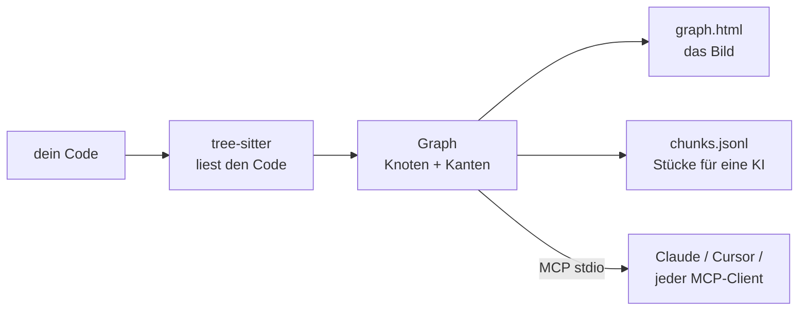

<div align="center">

# repo2graph

**Coding-Agenten belastbare, belegte Antworten über fremde Codebasen geben.**

Stell einem Repository eine Frage und bekomm den Quellcode zurück, der sie beantwortet — jeder
Block mit Datei und Zeilenbereich gestempelt, aus denen er stammt.

<p align="center">
  <a href="../../README.md">English</a> ·
  <a href="README_zh-CN.md">简体中文</a> ·
  <a href="README_ja.md">日本語</a> ·
  <a href="README_fr.md">Français</a> ·
  <a href="README_es.md">Español</a> ·
  <a href="README_de.md">Deutsch</a>
</p>

<table align="center">
<tr>
<th align="center">📦&nbsp; Paket</th>
<th align="center">🩺&nbsp; Zustand</th>
<th align="center">🗂️&nbsp; Gelistet bei</th>
</tr>
<tr>
<td align="center" valign="top">
<a href="https://pypi.org/project/repo2graph/"></a><br />
<a href="https://pypi.org/project/repo2graph/"></a><br />
<a href="../../LICENSE"></a>
</td>
<td align="center" valign="top">
<a href="https://github.com/Srinivasan-78/repo2graph/actions/workflows/ci.yml"></a><br />
<a href="https://github.com/Srinivasan-78/repo2graph/actions/workflows/dependency-audit.yml"></a><br />
<a href="https://github.com/Srinivasan-78/repo2graph/actions/workflows/provenance.yml"></a>
</td>
<td align="center" valign="top">
<a href="https://glama.ai/mcp/servers/Srinivasan-78/repo2graph"></a><br />
<a href="https://mcpservers.org/servers/srinivasan-78/repo2graph"></a><br />
<a href="https://registry.modelcontextprotocol.io/v0/servers?search=repo2graph"></a>
</td>
</tr>
</table>

<p align="center">
  <a href="https://github.com/Srinivasan-78/repo2graph/stargazers"></a>
</p>

<p align="center">
  
</p>

</div>

<!-- mcp-name: io.github.Srinivasan-78/repo2graph -->

> Diese Seite ist eine Übersetzung der englischen Original-[README.md](../../README.md). Im
> Zweifelsfall gilt die englische Fassung.

---

## ⚡ Was ist repo2graph?

Ein Agent, den man in eine Codebasis wirft, die er noch nie gesehen hat, hat zwei schlechte
Möglichkeiten. Grept er nach einem Wort, kippt er entweder ganze passende Dateien in seinen Kontext
oder findet gar nichts, weil der Code die Sache anders benennt als du. Rät er aus den
Trainingsdaten, schreibt er etwas Selbstbewusstes und Falsches. In beiden Fällen kannst du nicht
erkennen, was von beidem gerade passiert ist.

**repo2graph beantwortet Fragen über ein Repository mit dem Quellcode dieses Repositorys.** Frag
„wie wird eine Anfrage authentifiziert", und du bekommst die Funktion zurück, die das tut, dazu die
Funktionen, die sie aufrufen, und die, die sie selbst aufruft — jeder Block überschrieben mit
`[cite: Pfad:Start-Ende]`. Jede Aussage in der Antwort ist damit einen Klick von der Zeile entfernt,
aus der sie stammt. Ist die Antwort falsch, zeigt dir das Zitat, wo sie falsch wurde. Genau darum
geht es.

Erreicht wird das, indem der Code **gelesen** statt durchsucht wird: Ein Parse-Durchlauf hält fest,
wer wen aufruft, wer was importiert und welche Klasse von welcher erbt — und die Suche folgt diesen
Verbindungen, statt weiteren Text zu matchen. Das Ergebnis geht direkt in Claude Code, Cursor oder
jeden anderen **Model-Context-Protocol**-Client, oder wird für jedes andere LLM in einen
Markdown-Kontext mit hartem Token-Limit gepackt.



Kein Projekt-Setup, kein Language Server, kein Build-Schritt — auf einen Ordner zeigen, fertig.

<p align="center">
  
</p>

| Interaktive Leinwand, gezoomt | Filter- und Inspektor-Steuerung |
| :---: | :---: |
|  |  |

`graph.html` ist eine einzelne, in sich geschlossene Datei — kein Server, kein Internet nötig,
Ziehen zum Verschieben, Scrollen zum Zoomen, Klick auf einen Knoten zeigt dessen Code und Nachbarn.

## 👥 Für wen es gedacht ist

| Du bist… | Das Problem | Der erste Schritt |
|---|---|---|
| **🧭 Neu in einer fremden Codebasis** | Die erste Woche geht dafür drauf, Dateien zu lesen, um herauszufinden, welche überhaupt wichtig sind. | `uvx repo2graph build . -o .r2g`, dann `.r2g/human/graph.html` öffnen und bei den Hub-Dateien statt beim Wurzelverzeichnis anfangen. Danach ganze Fragen stellen: `repo2graph rag "<deine Frage>" -o .r2g`. |
| **🤖 Nutzer eines Coding-Agenten** | Der Agent grept, zieht drei komplette Dateien herein und ändert trotzdem die falsche. | `claude mcp add repo2graph -- uvx --from "repo2graph[mcp]" repo2graph-mcp .` — belegte Blöcke unter einer harten Grenze von 12k Tokens statt roher Datei-Dumps. Secrets werden bedingungslos ausgeschlossen; kein Flag schaltet das ab. |
| **🔍 Reviewer eines Pull Requests** | Der Diff hat 40 Zeilen, der Wirkungsradius ist unbekannt. | `repo2graph build . -o .r2g --git-history 500`, dann `repo2graph explain node "sym:src/auth.py::verify" -o .r2g`: Aufrufer, Importeure, Unterklassen — plus die Dateien, die laut Git-Historie ohnehin immer mitgeändert werden (`CO_CHANGE`). |
| **🌱 Open-Source-Maintainer** | Jeder neue Beitragende stellt dieselbe „wo fange ich an"-Frage. | Die GitHub Action mit `commit-branch: graph` einbinden: bei jedem Push eine frische, durchklickbare Karte. Die Job-Zusammenfassung nennt Hub-Dateien, Co-Change-Hotspots und das Graph-Delta seit dem letzten Build. |

## 🔎 Warum repo2graph statt grep oder Vektorsuche?

Beides ist weiterhin im Spiel — `repo2graph` startet jede Anfrage mit BM25-Seeds, dichte Vektoren
sind eine optionale Fusion. Der Unterschied liegt darin, was *nach* dem ersten Treffer passiert.

| | **grep / ripgrep** | **Embedding-Suche** | **repo2graph** |
|---|---|---|---|
| **Findet** | die exakte Zeichenkette | Text, der sich ähnlich liest | das Symbol — und alles, was damit verdrahtet ist |
| **Andere Wörter als im Code** | liefert nichts | kommt damit klar | BM25-Seeds, dann Graph-Sprünge zu Code, den die Anfrage nie benannt hat |
| **„Wer ruft das auf?"** | keine Antwort — ein Treffer im Kommentar rankt wie die Definition | keine Antwort — Nachbarn stecken nicht im Embedding | `CALLS`-Kanten, mit Richtung und `confidence` |
| **„Was bricht, wenn ich das ändere?"** | jeden Treffer von Hand lesen | nicht abgebildet | Aufrufer, Importeure, Unterklassen in einem Sprung |
| **Was zurückkommt** | passende Zeilen oder ganze Dateien, die der Agent dann in den Kontext kippt | Top-k ähnliche Chunks, Aufrufer ungeholt | der Quellcode, der die Frage beantwortet, pro Block mit `[cite: Pfad:Start-Ende]` |
| **Token-Kosten** | unbegrenzt — der Agent entscheidet, wie viel Datei er liest | unbegrenzt | harte Grenze für das *gesamte* Paket, vor der Rückgabe neu gemessen |
| **„Welche Dateien ändern sich zusammen?"** | — | — | `CO_CHANGE`, aus der Git-Historie |
| **Einrichtung** | keine | Index-Build + ein ~90 MB großes Embedding-Modell | ein Parse-Durchlauf, kein Modell, kein API-Key, kein Language Server |
| **Ranking erklärbar** | entfällt | eine Kosinus-Zahl | `repo2graph explain retrieval "<Frage>"` benennt den Seed und die Kante, die jeden Block hereingeholt hat |

**Nimm grep**, wenn du jedes Vorkommen einer wörtlichen Zeichenkette willst — einen Config-Key, eine
Fehlermeldung, ein TODO. repo2graph hat kein besonderes Wissen über String-Literale und wird dabei
nicht besser sein.
**Nimm repo2graph**, wenn die Frage Beziehungen betrifft: Wer ruft das auf, was bricht bei einer
Änderung, wie kommen Daten von A nach B. Ausführlich: **[docs/why-graph.md](../why-graph.md)**
(englisch).

## 🚀 Schnellstart (unter 30 Sekunden)

Python 3.10+ erforderlich. Ausführen über [uv](https://docs.astral.sh/uv/), ohne Installation:

```bash
uvx repo2graph build . -o .r2g && open .r2g/human/graph.html
```

Oder regulär installieren:

```bash
pip install repo2graph
repo2graph build /path/to/project -o .r2g --git-history 200
repo2graph query "how does routing match a path" -o .r2g
```

## 🔌 MCP-Client-Konfiguration

`repo2graph-mcp` ist ein stdio-**MCP-Server**. Er baut seinen eigenen Index beim ersten Aufruf auf,
falls noch keiner existiert — vorher muss nichts ausgeführt werden.

**Claude Code**

```bash
claude mcp add repo2graph -- uvx --from "repo2graph[mcp]" repo2graph-mcp /path/to/project
```

**Claude Desktop** (`claude_desktop_config.json`) und **Cursor** (`.cursor/mcp.json`) — derselbe
Block:

```json
{
  "mcpServers": {
    "repo2graph": {
      "command": "uvx",
      "args": ["--from", "repo2graph[mcp]", "repo2graph-mcp", "/path/to/project"]
    }
  }
}
```

Jeder andere stdio-basierte MCP-Client (Windsurf, Zed, generische Clients) verwendet dasselbe
`command`/`args`-Paar — siehe **[docs/mcp.md](../mcp.md)** (Englisch) für Speicherorte der
Konfigurationsdateien je nach Plattform und Client.

## ✨ Kernfunktionen

| | |
|---|---|
| **Deterministischer Graph statt reiner Embedding-Suche** | Aufrufer, Aufgerufene, Importe und Klassenhierarchien werden aus dem tatsächlichen AST aufgelöst — keine Nächste-Nachbar-Schätzung. |
| **Hybride Suche** | Standardmäßig BM25 + Graph-Nachbarschaftserweiterung; optionale dichte Vektorfusion (`repo2graph embed`) ohne zwingend erforderliche zusätzliche Abhängigkeiten. |
| **Doppelt durchgesetzte Token-Obergrenzen** | Das Budget von `pack_context()` begrenzt das *gesamte* gerenderte Markdown, nicht nur den Chunk-Text — und der MCP-Server begrenzt und misst vor der Rückgabe erneut nach. |
| **17 Grammatiken, vollständig unterstützt** | Python, JS, TS, TSX, Go, Rust, Java, Ruby, C, C++, C#, PHP, Kotlin, Swift, Scala, Bash und Lua erhalten volle Funktions-/Klassen-/Aufruf-Analyse — insgesamt 29 Dateiendungen. Alles andere erscheint trotzdem als Datei auf der Karte. |
| **CI-nativ** | Als GitHub Action veröffentlicht — bei jedem Push einen aktuellen Graphen neben dem Code committen. |
| **Standardmäßig lokal** | `build`, `query`, `rag` und der MCP-Server über stdio führen keinerlei Netzwerkaufrufe aus — zugesichert durch Tests auf Socket-Ebene. `rag --answer` ist der einzige Pfad, der Ihren Code überhaupt irgendwohin sendet, und er gibt vorher Anbieter und Hostnamen aus. Keine Telemetrie. |
| **Export in echte Graph-Werkzeuge** | `graph.graphml` (yEd, Gephi, NetworkX) und `graph.cypher` (Neo4j, Memgraph) entstehen bei jedem Build, ohne zusätzlichen Schritt. |

## ⚖️ Was es tut — und was nicht

Ein Retrieval-Werkzeug, das sich überverkauft, ist schlimmer als gar keines, weil man aufhört,
seine Antworten zu prüfen. Also, unverblümt:

**Es tut**

- Den **Quellcode zurückgeben, der eine Frage beantwortet**, belegt mit `Pfad:Start-Ende`, innerhalb
  eines Token-Budgets, das es **durchsetzt** statt darum zu bitten.
- **Aufrufer, Aufgerufene, Importe und Klassenhierarchien** aus einem echten Parse auflösen — in
  beide Richtungen von jedem Symbol aus begehbar.
- **`CO_CHANGE`** aus der Git-Historie gewinnen: die Dateien, die immer wieder gemeinsam geändert
  werden — etwas, das kein Parser wissen kann.
- **Vollständig lokal laufen**, ohne Modell, ohne Account und ohne Netzwerkaufruf, im CLI, in der CI
  und über MCP.
- **Sauber degradieren**: Eine nicht geparste Sprache erscheint weiterhin als Datei-Knoten und
  bleibt als Text auffindbar; ein fehlender Vektor-Index fällt auf BM25 zurück, statt zu scheitern.

**Es tut nicht**

| Grenze | Was das praktisch bedeutet |
|---|---|
| **Aufrufe über Typen auflösen** | Aufrufe werden über den **Namen** gematcht, mit Scoping nach gleicher Klasse, gleicher Datei und Importen zur Auflösung von Mehrdeutigkeiten. Isoliert das Scoping kein Ziel, fächert der Aufruf in bis zu 5 Kandidatenkanten mit `confidence = 1/n` auf, markiert als `ambiguous`. Filtere auf `confidence == 1.0`, wenn dir Sicherheit wichtiger ist als Trefferquote — in den fünf Benchmark-Repositories sind 4,6 %–21,3 % der `CALLS`-Kanten mehrdeutig. |
| **Dynamic Dispatch sehen** | Ein String-basiertes Lookup, eine Plugin-Registry, `getattr`-artiges Dispatching, ein erst zur Laufzeit aufgelöster virtueller Aufruf — nichts davon steht als Syntax da, also wird keine Kante gezogen. **Kein Pfeil beweist keinen Aufruf.** |
| **Reflection oder berechnete Importe sehen** | `importlib.import_module(name)`, Java-Reflection, ein dynamisches `import()` mit berechnetem Specifier. Nichts Wörtliches zum Auflösen, also nichts zum Verknüpfen. |
| **Dependency Injection bis zur Implementierung verfolgen** | Ein DI-Container bindet zur Laufzeit ein Interface an eine konkrete Klasse. Die Aufrufstelle nennt nur die Interface-Methode, also landet die Kante auf der Deklaration — oder fächert über alle gleichnamigen Implementierungen auf — nie auf der Klasse, die der Container tatsächlich injiziert hat. Über `INHERITS` lassen sich die Kandidaten aufzählen. |
| **Generierten Code unterscheiden** | Eine `.pb.go`, ein gebündeltes `.js`, ein generierter Client — alles genau wie handgeschriebener Code indexiert, ohne jede Markierung. Sie können die Symbolzahl dominieren, ohne eine Zeile darzustellen, die jemand pflegt. Mit `--exclude` ausschließen. |
| **Bemerken, dass sich deine Dateien geändert haben** | Der Index ist eine Momentaufnahme des Baums, aus dem er gebaut wurde; nichts beobachtet das Dateisystem. Änderst du eine Datei, beschreibt der Graph weiter die alte. Neu bauen (`build --incremental` parst nur, was sich bewegt hat) oder die GitHub Action bei jedem Push bauen lassen. `repo2graph doctor` prüft die *Integrität* des Index und Vektor-Drift — nicht, ob dein Arbeitsverzeichnis weitergezogen ist. |
| **Eine Sprachgrenze überqueren** | Python, das über generierte Bindings nach C++ ruft, wird zu einer `CALLS_EXTERNAL`-Kante, nicht zu einem Link auf die C++-Funktion. Das ist eine strukturelle Grenze reiner Quellcode-Analyse, kein Matching-Fehler. |
| **Makrolastiges C/C++ sauber parsen** | tree-sitter erzeugt `ERROR`-Knoten rund um nicht expandierte Makros; ein `cpp`-Preprocessor-Fallback fängt einen Teil davon auf. Erwarte eine nennenswerte `parse_errors`-Zahl in `stats.json` und lies sie als **Untergrenze** der verpassten Symbole. |

Jeder dieser Punkte ist gemessen, nicht behauptet — die Raten, die Repositories, an denen sie
gemessen wurden, und die Reproduktionsbefehle stehen in
**[docs/limitations.md](../limitations.md)** (englisch).

## 🆚 Im Vergleich zu anderen Graph-Werkzeugen

Mehrere Werkzeuge bauen einen Graphen aus einer Codebasis. Der Unterschied liegt darin, was
*zurückkommt*, wenn man eine Frage stellt — ein Bild, ein Teilgraph oder der Code selbst.

| | repo2graph | [Graphify](https://github.com/Graphify-Labs/graphify) | [Code Graph](https://community.obsidian.md/plugins/code-graph) (Obsidian) | grep / Embedding-RAG |
|---|---|---|---|---|
| **Was eine Abfrage zurückgibt** | den Quellcode, gepackt — jeder Block mit `[cite: Pfad:Start-Ende]` überschrieben | einen eingegrenzten Teilgraphen, einen Pfad oder eine Konzepterklärung zum Weiterverfolgen | ein kräftegerichtetes Bild zum Ansehen | passende Zeilen oder Nächste-Nachbar-Chunks |
| **Wie Treffer bewertet werden** | BM25-Seeds, dann k-Sprung-Graph-Erweiterung; optionale dichte Fusion | Graph-Traversierung (ausdrücklich kein Vektorindex) | entfällt — es ist eine Ansicht | rein lexikalisch oder rein vektorbasiert |
| **Token-Budget** | harte Obergrenze für das *gesamte* Paket, vor der Rückgabe neu gemessen (12k-Limit über MCP) | keine Packing-Schicht | entfällt | meist unbegrenzt |
| **Kanten aus der Git-Historie** | `CO_CHANGE`, aus `--git-history` | — | — | — |
| **Läuft ohne Assistent, Modell und Konto** | ja — CLI, MCP oder die GitHub Action | Code-Durchlauf lokal; der Docs-/Medien-Durchlauf nutzt ein Modell | benötigt Obsidian Desktop 1.7.2+ | unterschiedlich |
| **Korpus** | Code in 17 geparsten Grammatiken, jede andere Datei als Text | Code in ~40 Sprachen, dazu Dokumente, PDFs, Bilder, Video | TS/TSX/JS/Python geparst, nur Importe für 8 weitere | alles |

**Greif zu [Graphify](https://github.com/Graphify-Labs/graphify)**, wenn der Graph selbst das Produkt ist: Community-Erkennung,
kürzester Pfad zwischen zwei Konzepten und deine PDFs und Design-Dokumente im selben Graphen wie
der Code.
**Greif zum [Obsidian-Plugin](https://community.obsidian.md/plugins/code-graph)**, wenn ein Mensch den Graphen neben seinen Notizen
*lesen* möchte.
**Greif zu repo2graph**, wenn ein Agent zitierten Quellcode innerhalb eines festen Token-Budgets
braucht, wenn es in CI ohne Modell und ohne Konto laufen muss, oder wenn „welche Dateien ändern
sich immer gemeinsam" Teil der Antwort ist.

Die ausführliche Fassung mit den jeweiligen Kompromissen: **[docs/comparison.md](../comparison.md)**
(Englisch).

## 🛠️ Bereitgestellte MCP-Tools

Fünf Tools. Drei beantworten Fragen zum Code, zwei berichten über den Server selbst.

| Tool | Argumente | Was zurückkommt |
|---|---|---|
| `repo_map` | keine | Sprachen, zentrale Dateien und wichtigste Einstiegspunkte. Über Aufrufe hinweg stabil — zuerst lesen. |
| `repo_search` | `query`, optional `k` (Standard 8, max. 50), `hops` (Standard 1, max. 4), `budget_tokens` (Standard 6000, max. 12000) | Seed-Chunks plus ihre Graph-Nachbarn, jeder Block mit `[cite: Pfad:Start-Ende]` eingeleitet. |
| `repo_neighbours` | `node_id`, optional `hops` (Standard 1, max. 4), `limit` (Standard 20, max. 50) | Ein Graph-Sprung von einer Symbol-/Datei-/Verzeichnis-ID aus: Aufrufer, Aufgerufene, Basisklassen, definierende Datei. |
| `repo_cache_stats` | keine | Zähler des Ergebnis-Caches: `hits`, `misses`, `size`, `max_size`, `ttl_s`, `evictions`, `hit_rate`. Wird selbst nie gecacht. |
| `repo_build_status` | `task_id` | Fortschritt eines Hintergrund-Builds via `--async-build`: `building`, `ready`, `failed` oder `unknown`, mit `progress_pct` und `eta_s`. |

Die drei Code-Tools schließen Geheimnisse bedingungslos aus — kein Flag schaltet das ab — und jedes
numerische Argument wird im Handler begrenzt, sodass ein Aufrufer keine Obergrenze durch Nachfragen
erweitern kann. Vollständiger Vertrag, Argument-Obergrenzen und Client-Konfigurationen:
**[docs/mcp.md](../mcp.md)** (Englisch). Betrieb im Team über HTTP, mit Bearer- oder OIDC-Auth und
Audit-Log: **[docs/ENTERPRISE_DEPLOYMENT.md](../ENTERPRISE_DEPLOYMENT.md)** (Englisch).

## 📐 Architektur & Token-Ökonomie

Die Retrieval-Schicht ist eine **GraphRAG**-Pipeline: [tree-sitter](https://tree-sitter.github.io/tree-sitter/)
parst den Quellcode in einen typisierten Graphen, BM25 wählt die Seed-Chunks, und danach entscheidet
der **Graph** — nicht weitere Textähnlichkeit —, wofür das Budget ausgegeben wird. Dichte Vektoren
(`repo2graph embed`) fließen optional in das Seed-Ranking ein; nichts danach setzt sie voraus.

- **Knoten**: `repo`, `dir`, `file`, `symbol` (Funktion/Methode/Klasse/Struct/Trait/Interface/Typ),
  `module` (externe Abhängigkeit), `external` (ein nicht auflösbares Aufrufziel).
- **Kanten**: `CONTAINS`, `DEFINES`, `IMPORTS`, `CALLS` (trägt `count` + `confidence`),
  `CALLS_EXTERNAL`, `INHERITS`, `CO_CHANGE` (aus `--git-history`, erfordert 3+ gemeinsame
  Änderungen).
- **Die Aufrufauflösung erfolgt namensbasiert, nicht typbasiert** — ein bewusster Kompromiss, der
  repo2graph sprachunabhängig und ohne Konfiguration hält. Mehrdeutige Aufrufe fächern sich in bis
  zu 5 Kandidatenkanten mit `confidence = 1/n` auf; filtere auf `confidence == 1.0`, wenn du
  Gewissheit statt Vollständigkeit brauchst.
- **Zwei Budgetmodelle, bewusst getrennt**: `budget_chars` von `Index.retrieve()` begrenzt nur den
  eigenen Text der Chunks (eine Rückwärtskompatibilitäts-Schnittstelle); `budget_chars` von
  `Index.pack_context()` begrenzt das *gesamte* gerenderte Markdown — Zitat-Header, Trennzeichen,
  alles. Neuer Retrieval-Code sollte auf `pack_context()` aufbauen.
- **Chunking**: etwa ein Chunk pro Funktion/Klasse, bei ~4000 Zeichen geschnitten, mit 8 Zeilen
  Überlappung, damit an der Naht nichts verloren geht; der Header jedes Chunks nennt seine Aufrufer
  und Aufgerufenen — das macht graph-erweitertes Retrieval besser als eine einfache Top-k-Textsuche.

Vollständige Aufschlüsselung jeder Knoten-/Kantenart und des Chunk-Schemas:
**[docs/reference.md](../reference.md)** (Englisch). Die vollständige Pipeline, die Python-API, und
wo der Graph rät (und warum): **[TECHNICAL.md](../../TECHNICAL.md)** (Englisch).

## 📊 Im Einsatz an echten Repositories

Keine Spielzeug-Demo — fünf echte, große, öffentliche Repositories, jedes an einem fixierten Commit
indexiert, mit dem generierten Graphen im Repo und dem exakten Reproduktionsbefehl festgehalten.
Jede Zahl ist gemessen, aus [`benchmarks/results.json`](../../benchmarks/results.json), nicht
geschätzt.

| Repository | Sprache(n) | Umfang | Knoten | Kanten |
|---|---|---|---:|---:|
| [Kubernetes](https://github.com/kubernetes/kubernetes) | Go | eingegrenzt (Controller, Scheduler, API-Server) | 14.451 | 110.246 |
| [TensorFlow](https://github.com/tensorflow/tensorflow) | C++ / Python | eingegrenzt (Python/C++-Grenze) | 21.380 | 115.984 |
| [Django](https://github.com/django/django) | Python | vollständiges Repository | 55.810 | 303.339 |
| [VS Code](https://github.com/microsoft/vscode) | TypeScript | eingegrenzt (`src/vs/`) | 113.080 | 656.158 |
| [Linux-Kernel](https://github.com/torvalds/linux) | C | eingegrenzt (extreme Größenordnung) | 136.219 | 256.413 |

Siehe **[examples/README.md](../../examples/README.md)** für den vollständigen Index und die
Reproduktionsbefehle, **[docs/benchmarks.md](../benchmarks.md)** für die Methodik, und
**[docs/limitations.md](../limitations.md)** dafür, was der Lauf gegen fünf echte Repositories
tatsächlich zutage gefördert hat (Parse-Fehlerraten bei makro-lastigem C/C++, Mehrdeutigkeit von
Aufrufnamen, Grenzen der sprachübergreifenden Auflösung) — alles auf Englisch.

## 📖 CLI- & Server-Referenz

| Befehl | Macht |
|---|---|
| `repo2graph build <path> -o .r2g [--git-history N]` | Parst ein lokales Repository zu einem Graphen + Chunks. |
| `repo2graph github <owner/repo> -o <dir>` | Holt, baut und räumt auf — kein lokaler Clone nötig. |
| `repo2graph query "<question>" -o .r2g` | Lexikalische Suche + Graph-Erweiterung um einen Sprung. |
| `repo2graph rag "<question>" -o .r2g [--vectors] [--answer]` | Budgetbegrenztes GraphRAG-Paket; `--answer` sendet es an ein LLM (optional, Netzwerk). |
| `repo2graph embed -o .r2g [--verify-rag]` | Berechnet/prüft dichte Vektoren für hybride Suche. |
| `repo2graph map -o .r2g [--viz-nodes N]` | Erzeugt `graph.html` mit anderem Knoten-Limit neu. |
| `repo2graph stats -o .r2g [--format text]` | Knoten-/Kanten-/Funktionszahlen für einen bestehenden Index; `--format text` für eine Qualitätsübersicht. |
| `repo2graph doctor [path]` | Prüft Umgebung, Abhängigkeiten, Berechtigungen und Index-Integrität. |
| `repo2graph explain-path <path> [-r <repo>]` | Sagt, ob ein Pfad indexiert würde — und welche Vorrangregel das entschieden hat. |
| `repo2graph-mcp <path> [--no-auto-build] [--async-build]` | stdio-MCP-Server über `.r2g`. |

**Umgebungsvariablen** (nur von `rag --answer` gelesen, in dieser Prioritätsreihenfolge):
`GEMINI_API_KEY` → `OPENAI_API_KEY` → `ANTHROPIC_API_KEY` → `OLLAMA_HOST`. Kein anderer Befehl
macht einen Netzwerkaufruf oder liest diese Variablen. Vollständige Flag-Tabellen und
Budgetberechnung: **[docs/cli.md](../cli.md)** (Englisch).

## 🔐 Sicherheit

`build`, `query`, `rag`, `map`, `stats` und der MCP-Server über stdio öffnen überhaupt keinen
Socket — zugesichert durch Tests auf Socket-Ebene, nicht nur durch Lesen des Codes. **Keinerlei
Telemetrie**, und nichts zum Abschalten.

Vier Befehle können das Netz erreichen, und nur der erste sendet etwas von Ihnen:
`rag --answer` (lädt das Paket hoch; gibt vorher Anbieter und Hostnamen aus),
`repo2graph github` (klont), `repo2graph embed` (lädt einmalig ein Embedding-Modell) und
`repo2graph-mcp --auth-oidc-issuer` (holt öffentliche Schlüssel).

Der MCP-Server schließt Dateien, die wie Zugangsdaten aussehen, bedingungslos aus, ohne Flag zum
Abschalten. Wohin jedes Byte geht und wie man alles löscht: **[docs/PRIVACY.md](../PRIVACY.md)**.
Was ein Angreifer versuchen könnte: **[docs/THREAT_MODEL.md](../THREAT_MODEL.md)**. Gehärtete
Konfigurationen zum Kopieren: **[docs/secure-configuration.md](../secure-configuration.md)**.
Alle drei auf Englisch, ebenso **[SECURITY.md](../../.github/SECURITY.md)**.

## 🤝 Mitwirken & Community

```bash
git clone https://github.com/Srinivasan-78/repo2graph
cd repo2graph
python3 -m venv .venv && .venv/bin/pip install -e ".[dev]"
make lint format-check typecheck test    # die vier Gates, die CI ausführt
```

- **[.github/CONTRIBUTING.md](../../.github/CONTRIBUTING.md)** (Englisch) — vollständiges lokales
  Setup, Code-Stil und der Registry-/Glama-Veröffentlichungsprozess.
- **[docs/BACKLOG.md](../BACKLOG.md)** (Englisch) — bewusst zurückgestellte Arbeit und warum; kommt
  einer Roadmap am nächsten, inklusive eines Abschnitts „Gute erste Issues".
- **[AGENTS.md](../../AGENTS.md)** (Englisch) — die nicht offensichtlichen Konventionen dieser
  Codebasis (Windows-Encoding, Text-Slicing, die zwei Budgetmodelle), bevor du `repo2graph/`
  bearbeitest.
- **[CODE_OF_CONDUCT.md](../../CODE_OF_CONDUCT.md)** (Englisch) — Contributor Covenant v2.1.
- Bug gefunden oder eine Idee für ein Feature?
  [Issue eröffnen](https://github.com/Srinivasan-78/repo2graph/issues/new/choose).

## Lizenz

MIT. Siehe **[LICENSE](../../LICENSE)**.

---

<div align="center">

repo2graph nützlich gefunden? [Gib dem Repo einen Stern](https://github.com/Srinivasan-78/repo2graph)
— das ist der einfachste Weg, anderen zu helfen, es zu finden.

</div>
