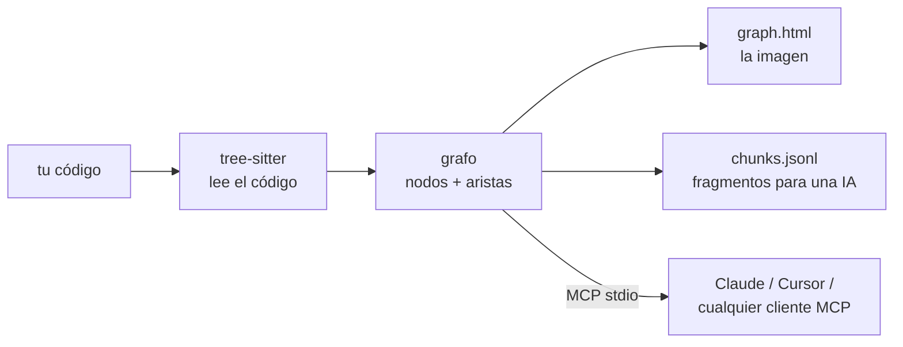

<div align="center">

# repo2graph

**Grafos de código impulsados por AST y GraphRAG sin dependencias, para agentes de codificación con IA y personas**

<p align="center">
  <a href="../../README.md">English</a> ·
  <a href="README_zh-CN.md">简体中文</a> ·
  <a href="README_ja.md">日本語</a> ·
  <a href="README_fr.md">Français</a> ·
  <a href="README_es.md">Español</a> ·
  <a href="README_de.md">Deutsch</a>
</p>

<p align="center">
  <a href="https://glama.ai/mcp/servers/Srinivasan-78/repo2graph"></a>
  <a href="https://mcpservers.org/servers/srinivasan-78/repo2graph"></a>
  <a href="https://pypi.org/project/repo2graph/"></a>
  <a href="https://pypi.org/project/repo2graph/"></a>
  <a href="../../LICENSE"></a>
  <a href="https://github.com/Srinivasan-78/repo2graph/actions/workflows/ci.yml"></a>
  
  <a href="https://github.com/Srinivasan-78/repo2graph/stargazers"></a>
</p>

<p align="center">
  
</p>

</div>

<!-- mcp-name: io.github.Srinivasan-78/repo2graph -->

> Esta página es una traducción del [README.md](../../README.md) original en inglés. En caso de
> discrepancia, prevalece la versión en inglés.

---

## ⚡ ¿Qué es repo2graph?

Cuando un agente de codificación con IA busca en una base de código con grep o coincidencia simple
de palabras clave, o bien vuelca archivos completos en su contexto — agotando el presupuesto de
tokens y perdiendo toda la estructura —, o directamente no encuentra la implementación porque la
consulta usó palabras distintas a las del código.

**repo2graph** analiza el código fuente con [tree-sitter](https://tree-sitter.github.io/tree-sitter/)
para construir un grafo de relaciones de código reales — `CALLS` (llamadas), `IMPORTS`
(importaciones), `INHERITS` (herencia), `DEFINES` (definiciones), `CO_CHANGE` (cambios conjuntos) —
y expone ese grafo a los agentes mediante el **Model Context Protocol (MCP)**, o lo empaqueta en un
contexto markdown acotado por presupuesto de tokens para cualquier LLM. Cada bloque devuelto lleva
un ancla de cita exacta `[cite: ruta:inicio-fin]`, de modo que las respuestas se pueden rastrear
hasta el código fuente en lugar de ser una paráfrasis basada en una suposición.



Sin configuración de proyecto, sin servidor de lenguaje, sin paso de compilación — apúntalo a una
carpeta y funciona.

<p align="center">
  
</p>

| Lienzo interactivo, ampliado | Controles de filtro e inspector |
| :---: | :---: |
|  |  |

`graph.html` es un único archivo autocontenido — sin servidor, sin necesidad de internet, arrastra
para desplazarte, usa la rueda para hacer zoom, haz clic en un nodo para inspeccionar su código y
sus vecinos.

## 🚀 Inicio rápido (en menos de 30 segundos)

Requiere Python 3.10 o superior. Ejecútalo con [uv](https://docs.astral.sh/uv/), sin paso de
instalación:

```bash
uvx repo2graph build . -o .r2g && open .r2g/human/graph.html
```

O instálalo de forma habitual:

```bash
pip install repo2graph
repo2graph build /path/to/project -o .r2g --git-history 200
repo2graph query "how does routing match a path" -o .r2g
```

## 🔌 Configuración de clientes MCP

`repo2graph-mcp` es un servidor **MCP** por stdio. Construye su propio índice en la primera
llamada si aún no existe uno — nada que ejecutar de antemano.

**Claude Code**

```bash
claude mcp add repo2graph -- uvx --from "repo2graph[mcp]" repo2graph-mcp /path/to/project
```

**Claude Desktop** (`claude_desktop_config.json`) y **Cursor** (`.cursor/mcp.json`) — el mismo
bloque:

```json
{
  "mcpServers": {
    "repo2graph": {
      "command": "uvx",
      "args": ["--from", "repo2graph[mcp]", "repo2graph-mcp", "/path/to/project"]
    }
  }
}
```

Cualquier otro cliente MCP basado en stdio (Windsurf, Zed, clientes genéricos) usa el mismo par
`command`/`args` — consulta **[docs/mcp.md](../mcp.md)** (en inglés) para las rutas de los
archivos de configuración según la plataforma y el cliente.

## ✨ Características clave

| | |
|---|---|
| **Grafo determinista, no solo búsqueda por embeddings** | Llamadores, llamados, importaciones y jerarquías de clases resueltos a partir del AST real — no una suposición por vecino más cercano. |
| **Recuperación híbrida** | BM25 + expansión por vecinos del grafo por defecto; fusión vectorial densa opcional (`repo2graph embed`) sin ninguna dependencia adicional obligatoria. |
| **Límites de tokens aplicados dos veces** | El presupuesto de `pack_context()` acota el markdown renderizado *en su totalidad*, no solo el texto de los fragmentos — y el servidor MCP recorta y vuelve a medir antes de devolver. |
| **15 lenguajes, tratamiento completo** | Python, JS/TS/TSX, Go, Rust, Java, Ruby, C, C++, C#, PHP, Kotlin, Swift, Scala y Bash reciben análisis de funciones/clases/llamadas. Todo lo demás igualmente aparece como archivos en el mapa. |
| **Nativo para CI** | Publicado como GitHub Action — versiona un grafo actualizado junto a tu código en cada push. |
| **Local por defecto** | `build`, `query`, `rag` y el servidor MCP no realizan ninguna llamada de red. La única excepción opcional (`rag --answer`) imprime el proveedor y el host antes de enviar nada. |
| **Exportación a herramientas de grafos reales** | `graph.graphml` (yEd, Gephi, NetworkX) y `graph.cypher` (Neo4j, Memgraph) se generan en cada build, sin pasos adicionales. |

## 🛠️ Herramientas MCP expuestas

| Herramienta | Argumentos | Qué devuelve |
|---|---|---|
| `repo_map` | ninguno | Lenguajes, archivos centrales y principales puntos de entrada. Estable entre llamadas — léelo primero. |
| `repo_search` | `query`, opcional `k` (por defecto 8, máx. 50), `hops` (por defecto 1, máx. 4), `budget_tokens` (por defecto 6000, máx. 12000) | Fragmentos semilla más sus vecinos de grafo, cada bloque encabezado con `[cite: ruta:inicio-fin]`. |
| `repo_neighbours` | `node_id`, opcional `hops` (máx. 4), `limit` (por defecto 20, máx. 50) | Un salto de grafo desde un id de símbolo/archivo/directorio: llamadores, llamados, clases base, archivo donde se define. |

Los secretos se excluyen incondicionalmente en cada llamada a una herramienta — ninguna opción
desactiva esto. Contrato completo, incluidas las dos herramientas de diagnóstico
(`repo_cache_stats`, `repo_build_status`) añadidas para despliegues de servidor de larga duración:
**[docs/mcp.md](../mcp.md)** (en inglés).

## 📐 Arquitectura y economía de tokens

- **Nodos**: `repo`, `dir`, `file`, `symbol` (función/método/clase/struct/trait/interfaz/tipo),
  `module` (dependencia externa), `external` (un objetivo de llamada no resuelto).
- **Aristas**: `CONTAINS`, `DEFINES`, `IMPORTS`, `CALLS` (lleva `count` y `confidence`),
  `CALLS_EXTERNAL`, `INHERITS`, `CO_CHANGE` (de `--git-history`, requiere 3 o más co-ediciones).
- **La resolución de llamadas se basa en el nombre, no en el tipo** — una decisión deliberada que
  mantiene a repo2graph independiente del lenguaje y sin configuración. Las llamadas ambiguas se
  expanden hasta en 5 aristas candidatas con `confidence = 1/n`; filtra por `confidence == 1.0`
  cuando necesites certeza en vez de exhaustividad.
- **Dos modelos de presupuesto, a propósito**: `budget_chars` de `Index.retrieve()` acota solo el
  texto propio de los fragmentos (una interfaz de compatibilidad retroactiva); `budget_chars` de
  `Index.pack_context()` acota el markdown renderizado *en su totalidad* — encabezados de cita,
  separadores, todo. El nuevo código de recuperación debe construirse sobre `pack_context()`.
- **Fragmentación**: aproximadamente un fragmento por función/clase, cortado en ~4000 caracteres
  con un solape de 8 líneas para no perder nada en la costura; el encabezado de cada fragmento
  nombra a sus llamadores y llamados, que es lo que hace que la recuperación expandida por grafo
  sea mejor que una simple búsqueda de texto top-k.

Desglose completo de cada tipo de nodo/arista y el esquema de fragmentos:
**[docs/reference.md](../reference.md)** (en inglés). El pipeline completo, la API de Python, y
dónde el grafo adivina (y por qué): **[TECHNICAL.md](../../TECHNICAL.md)** (en inglés).

## 📊 Puesto a prueba en repositorios reales

No es una demo de juguete — cinco repositorios públicos reales y grandes, cada uno indexado en un
commit fijo, con el grafo generado versionado y el comando exacto de reproducción registrado. Cada
número está medido, tomado de [`benchmarks/results.json`](../../benchmarks/results.json), no
estimado.

| Repositorio | Lenguaje(s) | Alcance | Nodos | Aristas |
|---|---|---|---:|---:|
| [Kubernetes](https://github.com/kubernetes/kubernetes) | Go | acotado (controllers, scheduler, API server) | 14.197 | 83.525 |
| [TensorFlow](https://github.com/tensorflow/tensorflow) | C++ / Python | acotado (frontera Python/C++) | 20.641 | 96.013 |
| [Django](https://github.com/django/django) | Python | repositorio completo | 54.544 | 228.461 |
| [VS Code](https://github.com/microsoft/vscode) | TypeScript | acotado (`src/vs/`) | 113.115 | 431.453 |
| [Linux kernel](https://github.com/torvalds/linux) | C | acotado (escala extrema) | 136.182 | 257.655 |

Consulta **[examples/README.md](../../examples/README.md)** para el índice completo y los comandos
de reproducción, **[docs/benchmarks.md](../benchmarks.md)** para la metodología, y
**[docs/limitations.md](../limitations.md)** para lo que reveló realmente ejecutar el pipeline
contra cinco repositorios reales (tasas de error de parseo en C/C++ con muchas macros, ambigüedad
de nombres de llamadas, límites de resolución entre lenguajes) — todo en inglés.

## 📖 Referencia de CLI y servidor

| Comando | Hace |
|---|---|
| `repo2graph build <path> -o .r2g [--git-history N]` | Analiza un repositorio local en un grafo + fragmentos. |
| `repo2graph github <owner/repo> -o <dir>` | Descarga, construye y limpia — sin necesidad de clonar localmente. |
| `repo2graph query "<question>" -o .r2g` | Búsqueda léxica + expansión de grafo de un salto. |
| `repo2graph rag "<question>" -o .r2g [--vectors] [--answer]` | Paquete GraphRAG acotado por presupuesto; `--answer` lo envía a un LLM (opcional, red). |
| `repo2graph embed -o .r2g [--verify-rag]` | Calcula/verifica vectores densos para búsqueda híbrida. |
| `repo2graph map -o .r2g [--viz-nodes N]` | Regenera `graph.html` con un límite de nodos distinto. |
| `repo2graph stats -o .r2g` | Conteos de nodos/aristas/funciones para un índice existente. |
| `repo2graph-mcp <path> [--no-auto-build] [--async-build]` | Servidor MCP por stdio sobre `.r2g`. |

**Variables de entorno** (leídas solo por `rag --answer`, en este orden de precedencia):
`GEMINI_API_KEY` → `OPENAI_API_KEY` → `ANTHROPIC_API_KEY` → `OLLAMA_HOST`. Ningún otro comando
realiza llamadas de red ni lee estas variables. Tablas completas de opciones y cálculo del
presupuesto: **[docs/cli.md](../cli.md)** (en inglés).

## 🔐 Seguridad

`build`, `query`, `rag` y el servidor MCP no realizan ninguna llamada de red. `rag --answer` es la
única excepción opcional — envía el paquete ensamblado a un proveedor de LLM e imprime el proveedor
y el host antes de hacerlo. El servidor MCP excluye incondicionalmente archivos con apariencia de
credenciales, sin ninguna opción para desactivarlo. Detalles: **[SECURITY.md](../../SECURITY.md)**
(en inglés).

## 🤝 Contribución y comunidad

```bash
git clone https://github.com/Srinivasan-78/repo2graph
cd repo2graph
python3 -m venv .venv && .venv/bin/pip install -e ".[dev]"
make lint test   # o: ruff check . && pytest
```

- **[.github/CONTRIBUTING.md](../../.github/CONTRIBUTING.md)** (en inglés) — configuración completa
  del entorno de desarrollo local, estilo de código, y el proceso de publicación en el registro/Glama.
- **[docs/BACKLOG.md](../BACKLOG.md)** (en inglés) — trabajo deliberadamente aplazado y por qué; lo
  más parecido a una hoja de ruta, con una sección de "buenos primeros issues".
- **[AGENTS.md](../../AGENTS.md)** (en inglés) — las convenciones no evidentes de esta base de
  código (codificación en Windows, corte de texto, los dos modelos de presupuesto) antes de editar
  `repo2graph/`.
- **[CODE_OF_CONDUCT.md](../../CODE_OF_CONDUCT.md)** (en inglés) — Contributor Covenant v2.1.
- ¿Encontraste un bug o tienes una idea de funcionalidad?
  [Abre un issue](https://github.com/Srinivasan-78/repo2graph/issues/new/choose).

## Licencia

MIT. Consulta **[LICENSE](../../LICENSE)**.

---

<div align="center">

¿Te resulta útil repo2graph? [Dale una estrella al repositorio](https://github.com/Srinivasan-78/repo2graph)
— es la forma más fácil de ayudar a que otras personas lo encuentren.

</div>
