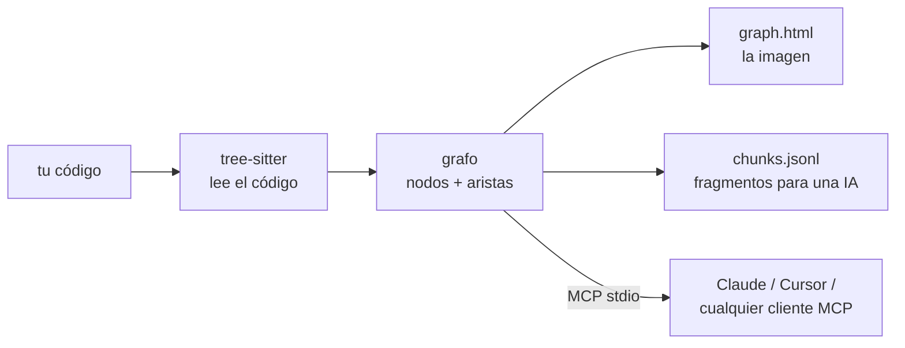

<div align="center">

# repo2graph

**Dar a los agentes de codificación respuestas fiables y con cita sobre bases de código que no conocen.**

Hazle una pregunta a un repositorio y recibe el código fuente que la responde, con cada bloque
sellado con el archivo y el rango de líneas del que salió.

<p align="center">
  <a href="../../README.md">English</a> ·
  <a href="README_zh-CN.md">简体中文</a> ·
  <a href="README_ja.md">日本語</a> ·
  <a href="README_fr.md">Français</a> ·
  <a href="README_es.md">Español</a> ·
  <a href="README_de.md">Deutsch</a>
</p>

<table align="center">
<tr>
<th align="center">📦&nbsp; Paquete</th>
<th align="center">🩺&nbsp; Estado</th>
<th align="center">🗂️&nbsp; Listado en</th>
</tr>
<tr>
<td align="center" valign="top">
<a href="https://pypi.org/project/repo2graph/"></a><br />
<a href="https://pypi.org/project/repo2graph/"></a><br />
<a href="../../LICENSE"></a>
</td>
<td align="center" valign="top">
<a href="https://github.com/Srinivasan-78/repo2graph/actions/workflows/ci.yml"></a><br />
<a href="https://github.com/Srinivasan-78/repo2graph/actions/workflows/dependency-audit.yml"></a><br />
<a href="https://github.com/Srinivasan-78/repo2graph/actions/workflows/provenance.yml"></a>
</td>
<td align="center" valign="top">
<a href="https://glama.ai/mcp/servers/Srinivasan-78/repo2graph"></a><br />
<a href="https://mcpservers.org/servers/srinivasan-78/repo2graph"></a><br />
<a href="https://registry.modelcontextprotocol.io/v0/servers?search=repo2graph"></a>
</td>
</tr>
</table>

<p align="center">
  <a href="https://github.com/Srinivasan-78/repo2graph/stargazers"></a>
</p>

<p align="center">
  
</p>

</div>

<!-- mcp-name: io.github.Srinivasan-78/repo2graph -->

> Esta página es una traducción del [README.md](../../README.md) original en inglés. En caso de
> discrepancia, prevalece la versión en inglés.

---

## ⚡ ¿Qué es repo2graph?

Un agente al que sueltan en una base de código que nunca ha visto tiene dos malas opciones. Si hace
grep de una palabra, o inunda su contexto con archivos enteros, o no encuentra nada porque el
código nombra la idea de otra forma que tú. Si lo adivina a partir de sus datos de entrenamiento,
escribe algo seguro de sí mismo y equivocado. En cualquiera de los dos casos, no puedes saber cuál
de las dos acaba de ocurrir.

**repo2graph responde preguntas sobre un repositorio con el propio código fuente de ese
repositorio.** Pregunta «cómo se autentica una petición» y obtendrás la función que lo hace, las
funciones que la llaman y las que ella llama — cada bloque encabezado por
`[cite: ruta:inicio-fin]`, de modo que cada afirmación de la respuesta queda a un clic de la línea
de la que salió. Si la respuesta es incorrecta, la cita te enseña dónde se torció. De eso se trata.

Lo consigue **leyendo** el código en lugar de buscarlo: una sola pasada de análisis registra quién
llama a quién, quién importa qué y qué clase hereda de cuál, y la recuperación sigue esos enlaces
en vez de emparejar más texto. El resultado se sirve directamente a Claude Code, Cursor o cualquier
cliente del **Model Context Protocol**, o se empaqueta en un contexto markdown con un techo de
tokens estricto para cualquier otro LLM.



Sin configuración de proyecto, sin servidor de lenguaje, sin paso de compilación — apúntalo a una
carpeta y funciona.

<p align="center">
  
</p>

| Lienzo interactivo, ampliado | Controles de filtro e inspector |
| :---: | :---: |
|  |  |

`graph.html` es un único archivo autocontenido — sin servidor, sin necesidad de internet, arrastra
para desplazarte, usa la rueda para hacer zoom, haz clic en un nodo para inspeccionar su código y
sus vecinos.

## 👥 Para quién es

| Eres… | El problema | Lo primero que ejecutar |
|---|---|---|
| **🧭 Alguien que llega a una base de código desconocida** | La primera semana se va en leer archivos para averiguar cuáles importan. | `uvx repo2graph build . -o .r2g`, abre `.r2g/human/graph.html` y empieza por los archivos concentradores en lugar del directorio raíz. Después pregunta cosas enteras: `repo2graph rag "<tu pregunta>" -o .r2g`. |
| **🤖 Quien usa un agente de codificación** | El agente hace grep, se trae tres archivos completos y aun así edita el equivocado. | `claude mcp add repo2graph -- uvx --from "repo2graph[mcp]" repo2graph-mcp .` — bloques con cita bajo un techo estricto de 12k tokens en lugar de volcados de archivos. Los secretos se excluyen sin condiciones; ninguna opción lo desactiva. |
| **🔍 Quien revisa una pull request** | El diff tiene 40 líneas; el radio de impacto es una incógnita. | `repo2graph build . -o .r2g --git-history 500` y luego `repo2graph explain node "sym:src/auth.py::verify" -o .r2g`: quién lo llama, quién lo importa, qué lo hereda — y los archivos que el historial de git dice que siempre cambian con él (`CO_CHANGE`). |
| **🌱 Mantenedor de un proyecto de código abierto** | Cada nuevo colaborador hace la misma pregunta: «¿por dónde empiezo?». | Añade la GitHub Action con `commit-branch: graph`: un mapa nuevo y navegable en cada push. El resumen del job lista archivos concentradores, puntos calientes de cambio conjunto y el delta del grafo desde la última compilación. |

## 🔎 ¿Por qué repo2graph en lugar de grep o búsqueda vectorial?

Ninguno de los dos queda fuera — `repo2graph` siembra cada consulta con BM25, y los vectores densos
son una fusión opcional. La diferencia está en lo que ocurre *después* de la primera coincidencia.

| | **grep / ripgrep** | **Búsqueda por embeddings** | **repo2graph** |
|---|---|---|---|
| **Encuentra** | la cadena exacta | texto que se lee parecido | el símbolo y todo lo que está conectado a él |
| **Palabras distintas a las del código** | no devuelve nada | lo resuelve | semillas BM25 y luego saltos de grafo hasta código que la consulta nunca nombró |
| **«¿Quién llama a esto?»** | no puede responder — una coincidencia en un comentario puntúa igual que la definición | no puede responder — los vecinos no están en el embedding | aristas `CALLS`, con dirección y `confidence` |
| **«¿Qué se rompe si cambio esto?»** | leer cada resultado a mano | no está representado | quien lo llama, quien lo importa y quien lo hereda en un salto |
| **Qué devuelve** | líneas coincidentes, o archivos enteros que el agente vuelca luego en contexto | los k fragmentos más parecidos, sin traer a quien los llama | el código fuente que responde, cada bloque encabezado por `[cite: ruta:inicio-fin]` |
| **Coste en tokens** | sin límite — el agente decide cuánto archivo lee | sin límite | techo estricto sobre *todo* el paquete, vuelto a medir antes de devolverlo |
| **«¿Qué archivos cambian juntos?»** | — | — | `CO_CHANGE`, extraído del historial de git |
| **Puesta en marcha** | ninguna | construir un índice + un modelo de embeddings de unos 90 MB | una pasada de análisis, sin modelo, sin clave de API, sin servidor de lenguaje |
| **Ranking explicable** | no aplica | un número coseno | `repo2graph explain retrieval "<pregunta>"` nombra la semilla y la arista que trajo cada bloque |

**Usa grep** cuando quieras todas las apariciones de una cadena literal — una clave de
configuración, un mensaje de error, un TODO. repo2graph no tiene conocimiento especial de los
literales de cadena y no lo va a superar.
**Usa repo2graph** cuando la pregunta sea sobre relaciones: qué llama a esto, qué se rompe si lo
cambio, cómo llegan los datos de A a B. Versión larga:
**[docs/why-graph.md](../why-graph.md)** (en inglés).

## 🚀 Inicio rápido (en menos de 30 segundos)

Requiere Python 3.10 o superior. Ejecútalo con [uv](https://docs.astral.sh/uv/), sin paso de
instalación:

```bash
uvx repo2graph build . -o .r2g && open .r2g/human/graph.html
```

O instálalo de forma habitual:

```bash
pip install repo2graph
repo2graph build /path/to/project -o .r2g --git-history 200
repo2graph query "how does routing match a path" -o .r2g
```

## 🔌 Configuración de clientes MCP

`repo2graph-mcp` es un servidor **MCP** por stdio. Construye su propio índice en la primera
llamada si aún no existe uno — nada que ejecutar de antemano.

**Claude Code**

```bash
claude mcp add repo2graph -- uvx --from "repo2graph[mcp]" repo2graph-mcp /path/to/project
```

**Claude Desktop** (`claude_desktop_config.json`) y **Cursor** (`.cursor/mcp.json`) — el mismo
bloque:

```json
{
  "mcpServers": {
    "repo2graph": {
      "command": "uvx",
      "args": ["--from", "repo2graph[mcp]", "repo2graph-mcp", "/path/to/project"]
    }
  }
}
```

Cualquier otro cliente MCP basado en stdio (Windsurf, Zed, clientes genéricos) usa el mismo par
`command`/`args` — consulta **[docs/mcp.md](../mcp.md)** (en inglés) para las rutas de los
archivos de configuración según la plataforma y el cliente.

## ✨ Características clave

| | |
|---|---|
| **Grafo determinista, no solo búsqueda por embeddings** | Llamadores, llamados, importaciones y jerarquías de clases resueltos a partir del AST real — no una suposición por vecino más cercano. |
| **Recuperación híbrida** | BM25 + expansión por vecinos del grafo por defecto; fusión vectorial densa opcional (`repo2graph embed`) sin ninguna dependencia adicional obligatoria. |
| **Límites de tokens aplicados dos veces** | El presupuesto de `pack_context()` acota el markdown renderizado *en su totalidad*, no solo el texto de los fragmentos — y el servidor MCP recorta y vuelve a medir antes de devolver. |
| **17 gramáticas, tratamiento completo** | Python, JS, TS, TSX, Go, Rust, Java, Ruby, C, C++, C#, PHP, Kotlin, Swift, Scala, Bash y Lua reciben análisis de funciones/clases/llamadas — 29 extensiones de archivo en total. Todo lo demás igualmente aparece como archivos en el mapa. |
| **Nativo para CI** | Publicado como GitHub Action — versiona un grafo actualizado junto a tu código en cada push. |
| **Local por defecto** | `build`, `query`, `rag` y el servidor MCP por stdio no realizan ninguna llamada de red — garantizado por pruebas a nivel de socket. `rag --answer` es el único camino que envía tu código a algún sitio, e imprime el proveedor y el host antes de hacerlo. Sin telemetría. |
| **Exportación a herramientas de grafos reales** | `graph.graphml` (yEd, Gephi, NetworkX) y `graph.cypher` (Neo4j, Memgraph) se generan en cada build, sin pasos adicionales. |

## ⚖️ Lo que hace — y lo que no

Una herramienta de recuperación que se vende de más es peor que no tener ninguna, porque dejas de
comprobar sus respuestas. Así que, sin rodeos:

**Sí hace**

- Devolver el **código fuente que responde a una pregunta**, citado a `ruta:inicio-fin`, dentro de
  un presupuesto de tokens que **impone** en lugar de pedir.
- Resolver **quién llama, a quién se llama, importaciones y jerarquías de clases** a partir de un
  análisis real del código, recorribles en ambos sentidos desde cualquier símbolo.
- Extraer **`CO_CHANGE`** del historial de git: los archivos que se editan una y otra vez juntos,
  algo que ningún analizador puede deducir.
- Funcionar **totalmente en local**, sin modelo, sin cuenta y sin ninguna llamada de red, en la CLI,
  en CI y por MCP.
- **Degradarse con elegancia**: un lenguaje no analizado sigue apareciendo como nodo de archivo y
  sigue siendo recuperable como texto; si falta el índice vectorial, se cae a BM25 en vez de fallar.

**No hace**

| Limitación | Qué significa en la práctica |
|---|---|
| **Resolver llamadas por tipo** | Las llamadas se emparejan por **nombre**, con acotado por misma clase, mismo archivo e importaciones para deshacer empates. Cuando el acotado no aísla un destino, la llamada se abre en hasta 5 aristas candidatas con `confidence = 1/n`, marcadas como `ambiguous`. Filtra por `confidence == 1.0` si prefieres certeza sobre cobertura: entre el 4,6 % y el 21,3 % de las aristas `CALLS` son ambiguas en los cinco repositorios de referencia. |
| **Ver despacho dinámico** | Una búsqueda por clave de cadena, un registro de plugins, despacho al estilo `getattr`, una llamada virtual resuelta en tiempo de ejecución: nada de eso está escrito como sintaxis, así que no se dibuja ninguna arista. **Que no haya flecha no demuestra que no haya llamada.** |
| **Ver reflexión o importaciones calculadas** | `importlib.import_module(name)`, la reflexión de Java, un `import()` dinámico con especificador calculado. No hay nada literal que resolver, así que no hay nada que enlazar. |
| **Seguir la inyección de dependencias hasta la implementación** | Un contenedor de inyección enlaza una interfaz con una clase concreta en tiempo de ejecución. El punto de llamada solo nombra el método de la interfaz, así que la arista aterriza en la declaración (o se abre sobre todas las implementaciones con ese nombre), nunca sobre la clase que el contenedor inyectó de verdad. Recorre `INHERITS` para enumerar las candidatas. |
| **Distinguir el código generado** | Un `.pb.go`, un `.js` empaquetado, un cliente generado: todo se indexa exactamente igual que el código escrito a mano, sin ninguna marca. Pueden dominar el recuento de símbolos sin representar una línea que nadie mantiene. Exclúyelos con `--exclude`. |
| **Darse cuenta de que tus archivos cambiaron** | El índice es una instantánea del árbol con el que se construyó; nada vigila el sistema de archivos. Edita un archivo y el grafo seguirá describiendo el anterior. Reconstruye (`build --incremental` solo reanaliza lo que se movió), o deja que la GitHub Action reconstruya en cada push. `repo2graph doctor` comprueba la *integridad* del índice y la deriva de los vectores, no si tu copia de trabajo ha avanzado. |
| **Cruzar una frontera de lenguaje** | Python llamando a C++ mediante bindings generados se convierte en una arista `CALLS_EXTERNAL`, no en un enlace a la función de C++. Es un límite estructural del análisis estático solo de fuentes, no un fallo de emparejamiento. |
| **Analizar limpiamente C/C++ cargado de macros** | tree-sitter emite nodos `ERROR` alrededor de las macros sin expandir; un repliegue al preprocesador `cpp` recupera una parte. Cuenta con un `parse_errors` no trivial en `stats.json` y léelo como un **suelo** de los símbolos que se perdieron. |

Cada uno de estos puntos está medido, no afirmado: las tasas, los repositorios donde se midieron y
los comandos de reproducción están en **[docs/limitations.md](../limitations.md)** (en inglés).

## 🆚 Comparativa con otras herramientas de grafos

Varias herramientas construyen un grafo a partir de una base de código. Lo que las separa es qué
*vuelve* cuando haces una pregunta: una imagen, un subgrafo o el código en sí.

| | repo2graph | [Graphify](https://github.com/Graphify-Labs/graphify) | [Code Graph](https://community.obsidian.md/plugins/code-graph) (Obsidian) | grep / RAG por embeddings |
|---|---|---|---|---|
| **Qué devuelve una consulta** | el código fuente, empaquetado — cada bloque encabezado por `[cite: ruta:inicio-fin]` | un subgrafo acotado, una ruta o una explicación conceptual para recorrer | una imagen dirigida por fuerzas para leer | líneas coincidentes, o fragmentos por vecino más cercano |
| **Cómo se ordenan los resultados** | semillas BM25 y después expansión del grafo a k saltos; fusión densa opcional | recorrido del grafo (explícitamente, no un índice vectorial) | no aplica — es una vista | solo léxico, o solo vectorial |
| **Presupuesto de tokens** | tope duro sobre *todo* el paquete, remedido antes de devolverlo (límite de 12k vía MCP) | no es una capa de empaquetado | no aplica | normalmente sin límite |
| **Aristas del historial de git** | `CO_CHANGE`, desde `--git-history` | — | — | — |
| **Funciona sin asistente, sin modelo, sin cuenta** | sí — CLI, MCP o la GitHub Action | la pasada de código es local; la de docs/medios usa un modelo | necesita Obsidian escritorio 1.7.2+ | varía |
| **Corpus** | código en 17 gramáticas analizadas, cualquier otro archivo como texto | código en ~40 lenguajes, más documentos, PDF, imágenes, vídeo | TS/TSX/JS/Python analizados, solo imports para 8 más | cualquier cosa |

**Recurre a [Graphify](https://github.com/Graphify-Labs/graphify)** cuando el grafo en sí es el producto: detección de comunidades,
camino más corto entre dos conceptos, y tus PDF y documentos de diseño en el mismo grafo que el
código.
**Recurre al [plugin de Obsidian](https://community.obsidian.md/plugins/code-graph)** cuando una persona quiere *leer* el grafo junto a
sus notas.
**Recurre a repo2graph** cuando un agente necesita código fuente citado dentro de un presupuesto
fijo de tokens, cuando tiene que correr en CI sin modelo ni cuenta, o cuando «qué archivos cambian
siempre juntos» forma parte de la respuesta.

La versión larga, con las concesiones que implica cada opción:
**[docs/comparison.md](../comparison.md)** (en inglés).

## 🛠️ Herramientas MCP expuestas

Cinco herramientas. Tres responden preguntas sobre el código; dos informan sobre el propio servidor.

| Herramienta | Argumentos | Qué devuelve |
|---|---|---|
| `repo_map` | ninguno | Lenguajes, archivos centrales y principales puntos de entrada. Estable entre llamadas — léelo primero. |
| `repo_search` | `query`, opcional `k` (por defecto 8, máx. 50), `hops` (por defecto 1, máx. 4), `budget_tokens` (por defecto 6000, máx. 12000) | Fragmentos semilla más sus vecinos de grafo, cada bloque encabezado con `[cite: ruta:inicio-fin]`. |
| `repo_neighbours` | `node_id`, opcional `hops` (por defecto 1, máx. 4), `limit` (por defecto 20, máx. 50) | Un salto de grafo desde un id de símbolo/archivo/directorio: llamadores, llamados, clases base, archivo donde se define. |
| `repo_cache_stats` | ninguno | Contadores de la caché de resultados: `hits`, `misses`, `size`, `max_size`, `ttl_s`, `evictions`, `hit_rate`. Nunca se cachea a sí misma. |
| `repo_build_status` | `task_id` | Progreso de una construcción en segundo plano con `--async-build`: `building`, `ready`, `failed` o `unknown`, con `progress_pct` y `eta_s`. |

Las tres herramientas de código excluyen los secretos incondicionalmente — ninguna opción lo
desactiva — y todo argumento numérico se acota en el manejador, de modo que quien llama no puede
ampliar un límite pidiéndolo. Contrato completo, topes de argumentos y configuraciones de cliente:
**[docs/mcp.md](../mcp.md)** (en inglés). Ejecución compartida, sobre HTTP, con autenticación bearer
u OIDC y registro de auditoría: **[docs/ENTERPRISE_DEPLOYMENT.md](../ENTERPRISE_DEPLOYMENT.md)**
(en inglés).

## 📐 Arquitectura y economía de tokens

La capa de recuperación es una canalización **GraphRAG**: [tree-sitter](https://tree-sitter.github.io/tree-sitter/)
analiza el código fuente en un grafo tipado, BM25 elige los fragmentos semilla y, a partir de ahí,
es el **grafo** — y no más similitud textual — quien decide en qué merece la pena gastar el
presupuesto. Los vectores densos (`repo2graph embed`) pueden fusionarse en el ranking de semillas;
nada aguas abajo los exige.

- **Nodos**: `repo`, `dir`, `file`, `symbol` (función/método/clase/struct/trait/interfaz/tipo),
  `module` (dependencia externa), `external` (un objetivo de llamada no resuelto).
- **Aristas**: `CONTAINS`, `DEFINES`, `IMPORTS`, `CALLS` (lleva `count` y `confidence`),
  `CALLS_EXTERNAL`, `INHERITS`, `CO_CHANGE` (de `--git-history`, requiere 3 o más co-ediciones).
- **La resolución de llamadas se basa en el nombre, no en el tipo** — una decisión deliberada que
  mantiene a repo2graph independiente del lenguaje y sin configuración. Las llamadas ambiguas se
  expanden hasta en 5 aristas candidatas con `confidence = 1/n`; filtra por `confidence == 1.0`
  cuando necesites certeza en vez de exhaustividad.
- **Dos modelos de presupuesto, a propósito**: `budget_chars` de `Index.retrieve()` acota solo el
  texto propio de los fragmentos (una interfaz de compatibilidad retroactiva); `budget_chars` de
  `Index.pack_context()` acota el markdown renderizado *en su totalidad* — encabezados de cita,
  separadores, todo. El nuevo código de recuperación debe construirse sobre `pack_context()`.
- **Fragmentación**: aproximadamente un fragmento por función/clase, cortado en ~4000 caracteres
  con un solape de 8 líneas para no perder nada en la costura; el encabezado de cada fragmento
  nombra a sus llamadores y llamados, que es lo que hace que la recuperación expandida por grafo
  sea mejor que una simple búsqueda de texto top-k.

Desglose completo de cada tipo de nodo/arista y el esquema de fragmentos:
**[docs/reference.md](../reference.md)** (en inglés). El pipeline completo, la API de Python, y
dónde el grafo adivina (y por qué): **[TECHNICAL.md](../../TECHNICAL.md)** (en inglés).

## 📊 Puesto a prueba en repositorios reales

No es una demo de juguete — cinco repositorios públicos reales y grandes, cada uno indexado en un
commit fijo, con el grafo generado versionado y el comando exacto de reproducción registrado. Cada
número está medido, tomado de [`benchmarks/results.json`](../../benchmarks/results.json), no
estimado.

| Repositorio | Lenguaje(s) | Alcance | Nodos | Aristas |
|---|---|---|---:|---:|
| [Kubernetes](https://github.com/kubernetes/kubernetes) | Go | acotado (controllers, scheduler, API server) | 14.451 | 110.246 |
| [TensorFlow](https://github.com/tensorflow/tensorflow) | C++ / Python | acotado (frontera Python/C++) | 21.380 | 115.984 |
| [Django](https://github.com/django/django) | Python | repositorio completo | 55.810 | 303.339 |
| [VS Code](https://github.com/microsoft/vscode) | TypeScript | acotado (`src/vs/`) | 113.080 | 656.158 |
| [Linux kernel](https://github.com/torvalds/linux) | C | acotado (escala extrema) | 136.219 | 256.413 |

Consulta **[examples/README.md](../../examples/README.md)** para el índice completo y los comandos
de reproducción, **[docs/benchmarks.md](../benchmarks.md)** para la metodología, y
**[docs/limitations.md](../limitations.md)** para lo que reveló realmente ejecutar el pipeline
contra cinco repositorios reales (tasas de error de parseo en C/C++ con muchas macros, ambigüedad
de nombres de llamadas, límites de resolución entre lenguajes) — todo en inglés.

## 📖 Referencia de CLI y servidor

| Comando | Hace |
|---|---|
| `repo2graph build <path> -o .r2g [--git-history N]` | Analiza un repositorio local en un grafo + fragmentos. |
| `repo2graph github <owner/repo> -o <dir>` | Descarga, construye y limpia — sin necesidad de clonar localmente. |
| `repo2graph query "<question>" -o .r2g` | Búsqueda léxica + expansión de grafo de un salto. |
| `repo2graph rag "<question>" -o .r2g [--vectors] [--answer]` | Paquete GraphRAG acotado por presupuesto; `--answer` lo envía a un LLM (opcional, red). |
| `repo2graph embed -o .r2g [--verify-rag]` | Calcula/verifica vectores densos para búsqueda híbrida. |
| `repo2graph map -o .r2g [--viz-nodes N]` | Regenera `graph.html` con un límite de nodos distinto. |
| `repo2graph stats -o .r2g [--format text]` | Conteos de nodos/aristas/funciones para un índice existente; `--format text` da un resumen de calidad legible. |
| `repo2graph doctor [path]` | Diagnostica el entorno, las dependencias, los permisos y la integridad del índice. |
| `repo2graph explain-path <path> [-r <repo>]` | Dice si una ruta se indexaría, y qué regla de precedencia lo decidió. |
| `repo2graph-mcp <path> [--no-auto-build] [--async-build]` | Servidor MCP por stdio sobre `.r2g`. |

**Variables de entorno** (leídas solo por `rag --answer`, en este orden de precedencia):
`GEMINI_API_KEY` → `OPENAI_API_KEY` → `ANTHROPIC_API_KEY` → `OLLAMA_HOST`. Ningún otro comando
realiza llamadas de red ni lee estas variables. Tablas completas de opciones y cálculo del
presupuesto: **[docs/cli.md](../cli.md)** (en inglés).

## 🔐 Seguridad

`build`, `query`, `rag`, `map`, `stats` y el servidor MCP por stdio no abren ningún socket —
garantizado por pruebas a nivel de socket, no solo por leer el código. **Ninguna telemetría**, y
nada que desactivar.

Cuatro comandos *pueden* alcanzar la red, y solo el primero envía algo tuyo: `rag --answer` (sube
el paquete; imprime antes el proveedor y el host), `repo2graph github` (clona),
`repo2graph embed` (descarga un modelo de embeddings una sola vez) y
`repo2graph-mcp --auth-oidc-issuer` (obtiene claves públicas).

El servidor MCP excluye incondicionalmente archivos con apariencia de credenciales, sin ninguna
opción para desactivarlo. A dónde va cada byte y cómo borrarlo todo:
**[docs/PRIVACY.md](../PRIVACY.md)**. Qué podría intentar un atacante:
**[docs/THREAT_MODEL.md](../THREAT_MODEL.md)**. Configuraciones endurecidas para copiar:
**[docs/secure-configuration.md](../secure-configuration.md)**. Las tres en inglés, igual que
**[SECURITY.md](../../.github/SECURITY.md)**.

## 🤝 Contribución y comunidad

```bash
git clone https://github.com/Srinivasan-78/repo2graph
cd repo2graph
python3 -m venv .venv && .venv/bin/pip install -e ".[dev]"
make lint format-check typecheck test    # las cuatro comprobaciones que ejecuta CI
```

- **[.github/CONTRIBUTING.md](../../.github/CONTRIBUTING.md)** (en inglés) — configuración completa
  del entorno de desarrollo local, estilo de código, y el proceso de publicación en el registro/Glama.
- **[docs/BACKLOG.md](../BACKLOG.md)** (en inglés) — trabajo deliberadamente aplazado y por qué; lo
  más parecido a una hoja de ruta, con una sección de "buenos primeros issues".
- **[AGENTS.md](../../AGENTS.md)** (en inglés) — las convenciones no evidentes de esta base de
  código (codificación en Windows, corte de texto, los dos modelos de presupuesto) antes de editar
  `repo2graph/`.
- **[CODE_OF_CONDUCT.md](../../CODE_OF_CONDUCT.md)** (en inglés) — Contributor Covenant v2.1.
- ¿Encontraste un bug o tienes una idea de funcionalidad?
  [Abre un issue](https://github.com/Srinivasan-78/repo2graph/issues/new/choose).

## Licencia

MIT. Consulta **[LICENSE](../../LICENSE)**.

---

<div align="center">

¿Te resulta útil repo2graph? [Dale una estrella al repositorio](https://github.com/Srinivasan-78/repo2graph)
— es la forma más fácil de ayudar a que otras personas lo encuentren.

</div>
