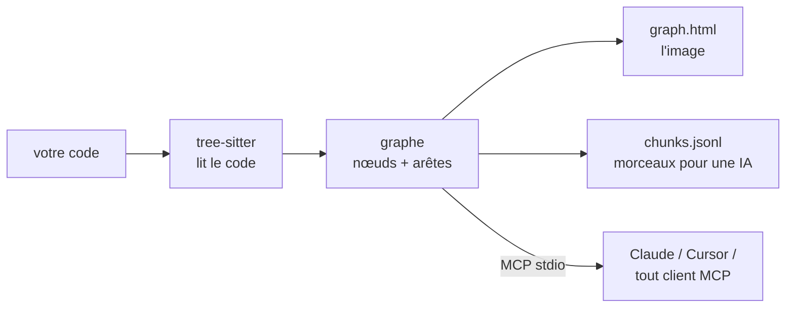

<div align="center">

# repo2graph

**Donner aux agents de codage des réponses fiables et sourcées sur des bases de code inconnues.**

Posez une question à un dépôt ; recevez le code source qui y répond, chaque bloc estampillé du
fichier et de la plage de lignes dont il provient.

<p align="center">
  <a href="../../README.md">English</a> ·
  <a href="README_zh-CN.md">简体中文</a> ·
  <a href="README_ja.md">日本語</a> ·
  <a href="README_fr.md">Français</a> ·
  <a href="README_es.md">Español</a> ·
  <a href="README_de.md">Deutsch</a>
</p>

<table align="center">
<tr>
<th align="center">📦&nbsp; Paquet</th>
<th align="center">🩺&nbsp; Santé</th>
<th align="center">🗂️&nbsp; Référencé sur</th>
</tr>
<tr>
<td align="center" valign="top">
<a href="https://pypi.org/project/repo2graph/"></a><br />
<a href="https://pypi.org/project/repo2graph/"></a><br />
<a href="../../LICENSE"></a>
</td>
<td align="center" valign="top">
<a href="https://github.com/Srinivasan-78/repo2graph/actions/workflows/ci.yml"></a><br />
<a href="https://github.com/Srinivasan-78/repo2graph/actions/workflows/dependency-audit.yml"></a><br />
<a href="https://github.com/Srinivasan-78/repo2graph/actions/workflows/provenance.yml"></a>
</td>
<td align="center" valign="top">
<a href="https://glama.ai/mcp/servers/Srinivasan-78/repo2graph"></a><br />
<a href="https://mcpservers.org/servers/srinivasan-78/repo2graph"></a><br />
<a href="https://registry.modelcontextprotocol.io/v0/servers?search=repo2graph"></a>
</td>
</tr>
</table>

<p align="center">
  <a href="https://github.com/Srinivasan-78/repo2graph/stargazers"></a>
</p>

<p align="center">
  
</p>

</div>

<!-- mcp-name: io.github.Srinivasan-78/repo2graph -->

> Cette page est une traduction du [README.md](../../README.md) original en anglais. En cas de
> divergence, la version anglaise fait foi.

---

## ⚡ Qu'est-ce que repo2graph ?

Un agent lâché dans une base de code qu'il n'a jamais vue n'a que deux mauvaises options. S'il
grep un mot, soit il inonde son contexte de fichiers entiers, soit il ne trouve rien parce que le
code nomme la chose autrement que vous. S'il devine à partir de ses données d'entraînement, il
écrit quelque chose d'assuré et de faux. Dans les deux cas, vous ne pouvez pas savoir laquelle des
deux vient de se produire.

**repo2graph répond aux questions sur un dépôt avec le code source de ce dépôt.** Demandez
« comment une requête est-elle authentifiée » et vous obtenez la fonction qui le fait, celles qui
l'appellent et celles qu'elle appelle — chaque bloc précédé de `[cite: chemin:début-fin]`, de sorte
que chaque affirmation de la réponse est à un clic de la ligne dont elle provient. Si la réponse est
fausse, la citation vous montre où elle a dérapé. C'est tout l'intérêt.

Il y parvient en **lisant** le code plutôt qu'en le cherchant : une seule passe d'analyse consigne
qui appelle qui, qui importe quoi et quelle classe hérite de quelle autre, et la recherche suit ces
liens au lieu de faire correspondre davantage de texte. Le résultat part directement dans Claude
Code, Cursor ou tout autre client **Model Context Protocol**, ou se compacte en un contexte markdown
à plafond de tokens strict pour n'importe quel autre LLM.



Aucune configuration de projet, aucun serveur de langage, aucune étape de build — pointez-le vers
un dossier et ça fonctionne.

<p align="center">
  
</p>

| Canevas interactif, zoomé | Contrôles de filtrage et d'inspection |
| :---: | :---: |
|  |  |

`graph.html` est un fichier unique et autonome — pas de serveur, pas d'internet requis, glissez
pour vous déplacer, faites défiler pour zoomer, cliquez sur un nœud pour inspecter son code et ses
voisins.

## 👥 À qui ça s'adresse

| Vous êtes… | Le problème | La première chose à lancer |
|---|---|---|
| **🧭 Nouveau sur une base de code inconnue** | La première semaine passe à lire des fichiers pour découvrir lesquels comptent. | `uvx repo2graph build . -o .r2g`, puis ouvrez `.r2g/human/graph.html` et partez des fichiers pivots plutôt que de la racine. Ensuite, posez des questions entières : `repo2graph rag "<votre question>" -o .r2g`. |
| **🤖 Utilisateur d'un agent de codage** | L'agent grep, tire trois fichiers entiers et modifie quand même le mauvais. | `claude mcp add repo2graph -- uvx --from "repo2graph[mcp]" repo2graph-mcp .` — des blocs sourcés sous un plafond strict de 12k tokens plutôt que des déversements de fichiers. Les secrets sont exclus sans condition ; aucun drapeau ne désactive cela. |
| **🔍 Relecteur d'une pull request** | Le diff fait 40 lignes ; le rayon d'impact est inconnu. | `repo2graph build . -o .r2g --git-history 500`, puis `repo2graph explain node "sym:src/auth.py::verify" -o .r2g` : appelants, importateurs, sous-classes — et les fichiers que l'historique git dit toujours modifiés en même temps (`CO_CHANGE`). |
| **🌱 Mainteneur open source** | Chaque nouveau contributeur pose la même question : « par où je commence ? ». | Ajoutez la GitHub Action avec `commit-branch: graph` : une carte fraîche et navigable commitée à chaque push. Le résumé du job liste les fichiers pivots, les points chauds de co-modification et le delta du graphe depuis le dernier build. |

## 🔎 Pourquoi repo2graph plutôt que grep ou la recherche vectorielle ?

Les deux restent de la partie — `repo2graph` amorce chaque requête avec BM25, et les vecteurs
denses sont une fusion optionnelle. La différence porte sur ce qui se passe *après* la première
correspondance.

| | **grep / ripgrep** | **Recherche par embeddings** | **repo2graph** |
|---|---|---|---|
| **Trouve** | la chaîne exacte | du texte qui se lit de façon similaire | le symbole, puis tout ce qui y est raccordé |
| **Des mots différents de ceux du code** | ne renvoie rien | s'en sort | des amorces BM25, puis des sauts de graphe jusqu'à du code que la requête n'a jamais nommé |
| **« Qui appelle ceci ? »** | sans réponse — une occurrence en commentaire se classe comme la définition | sans réponse — les voisins ne sont pas dans l'embedding | des arêtes `CALLS`, avec direction et `confidence` |
| **« Qu'est-ce qui casse si je change ça ? »** | relire chaque occurrence à la main | non représenté | appelants, importateurs et sous-classes en un saut |
| **Ce qui revient** | des lignes correspondantes, ou des fichiers entiers que l'agent déverse ensuite | les k morceaux les plus proches, appelants non récupérés | le code source qui répond, chaque bloc en-tête `[cite: chemin:début-fin]` |
| **Coût en tokens** | non borné — l'agent décide de la quantité de fichier à lire | non borné | plafond strict sur *tout* le paquet, re-mesuré avant retour |
| **« Quels fichiers changent ensemble ? »** | — | — | `CO_CHANGE`, extrait de l'historique git |
| **Mise en place** | aucune | construction d'index + un modèle d'embedding d'environ 90 Mo | une passe d'analyse, sans modèle, sans clé d'API, sans serveur de langage |
| **Classement explicable** | sans objet | un nombre cosinus | `repo2graph explain retrieval "<question>"` nomme l'amorce et l'arête qui a fait entrer chaque bloc |

**Prenez grep** quand vous voulez toutes les occurrences d'une chaîne littérale — une clé de
configuration, un message d'erreur, un TODO. repo2graph n'a aucune connaissance particulière des
littéraux de chaîne et ne fera pas mieux.
**Prenez repo2graph** quand la question porte sur des relations : qui appelle ceci, qu'est-ce qui
casse si je le change, comment les données vont de A à B. Version longue :
**[docs/why-graph.md](../why-graph.md)** (en anglais).

## 🚀 Démarrage rapide (en moins de 30 secondes)

Python 3.10+ requis. Exécutez via [uv](https://docs.astral.sh/uv/), sans étape d'installation :

```bash
uvx repo2graph build . -o .r2g && open .r2g/human/graph.html
```

Ou installez-le proprement :

```bash
pip install repo2graph
repo2graph build /path/to/project -o .r2g --git-history 200
repo2graph query "how does routing match a path" -o .r2g
```

## 🔌 Configuration des clients MCP

`repo2graph-mcp` est un serveur **MCP** en stdio. Il construit son propre index dès le premier
appel s'il n'en existe pas encore — rien à exécuter au préalable.

**Claude Code**

```bash
claude mcp add repo2graph -- uvx --from "repo2graph[mcp]" repo2graph-mcp /path/to/project
```

**Claude Desktop** (`claude_desktop_config.json`) et **Cursor** (`.cursor/mcp.json`) — le même bloc :

```json
{
  "mcpServers": {
    "repo2graph": {
      "command": "uvx",
      "args": ["--from", "repo2graph[mcp]", "repo2graph-mcp", "/path/to/project"]
    }
  }
}
```

Tout autre client MCP basé sur stdio (Windsurf, Zed, clients génériques) utilise la même paire
`command`/`args` — voir **[docs/mcp.md](../mcp.md)** (en anglais) pour l'emplacement des fichiers
de configuration selon la plateforme et le client.

## ✨ Fonctionnalités clés

| | |
|---|---|
| **Graphe déterministe, pas une simple recherche par embeddings** | Appelants, appelés, imports et hiérarchies de classes résolus à partir de l'AST réel — pas une supposition par plus proche voisin. |
| **Recherche hybride** | BM25 + expansion par voisinage de graphe par défaut ; fusion vectorielle dense optionnelle (`repo2graph embed`) sans dépendance supplémentaire requise. |
| **Plafonds de tokens appliqués deux fois** | Le budget de `pack_context()` borne le markdown rendu *dans son intégralité*, pas seulement le texte des morceaux — et le serveur MCP écrête et remesure avant de renvoyer. |
| **17 grammaires, traitement complet** | Python, JS, TS, TSX, Go, Rust, Java, Ruby, C, C++, C#, PHP, Kotlin, Swift, Scala, Bash et Lua bénéficient de l'analyse fonctions/classes/appels — 29 extensions de fichiers au total. Tout le reste apparaît quand même comme fichiers sur la carte. |
| **Natif CI** | Publié en tant que GitHub Action — versionnez un graphe à jour à côté de votre code à chaque push. |
| **Local par défaut** | `build`, `query`, `rag` et le serveur MCP en stdio n'effectuent aucun appel réseau — garanti par des tests au niveau socket. `rag --answer` est le seul chemin qui envoie votre code où que ce soit, et il affiche le fournisseur et l'hôte avant tout envoi. Aucune télémétrie. |
| **Export vers de vrais outils de graphe** | `graph.graphml` (yEd, Gephi, NetworkX) et `graph.cypher` (Neo4j, Memgraph) sont générés à chaque build, sans étape supplémentaire. |

## ⚖️ Ce qu'il fait — et ce qu'il ne fait pas

Un outil de recherche qui se survend est pire que pas d'outil du tout, parce qu'on cesse de
vérifier ses réponses. Donc, sans détour :

**Il fait**

- Renvoyer le **code source qui répond à une question**, sourcé en `chemin:début-fin`, dans un
  budget de tokens qu'il **impose** au lieu de le demander.
- Résoudre **appelants, appelés, imports et hiérarchies de classes** à partir d'une vraie analyse du
  code, parcourables dans les deux sens depuis n'importe quel symbole.
- Extraire **`CO_CHANGE`** de l'historique git — les fichiers sans cesse modifiés ensemble, ce
  qu'aucun analyseur ne peut deviner.
- Fonctionner **entièrement en local**, sans modèle, sans compte et sans appel réseau, en CLI, en CI
  et via MCP.
- **Se dégrader proprement** : un langage non analysé apparaît quand même comme nœud de fichier et
  reste récupérable en tant que texte ; un index vectoriel manquant retombe sur BM25 au lieu
  d'échouer.

**Il ne fait pas**

| Limite | Ce que cela signifie en pratique |
|---|---|
| **Résoudre les appels par type** | Les appels sont appariés par **nom**, avec un cadrage même-classe / même-fichier / imports pour départager. Quand le cadrage n'isole pas une cible, l'appel se déploie en jusqu'à 5 arêtes candidates à `confidence = 1/n`, marquées `ambiguous`. Filtrez sur `confidence == 1.0` si la certitude prime sur le rappel — 4,6 % à 21,3 % des arêtes `CALLS` sont ambiguës sur les cinq dépôts de référence. |
| **Voir la répartition dynamique** | Une recherche par clé de chaîne, un registre de plugins, une répartition à la `getattr`, un appel virtuel résolu à l'exécution — rien de tout cela n'est écrit comme syntaxe, donc aucune arête n'est tracée. **L'absence de flèche ne prouve pas l'absence d'appel.** |
| **Voir la réflexion ou les imports calculés** | `importlib.import_module(name)`, la réflexion Java, un `import()` dynamique à spécificateur calculé. Rien de littéral à résoudre, donc rien à relier. |
| **Suivre l'injection de dépendances jusqu'à l'implémentation** | Un conteneur d'injection relie une interface à une classe concrète à l'exécution. Le site d'appel ne nomme que la méthode de l'interface : l'arête se pose donc sur la déclaration (ou se déploie sur toutes les implémentations de même nom), jamais sur la classe réellement injectée. Parcourez `INHERITS` pour énumérer les candidates. |
| **Distinguer le code généré** | Un `.pb.go`, un `.js` bundlé, un client généré — tout est indexé exactement comme du code écrit à la main, sans aucun marqueur. Ils peuvent dominer le compte de symboles sans représenter une ligne que quiconque maintient. Excluez-les avec `--exclude`. |
| **Remarquer que vos fichiers ont changé** | L'index est un instantané de l'arbre à partir duquel il a été construit ; rien ne surveille le système de fichiers. Modifiez un fichier et le graphe continue de décrire l'ancien. Reconstruisez (`build --incremental` ne réanalyse que ce qui a bougé), ou laissez la GitHub Action reconstruire à chaque push. `repo2graph doctor` vérifie l'*intégrité* de l'index et la dérive des vecteurs — pas si votre copie de travail a avancé. |
| **Franchir une frontière de langage** | Python appelant du C++ via des bindings générés devient une arête `CALLS_EXTERNAL`, pas un lien vers la fonction C++. C'est une limite structurelle de l'analyse statique sur source seule, pas un défaut d'appariement. |
| **Analyser proprement du C/C++ chargé en macros** | tree-sitter émet des nœuds `ERROR` autour des macros non expansées ; un repli sur le préprocesseur `cpp` en récupère une partie. Attendez-vous à un `parse_errors` non négligeable dans `stats.json` et lisez-le comme un **plancher** des symboles manqués. |

Chacun de ces points est mesuré, pas affirmé — les taux, les dépôts sur lesquels ils l'ont été et
les commandes de reproduction sont dans **[docs/limitations.md](../limitations.md)** (en anglais).

## 🆚 Comparaison avec les autres outils de graphe

Plusieurs outils construisent un graphe à partir d'une base de code. Ce qui les distingue, c'est ce
qui *revient* quand on pose une question — une image, un sous-graphe, ou le code lui-même.

| | repo2graph | [Graphify](https://github.com/Graphify-Labs/graphify) | [Code Graph](https://community.obsidian.md/plugins/code-graph) (Obsidian) | grep / RAG par embeddings |
|---|---|---|---|---|
| **Ce que renvoie une requête** | le code source, empaqueté — chaque bloc précédé de `[cite: chemin:début-fin]` | un sous-graphe délimité, un chemin, ou une explication conceptuelle à parcourir | une image en disposition par forces, à lire | des lignes correspondantes, ou des morceaux par plus proche voisin |
| **Comment les résultats sont classés** | amorces BM25, puis expansion de graphe sur k sauts ; fusion dense optionnelle | traversée de graphe (explicitement pas un index vectoriel) | sans objet — c'est une vue | lexical seul, ou vectoriel seul |
| **Budget de tokens** | plafond strict sur *tout* le paquet, remesuré avant renvoi (limite de 12k via MCP) | pas une couche d'empaquetage | sans objet | généralement illimité |
| **Arêtes issues de l'historique git** | `CO_CHANGE`, via `--git-history` | — | — | — |
| **Fonctionne sans assistant, sans modèle, sans compte** | oui — CLI, MCP, ou la GitHub Action | la passe sur le code est locale ; la passe docs/médias utilise un modèle | nécessite Obsidian desktop 1.7.2+ | variable |
| **Corpus** | code dans 17 grammaires analysées, tout autre fichier en texte | code dans ~40 langages, plus documents, PDF, images, vidéo | TS/TSX/JS/Python analysés, imports seuls pour 8 autres | n'importe quoi |

**Tournez-vous vers [Graphify](https://github.com/Graphify-Labs/graphify)** quand le graphe lui-même est le produit : détection de
communautés, plus court chemin entre deux concepts, et vos PDF et documents de conception dans le
même graphe que le code.
**Tournez-vous vers le [plugin Obsidian](https://community.obsidian.md/plugins/code-graph)** quand un humain veut *lire* le graphe à côté
de ses notes.
**Tournez-vous vers repo2graph** quand un agent a besoin de code source cité dans un budget de
tokens fixe, quand cela doit tourner en CI sans modèle ni compte, ou quand « quels fichiers changent
toujours ensemble » fait partie de la réponse.

La version longue, avec les compromis qu'implique chaque choix :
**[docs/comparison.md](../comparison.md)** (en anglais).

## 🛠️ Outils MCP exposés

Cinq outils. Trois répondent à des questions sur le code, deux rendent compte du serveur lui-même.

| Outil | Arguments | Ce qui est renvoyé |
|---|---|---|
| `repo_map` | aucun | Langages, fichiers centraux et points d'entrée principaux. Stable d'un appel à l'autre — à lire en premier. |
| `repo_search` | `query`, `k` optionnel (défaut 8, max 50), `hops` optionnel (défaut 1, max 4), `budget_tokens` optionnel (défaut 6000, max 12000) | Morceaux germes plus leurs voisins de graphe, chaque bloc étant précédé de `[cite: chemin:début-fin]`. |
| `repo_neighbours` | `node_id`, `hops` optionnel (défaut 1, max 4), `limit` optionnel (défaut 20, max 50) | Un saut de graphe depuis un identifiant de symbole/fichier/dossier : appelants, appelés, classes de base, fichier de définition. |
| `repo_cache_stats` | aucun | Compteurs du cache de résultats : `hits`, `misses`, `size`, `max_size`, `ttl_s`, `evictions`, `hit_rate`. Jamais mis en cache lui-même. |
| `repo_build_status` | `task_id` | Progression d'une construction en arrière-plan lancée par `--async-build` : `building`, `ready`, `failed` ou `unknown`, avec `progress_pct` et `eta_s`. |

Les trois outils de code excluent les secrets sans condition — aucun flag ne permet de désactiver ce
comportement — et chaque argument numérique est écrêté dans le gestionnaire, si bien qu'un appelant
ne peut pas élargir une borne en la demandant. Contrat complet, plafonds d'arguments et
configurations clientes : **[docs/mcp.md](../mcp.md)** (en anglais). Exécution partagée, via HTTP,
avec authentification bearer ou OIDC et journal d'audit :
**[docs/ENTERPRISE_DEPLOYMENT.md](../ENTERPRISE_DEPLOYMENT.md)** (en anglais).

## 📐 Architecture et économie des tokens

La couche de recherche est un pipeline **GraphRAG** : [tree-sitter](https://tree-sitter.github.io/tree-sitter/)
analyse le source en un graphe typé, BM25 choisit les morceaux d'amorce, et c'est ensuite le
**graphe** — et non une similarité textuelle supplémentaire — qui décide de la façon de dépenser le
budget. Les vecteurs denses (`repo2graph embed`) peuvent fusionner dans le classement des amorces ;
rien en aval ne les exige.

- **Nœuds** : `repo`, `dir`, `file`, `symbol` (fonction/méthode/classe/struct/trait/interface/type),
  `module` (dépendance externe), `external` (une cible d'appel non résolue).
- **Arêtes** : `CONTAINS`, `DEFINES`, `IMPORTS`, `CALLS` (porte `count` + `confidence`),
  `CALLS_EXTERNAL`, `INHERITS`, `CO_CHANGE` (issu de `--git-history`, nécessite au moins 3
  co-modifications).
- **La résolution des appels est basée sur le nom, pas sur le type** — un compromis délibéré qui
  garde repo2graph agnostique du langage et sans configuration. Les appels ambigus se déploient en
  jusqu'à 5 arêtes candidates à `confidence = 1/n` ; filtrez sur `confidence == 1.0` quand vous avez
  besoin de certitude plutôt que de rappel.
- **Deux modèles de budget, volontairement** : `budget_chars` de `Index.retrieve()` ne borne que le
  texte propre des morceaux (une interface de rétrocompatibilité) ; `budget_chars` de
  `Index.pack_context()` borne le markdown rendu *dans son intégralité* — en-têtes de citation,
  séparateurs, tout. Le nouveau code de recherche doit être construit sur `pack_context()`.
- **Découpage** : environ un morceau par fonction/classe, coupé à ~4000 caractères avec un
  chevauchement de 8 lignes pour ne rien perdre à la jointure ; l'en-tête de chaque morceau nomme
  ses appelants et appelés, ce qui rend la recherche par expansion de graphe meilleure qu'une simple
  recherche textuelle top-k.

Détail complet de chaque type de nœud/arête et du schéma des morceaux : **[docs/reference.md](../reference.md)**
(en anglais). Le pipeline complet, l'API Python, et où le graphe devine (et pourquoi) :
**[TECHNICAL.md](../../TECHNICAL.md)** (en anglais).

## 📊 À l'épreuve de dépôts réels

Pas une démo jouet — cinq dépôts publics réels et volumineux, chacun indexé à un commit fixé, avec
le graphe généré versionné et la commande de reproduction exacte enregistrée. Chaque chiffre est
mesuré, tiré de [`benchmarks/results.json`](../../benchmarks/results.json), pas estimé.

| Dépôt | Langage(s) | Portée | Nœuds | Arêtes |
|---|---|---|---:|---:|
| [Kubernetes](https://github.com/kubernetes/kubernetes) | Go | ciblée (controllers, scheduler, API server) | 14 451 | 110 246 |
| [TensorFlow](https://github.com/tensorflow/tensorflow) | C++ / Python | ciblée (frontière Python/C++) | 21 380 | 115 984 |
| [Django](https://github.com/django/django) | Python | dépôt complet | 55 810 | 303 339 |
| [VS Code](https://github.com/microsoft/vscode) | TypeScript | ciblée (`src/vs/`) | 113 080 | 656 158 |
| [Linux kernel](https://github.com/torvalds/linux) | C | ciblée (échelle extrême) | 136 219 | 256 413 |

Voir **[examples/README.md](../../examples/README.md)** pour l'index complet et les commandes de
reproduction, **[docs/benchmarks.md](../benchmarks.md)** pour la méthodologie, et
**[docs/limitations.md](../limitations.md)** pour ce que l'exécution sur cinq dépôts réels a
réellement révélé (taux d'erreurs de parsing sur du C/C++ riche en macros, ambiguïté des noms
d'appels, limites de résolution inter-langages) — tous en anglais.

## 📖 Référence CLI & serveur

| Commande | Fait |
|---|---|
| `repo2graph build <path> -o .r2g [--git-history N]` | Analyse un dépôt local en un graphe + morceaux. |
| `repo2graph github <owner/repo> -o <dir>` | Récupère, construit et nettoie — pas de clone local nécessaire. |
| `repo2graph query "<question>" -o .r2g` | Recherche lexicale + expansion de graphe à un saut. |
| `repo2graph rag "<question>" -o .r2g [--vectors] [--answer]` | Paquet GraphRAG borné en tokens ; `--answer` l'envoie à un LLM (optionnel, réseau). |
| `repo2graph embed -o .r2g [--verify-rag]` | Calcule/vérifie les vecteurs denses pour la recherche hybride. |
| `repo2graph map -o .r2g [--viz-nodes N]` | Régénère `graph.html` avec un plafond de nœuds différent. |
| `repo2graph stats -o .r2g [--format text]` | Comptes de nœuds/arêtes/fonctions pour un index existant ; `--format text` pour un résumé de qualité lisible. |
| `repo2graph doctor [path]` | Diagnostique l'environnement, les dépendances, les permissions et l'intégrité de l'index. |
| `repo2graph explain-path <path> [-r <repo>]` | Indique si un chemin serait indexé, et quelle règle de précédence l'a décidé. |
| `repo2graph-mcp <path> [--no-auto-build] [--async-build]` | Serveur MCP stdio sur `.r2g`. |

**Variables d'environnement** (lues uniquement par `rag --answer`, dans cet ordre de priorité) :
`GEMINI_API_KEY` → `OPENAI_API_KEY` → `ANTHROPIC_API_KEY` → `OLLAMA_HOST`. Aucune autre commande
n'effectue d'appel réseau ni ne lit ces variables. Tableaux complets des options et calcul du
budget : **[docs/cli.md](../cli.md)** (en anglais).

## 🔐 Sécurité

`build`, `query`, `rag`, `map`, `stats` et le serveur MCP en stdio n'ouvrent aucune socket —
garanti par des tests au niveau socket, pas seulement par la lecture du code. **Aucune
télémétrie**, et rien à désactiver.

Quatre commandes *peuvent* atteindre le réseau, et seule la première envoie quelque chose qui vous
appartient : `rag --answer` (téléverse le paquet ; affiche d'abord le fournisseur et l'hôte),
`repo2graph github` (clone), `repo2graph embed` (télécharge un modèle d'embedding une seule fois)
et `repo2graph-mcp --auth-oidc-issuer` (récupère des clés publiques).

Le serveur MCP exclut sans condition les fichiers ayant l'apparence d'identifiants, sans flag pour
désactiver ce comportement. Où va chaque octet et comment tout supprimer :
**[docs/PRIVACY.md](../PRIVACY.md)**. Ce qu'un attaquant pourrait tenter :
**[docs/THREAT_MODEL.md](../THREAT_MODEL.md)**. Configurations durcies à copier :
**[docs/secure-configuration.md](../secure-configuration.md)**. Les trois en anglais, comme
**[SECURITY.md](../../.github/SECURITY.md)**.

## 🤝 Contribution & communauté

```bash
git clone https://github.com/Srinivasan-78/repo2graph
cd repo2graph
python3 -m venv .venv && .venv/bin/pip install -e ".[dev]"
make lint format-check typecheck test    # les quatre contrôles que la CI exécute
```

- **[.github/CONTRIBUTING.md](../../.github/CONTRIBUTING.md)** (en anglais) — configuration complète
  du développement local, style de code, et processus de publication sur le registre/Glama.
- **[docs/BACKLOG.md](../BACKLOG.md)** (en anglais) — travail volontairement différé, et pourquoi ;
  ce qui se rapproche le plus d'une feuille de route, avec une section « bons premiers tickets ».
- **[AGENTS.md](../../AGENTS.md)** (en anglais) — les conventions non évidentes de cette base de
  code (encodage Windows, découpage de texte, les deux modèles de budget) avant de modifier
  `repo2graph/`.
- **[CODE_OF_CONDUCT.md](../../CODE_OF_CONDUCT.md)** (en anglais) — Contributor Covenant v2.1.
- Un bug trouvé ou une idée de fonctionnalité ?
  [Ouvrez un ticket](https://github.com/Srinivasan-78/repo2graph/issues/new/choose).

## Licence

MIT. Voir **[LICENSE](../../LICENSE)**.

---

<div align="center">

repo2graph vous est utile ? [Mettez une étoile au dépôt](https://github.com/Srinivasan-78/repo2graph)
— c'est le moyen le plus simple d'aider d'autres personnes à le découvrir.

</div>
