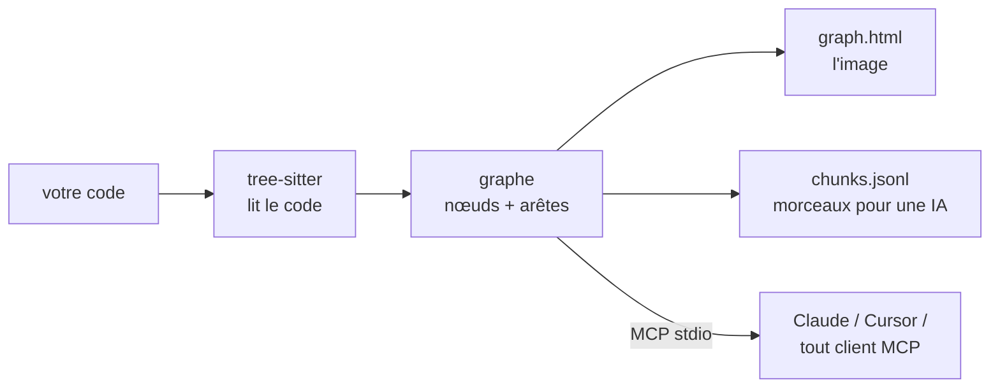

<div align="center">

# repo2graph

**Graphes de code pilotés par AST et GraphRAG sans dépendance, pour les agents de codage IA et les humains**

<p align="center">
  <a href="../../README.md">English</a> ·
  <a href="README_zh-CN.md">简体中文</a> ·
  <a href="README_ja.md">日本語</a> ·
  <a href="README_fr.md">Français</a> ·
  <a href="README_es.md">Español</a> ·
  <a href="README_de.md">Deutsch</a>
</p>

<p align="center">
  <a href="https://glama.ai/mcp/servers/Srinivasan-78/repo2graph"></a>
  <a href="https://mcpservers.org/servers/srinivasan-78/repo2graph"></a>
  <a href="https://pypi.org/project/repo2graph/"></a>
  <a href="https://pypi.org/project/repo2graph/"></a>
  <a href="../../LICENSE"></a>
  <a href="https://github.com/Srinivasan-78/repo2graph/actions/workflows/ci.yml"></a>
  
  <a href="https://github.com/Srinivasan-78/repo2graph/stargazers"></a>
</p>

<p align="center">
  
</p>

</div>

<!-- mcp-name: io.github.Srinivasan-78/repo2graph -->

> Cette page est une traduction du [README.md](../../README.md) original en anglais. En cas de
> divergence, la version anglaise fait foi.

---

## ⚡ Qu'est-ce que repo2graph ?

Lorsqu'un agent de codage IA recherche dans une base de code avec grep ou une simple correspondance
de mots-clés, il déverse soit des fichiers entiers dans son contexte — épuisant le budget de tokens
et perdant toute structure —, soit passe complètement à côté de l'implémentation parce que la
requête utilisait des mots différents du code.

**repo2graph** analyse le code source avec [tree-sitter](https://tree-sitter.github.io/tree-sitter/)
pour construire un graphe de relations de code réelles — `CALLS` (appels), `IMPORTS` (imports),
`INHERITS` (héritage), `DEFINES` (définitions), `CO_CHANGE` (co-modifications) — et expose ce
graphe aux agents via le **Model Context Protocol (MCP)**, ou l'empaquette dans un contexte markdown
borné en tokens pour n'importe quel LLM. Chaque bloc retourné porte une ancre de citation exacte
`[cite: chemin:début-fin]`, si bien que les réponses sont traçables jusqu'à la source plutôt que
paraphrasées à partir d'une supposition.



Aucune configuration de projet, aucun serveur de langage, aucune étape de build — pointez-le vers
un dossier et ça fonctionne.

<p align="center">
  
</p>

| Canevas interactif, zoomé | Contrôles de filtrage et d'inspection |
| :---: | :---: |
|  |  |

`graph.html` est un fichier unique et autonome — pas de serveur, pas d'internet requis, glissez
pour vous déplacer, faites défiler pour zoomer, cliquez sur un nœud pour inspecter son code et ses
voisins.

## 🚀 Démarrage rapide (en moins de 30 secondes)

Python 3.10+ requis. Exécutez via [uv](https://docs.astral.sh/uv/), sans étape d'installation :

```bash
uvx repo2graph build . -o .r2g && open .r2g/human/graph.html
```

Ou installez-le proprement :

```bash
pip install repo2graph
repo2graph build /path/to/project -o .r2g --git-history 200
repo2graph query "how does routing match a path" -o .r2g
```

## 🔌 Configuration des clients MCP

`repo2graph-mcp` est un serveur **MCP** en stdio. Il construit son propre index dès le premier
appel s'il n'en existe pas encore — rien à exécuter au préalable.

**Claude Code**

```bash
claude mcp add repo2graph -- uvx --from "repo2graph[mcp]" repo2graph-mcp /path/to/project
```

**Claude Desktop** (`claude_desktop_config.json`) et **Cursor** (`.cursor/mcp.json`) — le même bloc :

```json
{
  "mcpServers": {
    "repo2graph": {
      "command": "uvx",
      "args": ["--from", "repo2graph[mcp]", "repo2graph-mcp", "/path/to/project"]
    }
  }
}
```

Tout autre client MCP basé sur stdio (Windsurf, Zed, clients génériques) utilise la même paire
`command`/`args` — voir **[docs/mcp.md](../mcp.md)** (en anglais) pour l'emplacement des fichiers
de configuration selon la plateforme et le client.

## ✨ Fonctionnalités clés

| | |
|---|---|
| **Graphe déterministe, pas une simple recherche par embeddings** | Appelants, appelés, imports et hiérarchies de classes résolus à partir de l'AST réel — pas une supposition par plus proche voisin. |
| **Recherche hybride** | BM25 + expansion par voisinage de graphe par défaut ; fusion vectorielle dense optionnelle (`repo2graph embed`) sans dépendance supplémentaire requise. |
| **Plafonds de tokens appliqués deux fois** | Le budget de `pack_context()` borne le markdown rendu *dans son intégralité*, pas seulement le texte des morceaux — et le serveur MCP écrête et remesure avant de renvoyer. |
| **15 langages, traitement complet** | Python, JS/TS/TSX, Go, Rust, Java, Ruby, C, C++, C#, PHP, Kotlin, Swift, Scala, Bash bénéficient de l'analyse fonctions/classes/appels. Tout le reste apparaît quand même comme fichiers sur la carte. |
| **Natif CI** | Publié en tant que GitHub Action — versionnez un graphe à jour à côté de votre code à chaque push. |
| **Local par défaut** | `build`, `query`, `rag` et le serveur MCP n'effectuent aucun appel réseau. La seule exception optionnelle (`rag --answer`) affiche le fournisseur et l'hôte avant tout envoi. |
| **Export vers de vrais outils de graphe** | `graph.graphml` (yEd, Gephi, NetworkX) et `graph.cypher` (Neo4j, Memgraph) sont générés à chaque build, sans étape supplémentaire. |

## 🛠️ Outils MCP exposés

| Outil | Arguments | Ce qui est renvoyé |
|---|---|---|
| `repo_map` | aucun | Langages, fichiers centraux et points d'entrée principaux. Stable d'un appel à l'autre — à lire en premier. |
| `repo_search` | `query`, `k` optionnel (défaut 8, max 50), `hops` optionnel (défaut 1, max 4), `budget_tokens` optionnel (défaut 6000, max 12000) | Morceaux germes plus leurs voisins de graphe, chaque bloc étant précédé de `[cite: chemin:début-fin]`. |
| `repo_neighbours` | `node_id`, `hops` optionnel (max 4), `limit` optionnel (défaut 20, max 50) | Un saut de graphe depuis un identifiant de symbole/fichier/dossier : appelants, appelés, classes de base, fichier de définition. |

Les secrets sont exclus sans condition à chaque appel d'outil — aucun flag ne permet de désactiver
ce comportement. Contrat complet, y compris les deux outils de diagnostic (`repo_cache_stats`,
`repo_build_status`) ajoutés pour les déploiements serveur de longue durée : **[docs/mcp.md](../mcp.md)**
(en anglais).

## 📐 Architecture et économie des tokens

- **Nœuds** : `repo`, `dir`, `file`, `symbol` (fonction/méthode/classe/struct/trait/interface/type),
  `module` (dépendance externe), `external` (une cible d'appel non résolue).
- **Arêtes** : `CONTAINS`, `DEFINES`, `IMPORTS`, `CALLS` (porte `count` + `confidence`),
  `CALLS_EXTERNAL`, `INHERITS`, `CO_CHANGE` (issu de `--git-history`, nécessite au moins 3
  co-modifications).
- **La résolution des appels est basée sur le nom, pas sur le type** — un compromis délibéré qui
  garde repo2graph agnostique du langage et sans configuration. Les appels ambigus se déploient en
  jusqu'à 5 arêtes candidates à `confidence = 1/n` ; filtrez sur `confidence == 1.0` quand vous avez
  besoin de certitude plutôt que de rappel.
- **Deux modèles de budget, volontairement** : `budget_chars` de `Index.retrieve()` ne borne que le
  texte propre des morceaux (une interface de rétrocompatibilité) ; `budget_chars` de
  `Index.pack_context()` borne le markdown rendu *dans son intégralité* — en-têtes de citation,
  séparateurs, tout. Le nouveau code de recherche doit être construit sur `pack_context()`.
- **Découpage** : environ un morceau par fonction/classe, coupé à ~4000 caractères avec un
  chevauchement de 8 lignes pour ne rien perdre à la jointure ; l'en-tête de chaque morceau nomme
  ses appelants et appelés, ce qui rend la recherche par expansion de graphe meilleure qu'une simple
  recherche textuelle top-k.

Détail complet de chaque type de nœud/arête et du schéma des morceaux : **[docs/reference.md](../reference.md)**
(en anglais). Le pipeline complet, l'API Python, et où le graphe devine (et pourquoi) :
**[TECHNICAL.md](../../TECHNICAL.md)** (en anglais).

## 📊 À l'épreuve de dépôts réels

Pas une démo jouet — cinq dépôts publics réels et volumineux, chacun indexé à un commit fixé, avec
le graphe généré versionné et la commande de reproduction exacte enregistrée. Chaque chiffre est
mesuré, tiré de [`benchmarks/results.json`](../../benchmarks/results.json), pas estimé.

| Dépôt | Langage(s) | Portée | Nœuds | Arêtes |
|---|---|---|---:|---:|
| [Kubernetes](https://github.com/kubernetes/kubernetes) | Go | ciblée (controllers, scheduler, API server) | 14 197 | 83 525 |
| [TensorFlow](https://github.com/tensorflow/tensorflow) | C++ / Python | ciblée (frontière Python/C++) | 20 641 | 96 013 |
| [Django](https://github.com/django/django) | Python | dépôt complet | 54 544 | 228 461 |
| [VS Code](https://github.com/microsoft/vscode) | TypeScript | ciblée (`src/vs/`) | 113 115 | 431 453 |
| [Linux kernel](https://github.com/torvalds/linux) | C | ciblée (échelle extrême) | 136 182 | 257 655 |

Voir **[examples/README.md](../../examples/README.md)** pour l'index complet et les commandes de
reproduction, **[docs/benchmarks.md](../benchmarks.md)** pour la méthodologie, et
**[docs/limitations.md](../limitations.md)** pour ce que l'exécution sur cinq dépôts réels a
réellement révélé (taux d'erreurs de parsing sur du C/C++ riche en macros, ambiguïté des noms
d'appels, limites de résolution inter-langages) — tous en anglais.

## 📖 Référence CLI & serveur

| Commande | Fait |
|---|---|
| `repo2graph build <path> -o .r2g [--git-history N]` | Analyse un dépôt local en un graphe + morceaux. |
| `repo2graph github <owner/repo> -o <dir>` | Récupère, construit et nettoie — pas de clone local nécessaire. |
| `repo2graph query "<question>" -o .r2g` | Recherche lexicale + expansion de graphe à un saut. |
| `repo2graph rag "<question>" -o .r2g [--vectors] [--answer]` | Paquet GraphRAG borné en tokens ; `--answer` l'envoie à un LLM (optionnel, réseau). |
| `repo2graph embed -o .r2g [--verify-rag]` | Calcule/vérifie les vecteurs denses pour la recherche hybride. |
| `repo2graph map -o .r2g [--viz-nodes N]` | Régénère `graph.html` avec un plafond de nœuds différent. |
| `repo2graph stats -o .r2g` | Comptes de nœuds/arêtes/fonctions pour un index existant. |
| `repo2graph-mcp <path> [--no-auto-build] [--async-build]` | Serveur MCP stdio sur `.r2g`. |

**Variables d'environnement** (lues uniquement par `rag --answer`, dans cet ordre de priorité) :
`GEMINI_API_KEY` → `OPENAI_API_KEY` → `ANTHROPIC_API_KEY` → `OLLAMA_HOST`. Aucune autre commande
n'effectue d'appel réseau ni ne lit ces variables. Tableaux complets des options et calcul du
budget : **[docs/cli.md](../cli.md)** (en anglais).

## 🔐 Sécurité

`build`, `query`, `rag` et le serveur MCP n'effectuent aucun appel réseau. `rag --answer` est la
seule exception optionnelle — il envoie le paquet assemblé à un fournisseur de LLM et affiche le
fournisseur et l'hôte avant de le faire. Le serveur MCP exclut sans condition les fichiers ayant
l'apparence d'identifiants, sans flag pour désactiver ce comportement. Détails :
**[SECURITY.md](../../SECURITY.md)** (en anglais).

## 🤝 Contribution & communauté

```bash
git clone https://github.com/Srinivasan-78/repo2graph
cd repo2graph
python3 -m venv .venv && .venv/bin/pip install -e ".[dev]"
make lint test   # ou : ruff check . && pytest
```

- **[.github/CONTRIBUTING.md](../../.github/CONTRIBUTING.md)** (en anglais) — configuration complète
  du développement local, style de code, et processus de publication sur le registre/Glama.
- **[docs/BACKLOG.md](../BACKLOG.md)** (en anglais) — travail volontairement différé, et pourquoi ;
  ce qui se rapproche le plus d'une feuille de route, avec une section « bons premiers tickets ».
- **[AGENTS.md](../../AGENTS.md)** (en anglais) — les conventions non évidentes de cette base de
  code (encodage Windows, découpage de texte, les deux modèles de budget) avant de modifier
  `repo2graph/`.
- **[CODE_OF_CONDUCT.md](../../CODE_OF_CONDUCT.md)** (en anglais) — Contributor Covenant v2.1.
- Un bug trouvé ou une idée de fonctionnalité ?
  [Ouvrez un ticket](https://github.com/Srinivasan-78/repo2graph/issues/new/choose).

## Licence

MIT. Voir **[LICENSE](../../LICENSE)**.

---

<div align="center">

repo2graph vous est utile ? [Mettez une étoile au dépôt](https://github.com/Srinivasan-78/repo2graph)
— c'est le moyen le plus simple d'aider d'autres personnes à le découvrir.

</div>
