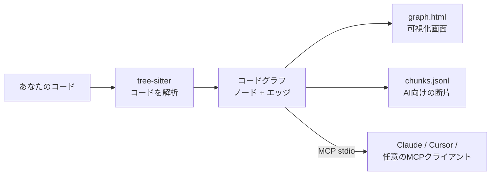

<div align="center">

# repo2graph

**コーディングエージェントに、見知らぬコードベースについての信頼できる出典付きの回答を。**

リポジトリに質問すると、それに答えるソースコードそのものが返ってきます。各ブロックには、引用元のファイルと行範囲が刻まれています。

<p align="center">
  <a href="../../README.md">English</a> ·
  <a href="README_zh-CN.md">简体中文</a> ·
  <a href="README_ja.md">日本語</a> ·
  <a href="README_fr.md">Français</a> ·
  <a href="README_es.md">Español</a> ·
  <a href="README_de.md">Deutsch</a>
</p>

<table align="center">
<tr>
<th align="center">📦&nbsp; パッケージ</th>
<th align="center">🩺&nbsp; ヘルス</th>
<th align="center">🗂️&nbsp; 掲載先</th>
</tr>
<tr>
<td align="center" valign="top">
<a href="https://pypi.org/project/repo2graph/"></a><br />
<a href="https://pypi.org/project/repo2graph/"></a><br />
<a href="../../LICENSE"></a>
</td>
<td align="center" valign="top">
<a href="https://github.com/Srinivasan-78/repo2graph/actions/workflows/ci.yml"></a><br />
<a href="https://github.com/Srinivasan-78/repo2graph/actions/workflows/dependency-audit.yml"></a><br />
<a href="https://github.com/Srinivasan-78/repo2graph/actions/workflows/provenance.yml"></a>
</td>
<td align="center" valign="top">
<a href="https://glama.ai/mcp/servers/Srinivasan-78/repo2graph"></a><br />
<a href="https://mcpservers.org/servers/srinivasan-78/repo2graph"></a><br />
<a href="https://registry.modelcontextprotocol.io/v0/servers?search=repo2graph"></a>
</td>
</tr>
</table>

<p align="center">
  <a href="https://github.com/Srinivasan-78/repo2graph/stargazers"></a>
</p>

<p align="center">
  
</p>

</div>

<!-- mcp-name: io.github.Srinivasan-78/repo2graph -->

> 本ページは英語版 [README.md](../../README.md) の翻訳です。内容に相違がある場合は英語版が正となります。

---

## ⚡ repo2graphとは?

初めて触れるコードベースに放り込まれたエージェントには、どちらも良くない2つの選択肢しかありません。単語で grep すれば、一致したファイル全体をコンテキストに流し込むか、コードがその概念を別の言葉で表現しているために何も見つけられないかのどちらかです。学習データから推測すれば、自信に満ちた誤りを書きます。そしてどちらが起きたのかを、あなたは見分けられません。

**repo2graph は、リポジトリについての質問に、そのリポジトリ自身のソースコードで答えます。**「リクエストはどこで認証されるのか」と尋ねれば、それを行っている関数と、その呼び出し元、そして呼び出し先が返ってきます。各ブロックには `[cite: パス:開始行-終了行]` という見出しが付くため、回答中のあらゆる主張が、その根拠となった行までワンクリックで辿れます。回答が間違っていれば、引用がどこで間違えたのかを示します。それがこのツールの要点です。

それを実現しているのは、コードを検索するのではなく**読む**ことです。1回の解析パスで、どの関数がどれを呼ぶか、どのファイルが何をインポートするか、どのクラスが何を継承するかを記録し、検索はテキストの類似ではなくその関係をたどります。結果は Claude Code、Cursor、その他あらゆる **Model Context Protocol** クライアントへ直接届けることも、トークン上限付きの Markdown コンテキストとして任意の LLM 向けにまとめることもできます。



プロジェクトの設定も、言語サーバーも、ビルドステップも不要——フォルダを指定するだけで動作します。

<p align="center">
  
</p>

| インタラクティブキャンバス(拡大表示) | フィルター & インスペクターパネル |
| :---: | :---: |
|  |  |

`graph.html` は単一の自己完結型ファイルです——サーバーもインターネットも不要。ドラッグでパン、スクロールでズーム、ノードをクリックしてコードと隣接ノードを確認できます。

## 👥 想定ユーザー

| こんな人 | 抱えている問題 | 最初に実行すること |
|---|---|---|
| **🧭 新しいコードベースに参加した開発者** | 最初の1週間が、どのファイルが重要なのかを探すためのファイル読みで消える。 | `uvx repo2graph build . -o .r2g` を実行し `.r2g/human/graph.html` を開く。ルートディレクトリではなくハブファイルから読み始め、そのうえで `repo2graph rag "<質問>" -o .r2g` と丸ごと質問する。 |
| **🤖 コーディングエージェントを使う人** | エージェントが grep してファイル3つをまるごと読み込み、それでも直すべきでないファイルを編集する。 | `claude mcp add repo2graph -- uvx --from "repo2graph[mcp]" repo2graph-mcp .`。12kトークンの厳格な上限の中で、ファイル丸投げではなく引用付きブロックが渡される。機密情報は無条件に除外され、それを無効化するフラグはない。 |
| **🔍 プルリクエストをレビューする人** | 差分は40行。だが影響範囲がわからない。 | `repo2graph build . -o .r2g --git-history 500` のあと `repo2graph explain node "sym:src/auth.py::verify" -o .r2g`。呼び出し元・インポート元・サブクラスに加え、git 履歴上で一緒に変更されてきたファイル(`CO_CHANGE`)も見える。 |
| **🌱 OSSメンテナー** | 新しいコントリビューターが毎回同じ「どこから読めばいい?」を尋ねてくる。 | GitHub Action に `commit-branch: graph` を指定し、push のたびに最新のマップをコミットして閲覧可能にする。ジョブサマリーにはハブファイル、同時変更のホットスポット、前回ビルドからの差分が出る。 |

## 🔎 grep やベクトル検索ではなく repo2graph を使う理由

どちらも排除していません——`repo2graph` はすべてのクエリを BM25 のシードから始め、密ベクトルはオプトインの融合です。違いは、最初の一致の*あと*に何が起きるかです。

| | **grep / ripgrep** | **埋め込み検索** | **repo2graph** |
|---|---|---|---|
| **見つけるもの** | 完全一致する文字列 | 似た意味に読めるテキスト | シンボルと、それに接続されたすべて |
| **コードと違う語で尋ねたとき** | 何も返らない | 対応できる | BM25 でシードを取り、グラフのホップでクエリが名指ししていないコードにも届く |
| **「これを呼んでいるのは?」** | 答えられない——コメント中の一致も定義と同順位 | 答えられない——隣接情報は埋め込みに入っていない | `CALLS` エッジ。方向と `confidence` 付き |
| **「これを変えたら何が壊れる?」** | 全ヒットを手で読むしかない | 表現されていない | 呼び出し元・インポート元・サブクラスを1ホップで |
| **返ってくるもの** | 一致した行、またはファイル全体(それをエージェントがコンテキストへ流し込む) | 類似度上位 k 個のチャンク。呼び出し元は未取得 | 答えとなるソースそのもの。各ブロックに `[cite: パス:開始-終了]` |
| **トークン消費** | 無制限——どこまで読むかはエージェント任せ | 無制限 | パック*全体*に厳格な上限。返却前に再計測 |
| **「どのファイルが一緒に変わる?」** | — | — | `CO_CHANGE`(git 履歴から抽出) |
| **セットアップ** | 不要 | インデックス構築 + 約90MBの埋め込みモデル | 解析1パスのみ。モデルもAPIキーも言語サーバーも不要 |
| **順位付けを説明できるか** | 該当なし | コサイン値がひとつ | `repo2graph explain retrieval "<質問>"` が、シードと、各ブロックを引き込んだエッジを名指しする |

**grep を使うべきとき**: 設定キー、エラーメッセージ、TODO など、特定の文字列の出現箇所をすべて知りたいとき。repo2graph は文字列リテラルについて特別な知識を持たず、この用途で grep に勝つことはありません。
**repo2graph を使うべきとき**: 質問が関係についてのとき——何がこれを呼ぶのか、これを変えると何が壊れるのか、データは A から B までどう流れるのか。詳細版: **[docs/why-graph.md](../why-graph.md)**(英語)。

## 🚀 30秒未満で始めるクイックスタート

Python 3.10 以上が必要です。[uv](https://docs.astral.sh/uv/) を使えばインストール不要で実行できます。

```bash
uvx repo2graph build . -o .r2g && open .r2g/human/graph.html
```

または通常のインストール:

```bash
pip install repo2graph
repo2graph build /path/to/project -o .r2g --git-history 200
repo2graph query "how does routing match a path" -o .r2g
```

## 🔌 MCPクライアント設定

`repo2graph-mcp` は stdio 経由の**MCPサーバー**です。インデックスがまだ存在しない場合、最初の呼び出し時に自動でインデックスを構築します——事前に何かを実行しておく必要はありません。

**Claude Code**

```bash
claude mcp add repo2graph -- uvx --from "repo2graph[mcp]" repo2graph-mcp /path/to/project
```

**Claude Desktop**(`claude_desktop_config.json`)と **Cursor**(`.cursor/mcp.json`)——同じ設定ブロックを使用します:

```json
{
  "mcpServers": {
    "repo2graph": {
      "command": "uvx",
      "args": ["--from", "repo2graph[mcp]", "repo2graph-mcp", "/path/to/project"]
    }
  }
}
```

その他の stdio ベースの MCP クライアント(Windsurf、Zed、汎用クライアント)も同じ `command`/`args` の組み合わせで利用できます。プラットフォームおよびクライアントごとの設定ファイルの場所については **[docs/mcp.md](../mcp.md)**(英語)を参照してください。

## ✨ 主な機能

| | |
|---|---|
| **埋め込みだけに頼らない決定的なグラフ** | 呼び出し元・呼び出し先・インポート関係・クラス階層は、実際のASTから解決されます——近傍探索による推測ではありません。 |
| **ハイブリッド検索** | デフォルトで BM25 + グラフ近傍展開を使用。追加の必須依存関係なしで、オプションの密ベクトル融合(`repo2graph embed`)も利用可能です。 |
| **二重に強制されるトークン上限** | `pack_context()` の予算は、断片テキストだけでなく*レンダリングされたMarkdown全体*を制限します。さらにMCPサーバーは返却前にクランプと再計測を行います。 |
| **17の文法をフルサポート** | Python、JS、TS、TSX、Go、Rust、Java、Ruby、C、C++、C#、PHP、Kotlin、Swift、Scala、Bash、Lua では関数/クラス/呼び出しを完全解析します(合計29のファイル拡張子)。それ以外の言語のファイルもマップ上にファイルとして表示されます。 |
| **CIネイティブ** | GitHub Action として公開されており、push のたびにコードと並んで最新のグラフをコミットできます。 |
| **デフォルトでローカル動作** | `build`、`query`、`rag`、stdio 経由の MCP サーバーはいずれもネットワーク通信を行いません——ソケットレベルのテストで保証されています。あなたのコードをどこかへ送信する経路は `rag --answer` だけで、送信前にプロバイダー名とホスト名を表示します。テレメトリは一切ありません。 |
| **実用的なグラフツールへのエクスポート** | すべてのビルドで `graph.graphml`(yEd、Gephi、NetworkX 用)と `graph.cypher`(Neo4j、Memgraph 用)が追加のステップなしで生成されます。 |

## ⚖️ できること・できないこと

自らを過大に見せる検索ツールは、検索ツールが無いことより有害です。回答を検証しなくなるからです。そこで、率直に書きます。

**できること**

- 質問に**答えとなるソースコード**を、`パス:開始-終了` の引用付きで、要求ではなく**強制**されるトークン予算の中で返す。
- **呼び出し元・呼び出し先・インポート・クラス階層**を実際の解析結果から解決し、任意のシンボルから双方向にたどれるようにする。
- git 履歴から **`CO_CHANGE`** を抽出する——一緒に編集され続けているファイルは、どんなパーサーにも分かりません。
- CLI でも CI でも MCP 経由でも、モデルもアカウントもネットワーク通信もなしに**完全にローカルで**動作する。
- **優雅に劣化する**: 解析対象外の言語もファイルノードとして現れ、テキストとして検索可能。ベクトルインデックスが無ければ BM25 にフォールバックし、失敗しません。

**できないこと**

| 限界 | 実際に何を意味するか |
|---|---|
| **型に基づく呼び出し解決** | 呼び出しは**名前**で照合し、同一クラス・同一ファイル・インポートのスコープで候補を絞ります。それでも1つに定まらない場合、最大5本の候補エッジに `confidence = 1/n` で展開され、`ambiguous` の印が付きます。再現率より確実性が必要なら `confidence == 1.0` で絞ってください——5つのベンチマークリポジトリでは `CALLS` エッジの 4.6%〜21.3% が曖昧でした。 |
| **動的ディスパッチの把握** | 文字列キーによる参照、プラグインレジストリ、`getattr` 系のディスパッチ、実行時に解決される仮想呼び出し——いずれも構文として書かれていないため、エッジは引かれません。**矢印が無いことは、呼び出しが無いことの証明にはなりません。** |
| **リフレクションや動的インポートの把握** | `importlib.import_module(name)`、Java のリフレクション、算出された指定子による動的 `import()`。解決すべきリテラルが無いため、繋ぐものがありません。 |
| **DIコンテナの実装先まで辿ること** | DIコンテナは実行時にインターフェースを具象クラスへ結びつけます。呼び出し側はインターフェースのメソッド名しか書かないため、エッジは宣言側に落ちるか、同名の全実装へ展開されるかであり、実際に注入されたクラスには決して届きません。候補の列挙には `INHERITS` をたどってください。 |
| **生成コードの区別** | `.pb.go`、バンドルされた `.js`、コード生成されたクライアント——すべて手書きコードと同じように、何の印も無くインデックス化されます。誰も保守していない行がシンボル数を占有し得ます。`--exclude` で除外してください。 |
| **ファイルが変わったことの検知** | インデックスは構築時点のスナップショットであり、ファイルシステムを監視するものはありません。編集しても、グラフは古い状態を語り続けます。再ビルド(`build --incremental` は変わったファイルだけを再解析)するか、GitHub Action に push ごとの再ビルドを任せてください。`repo2graph doctor` が見るのはインデックスの*整合性*とベクトルのずれであり、作業ツリーが先へ進んだかどうかではありません。 |
| **言語境界をまたぐこと** | 生成されたバインディング越しに Python が C++ を呼ぶ箇所は `CALLS_EXTERNAL` エッジになり、C++ 側の関数へのリンクにはなりません。これは照合の不具合ではなく、ソースのみの静的解析の構造的な限界です。 |
| **マクロ多用の C/C++ の完全な解析** | tree-sitter は展開されていないマクロの周辺で `ERROR` ノードを出します(`cpp` プリプロセッサによる部分的な救済はあります)。`stats.json` の `parse_errors` はゼロにならないものと考え、見落としたシンボル数の**下限**として読んでください。 |

これらはすべて主張ではなく実測です。測定値、対象リポジトリ、再現コマンドは **[docs/limitations.md](../limitations.md)**(英語)にあります。

## 🆚 他のグラフツールとの比較

コードベースからグラフを構築するツールは複数あります。違いは、質問したときに何が*返ってくるか*です——図か、部分グラフか、それともコードそのものか。

| | repo2graph | [Graphify](https://github.com/Graphify-Labs/graphify) | [Code Graph](https://community.obsidian.md/plugins/code-graph)(Obsidian) | grep / 埋め込みRAG |
|---|---|---|---|---|
| **クエリが返すもの** | パッケージ化されたソースコード。各ブロックに `[cite: パス:開始-終了]` の見出しが付く | 範囲を絞った部分グラフ、パス、またはたどるための概念説明 | 読むための力学配置された図 | 一致した行、または最近傍のチャンク |
| **ヒットの順位付け** | BM25 のシード、その後 k ホップのグラフ展開。オプションで密ベクトル融合 | グラフ探索(明示的にベクトルインデックスではない) | 該当なし——これはビューである | 字句のみ、またはベクトルのみ |
| **トークン予算** | パック*全体*に対する厳格な上限。返却前に再計測(MCP 経由では 12k が上限) | パッケージ化の層ではない | 該当なし | 通常は無制限 |
| **git 履歴由来のエッジ** | `CO_CHANGE`(`--git-history` から) | — | — | — |
| **アシスタント・モデル・アカウントなしで動作** | はい——CLI、MCP、GitHub Action のいずれでも | コード解析はローカル。ドキュメント/メディア解析はモデルを使用 | Obsidian デスクトップ 1.7.2+ が必要 | 場合による |
| **対象範囲** | 解析対象の17文法のコードと、それ以外のすべてのファイルをテキストとして | 約40言語のコードに加え、ドキュメント、PDF、画像、動画 | TS/TSX/JS/Python を解析、他8言語はインポートのみ | あらゆるもの |

グラフそのものが目的なら **[Graphify](https://github.com/Graphify-Labs/graphify)** を選んでください——コミュニティ検出、2つの概念間の最短経路、PDF や設計文書をコードと同じグラフに載せられます。
人間がノートの横でグラフを*読みたい*のなら **[Obsidian プラグイン](https://community.obsidian.md/plugins/code-graph)** を選んでください。
エージェントが決まったトークン予算の中で引用付きのソースコードを必要とするとき、モデルもアカウントもない CI で動かす必要があるとき、あるいは「どのファイルが一緒に変更され続けているか」が答えの一部であるときは **repo2graph** を選んでください。

それぞれの選択に伴うトレードオフを含む詳細版: **[docs/comparison.md](../comparison.md)**(英語)。

## 🛠️ 提供されるMCPツール

ツールは5つです。3つはコードに関する質問に答え、2つはサーバー自身の状態を報告します。

| ツール | 引数 | 返される内容 |
|---|---|---|
| `repo_map` | なし | 使用言語、ハブファイル、主なエントリーポイント。呼び出しごとに結果が安定しているため、最初に呼ぶべきツールです。 |
| `repo_search` | `query`、オプションで `k`(デフォルト 8、最大 50)、`hops`(デフォルト 1、最大 4)、`budget_tokens`(デフォルト 6000、最大 12000) | シード断片とそのグラフ近傍。各ブロックには `[cite: パス:開始-終了]` の見出しが付きます。 |
| `repo_neighbours` | `node_id`、オプションで `hops`(デフォルト 1、最大 4)、`limit`(デフォルト 20、最大 50) | シンボル/ファイル/ディレクトリノードから1ホップ分の隣接情報: 呼び出し元、呼び出し先、基底クラス、定義元ファイル。 |
| `repo_cache_stats` | なし | 結果キャッシュのカウンター: `hits`、`misses`、`size`、`max_size`、`ttl_s`、`evictions`、`hit_rate`。これ自体がキャッシュされることはありません。 |
| `repo_build_status` | `task_id` | `--async-build` によるバックグラウンド構築の進捗: `building`、`ready`、`failed`、`unknown` のいずれかと、`progress_pct`、`eta_s`。 |

コードを扱う3つのツールは機密情報らしきファイルを無条件に除外します——これを無効化するフラグはありません。また数値引数はすべてハンドラー側でクランプされるため、呼び出し側が要求によって上限を広げることはできません。完全な仕様、引数の上限、クライアント設定は **[docs/mcp.md](../mcp.md)**(英語)を参照してください。HTTP 経由での共有運用、Bearer / OIDC 認証、監査ログについては **[docs/ENTERPRISE_DEPLOYMENT.md](../ENTERPRISE_DEPLOYMENT.md)**(英語)を参照してください。

## 📐 アーキテクチャとトークン経済学

検索層は **GraphRAG** のパイプラインです。[tree-sitter](https://tree-sitter.github.io/tree-sitter/) がソースを型付きのグラフへ解析し、BM25 がシードとなるチャンクを選び、そこから先はテキストの類似度ではなく**グラフ**が予算の使い道を決めます。密ベクトル(`repo2graph embed`)はシードの順位付けに融合できますが、その後段がそれを必要とすることはありません。

- **ノード**: `repo`、`dir`(ディレクトリ)、`file`(ファイル)、`symbol`(関数/メソッド/クラス/構造体/トレイト/インターフェース/型)、`module`(外部依存)、`external`(解決できなかった呼び出し先)。
- **エッジ**: `CONTAINS`(包含)、`DEFINES`(定義)、`IMPORTS`(インポート)、`CALLS`(呼び出し、`count` と `confidence` を保持)、`CALLS_EXTERNAL`(外部呼び出し)、`INHERITS`(継承)、`CO_CHANGE`(`--git-history` により検出される同時変更、3回以上の共同編集が必要)。
- **呼び出し解決は型ではなく名前ベース**です——これは repo2graph を言語非依存かつセットアップ不要に保つための意図的なトレードオフです。曖昧な呼び出しは最大5本の候補エッジに展開され、それぞれ `confidence = 1/n` となります。確実性が必要な場合は `confidence == 1.0` のエッジのみを使用してください。
- **意図的に2つの予算モデルが併存**: `Index.retrieve()` の `budget_chars` は断片自体のテキストのみを制限します(後方互換のためのサーフェス)。`Index.pack_context()` の `budget_chars` は引用ヘッダー・区切り線を含む*レンダリングされたMarkdown全体*を制限します。新しい検索コードは `pack_context()` の上に構築すべきです。
- **チャンク分割**: おおむね関数/クラスごとに1チャンク、約4000文字で分割し、継ぎ目での情報欠落を防ぐため8行分のオーバーラップを持たせます。各チャンクのヘッダーには呼び出し元・呼び出し先が記載されており、これがグラフ展開による検索が単純なtop-kテキスト検索より優れている理由です。

すべてのノード/エッジ種別とチャンク形式の完全な内訳: **[docs/reference.md](../reference.md)**(英語)。パイプライン全体、Python API、グラフが推測に頼る箇所(とその理由): **[TECHNICAL.md](../../TECHNICAL.md)**(英語)。

## 📊 実際のリポジトリでの実績

おもちゃのデモではありません——5つの実在する大規模な公開リポジトリを、それぞれ固定のコミットでインデックス化し、生成されたグラフと再現用コマンドをコミットしています。以下の数値はすべて [`benchmarks/results.json`](../../benchmarks/results.json) による実測値であり、推定値ではありません。

| リポジトリ | 言語 | 範囲 | ノード数 | エッジ数 |
|---|---|---|---:|---:|
| [Kubernetes](https://github.com/kubernetes/kubernetes) | Go | 範囲限定(controllers、scheduler、APIサーバー) | 14,451 | 110,246 |
| [TensorFlow](https://github.com/tensorflow/tensorflow) | C++ / Python | 範囲限定(Python/C++境界) | 21,380 | 115,984 |
| [Django](https://github.com/django/django) | Python | リポジトリ全体 | 55,810 | 303,339 |
| [VS Code](https://github.com/microsoft/vscode) | TypeScript | 範囲限定(`src/vs/`) | 113,080 | 656,158 |
| [Linux kernel](https://github.com/torvalds/linux) | C | 範囲限定(超大規模) | 136,219 | 256,413 |

完全な一覧と再現手順は **[examples/README.md](../../examples/README.md)**、測定方法は **[docs/benchmarks.md](../benchmarks.md)**、5つの実リポジトリで実行して実際に判明した課題(マクロ多用なC/C++での解析エラー率、呼び出し名の曖昧性、言語間解決の限界)は **[docs/limitations.md](../limitations.md)**(いずれも英語)を参照してください。

## 📖 CLI & サーバーリファレンス

| コマンド | 内容 |
|---|---|
| `repo2graph build <path> -o .r2g [--git-history N]` | ローカルリポジトリを解析し、グラフとチャンクを生成します。 |
| `repo2graph github <owner/repo> -o <dir>` | 取得・ビルド・後片付けを一括実行——ローカルへのクローン不要。 |
| `repo2graph query "<question>" -o .r2g` | キーワード検索 + 1ホップのグラフ展開。 |
| `repo2graph rag "<question>" -o .r2g [--vectors] [--answer]` | トークン上限付きのGraphRAGパック生成。`--answer` はLLMへ送信します(オプトイン、通信あり)。 |
| `repo2graph embed -o .r2g [--verify-rag]` | ハイブリッド検索用の密ベクトルを計算/検証します。 |
| `repo2graph map -o .r2g [--viz-nodes N]` | ノード上限を変えて `graph.html` を再生成します。 |
| `repo2graph stats -o .r2g [--format text]` | 既存インデックスのノード/エッジ/関数の統計を出力します。`--format text` で人間向けの品質サマリーになります。 |
| `repo2graph doctor [path]` | 実行環境、依存関係、権限、インデックスの整合性を診断します。 |
| `repo2graph explain-path <path> [-r <repo>]` | あるパスがインデックス対象になるか、どの優先規則がそれを決めたかを説明します。 |
| `repo2graph-mcp <path> [--no-auto-build] [--async-build]` | `.r2g` を対象とした stdio MCPサーバー。 |

**環境変数**(`rag --answer` のみが読み取ります。優先順位は以下の通り): `GEMINI_API_KEY` → `OPENAI_API_KEY` → `ANTHROPIC_API_KEY` → `OLLAMA_HOST`。他のコマンドはこれらを読み取らず、ネットワーク通信も行いません。完全なフラグ一覧とトークン上限の計算方法: **[docs/cli.md](../cli.md)**(英語)。

## 🔐 セキュリティ

`build`、`query`、`rag`、`map`、`stats`、および stdio 経由の MCP サーバーはソケットを一切開きません——コードを読むだけでなく、ソケットレベルのテストで保証されています。**テレメトリは一切なく**、無効化すべきものもありません。

ネットワークに到達*しうる*コマンドは4つあり、あなたのものを送信するのは最初の1つだけです: `rag --answer`(パックをアップロードし、その前にプロバイダー名とホスト名を表示)、`repo2graph github`(クローン)、`repo2graph embed`(埋め込みモデルを初回のみダウンロード)、`repo2graph-mcp --auth-oidc-issuer`(公開鍵を取得)。

MCPサーバーは機密情報らしきファイルを無条件に除外し、これを無効化するフラグはありません。どのバイトがどこへ行くのか、そしてすべてを削除する方法: **[docs/PRIVACY.md](../PRIVACY.md)**。攻撃者が何を試みうるか: **[docs/THREAT_MODEL.md](../THREAT_MODEL.md)**。コピーして使える堅牢化構成: **[docs/secure-configuration.md](../secure-configuration.md)**。いずれも英語で、**[SECURITY.md](../../.github/SECURITY.md)** も同様です。

## 🤝 コントリビューションとコミュニティ

```bash
git clone https://github.com/Srinivasan-78/repo2graph
cd repo2graph
python3 -m venv .venv && .venv/bin/pip install -e ".[dev]"
make lint format-check typecheck test    # CI が実行する4つのゲート
```

- **[.github/CONTRIBUTING.md](../../.github/CONTRIBUTING.md)**(英語)——ローカル開発環境のセットアップ、コーディングスタイル、レジストリ/Glamaへの公開手順。
- **[docs/BACKLOG.md](../BACKLOG.md)**(英語)——意図的に後回しにされた作業とその理由。ロードマップに最も近いドキュメントで、「初めての方向けの issue」セクションも含まれます。
- **[AGENTS.md](../../AGENTS.md)**(英語)——`repo2graph/` を編集する前に、このコードベース特有の分かりにくい慣習(Windowsのエンコーディング、テキストのスライス方法、2つの予算モデル)を確認してください。
- **[CODE_OF_CONDUCT.md](../../CODE_OF_CONDUCT.md)**(英語)——Contributor Covenant v2.1 に準拠した行動規範。
- バグを見つけた、または機能の提案がありますか? [Issueを作成](https://github.com/Srinivasan-78/repo2graph/issues/new/choose)してください。

## ライセンス

MIT ライセンス。詳細は **[LICENSE](../../LICENSE)** を参照してください。

---

<div align="center">

repo2graph が役に立ったら、[リポジトリにスターを付けて](https://github.com/Srinivasan-78/repo2graph)ください——他の人がこのプロジェクトを見つける最も簡単な方法です。

</div>
