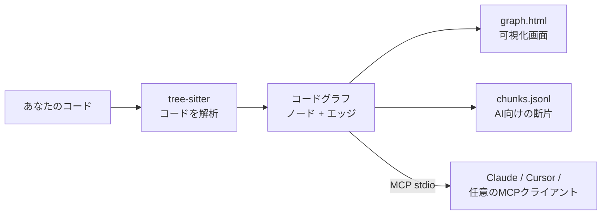

<div align="center">

# repo2graph

**AIコーディングエージェントと開発者のための、AST駆動コードグラフ & ゼロ依存GraphRAG**

<p align="center">
  <a href="../../README.md">English</a> ·
  <a href="README_zh-CN.md">简体中文</a> ·
  <a href="README_ja.md">日本語</a> ·
  <a href="README_fr.md">Français</a> ·
  <a href="README_es.md">Español</a> ·
  <a href="README_de.md">Deutsch</a>
</p>

<p align="center">
  <a href="https://glama.ai/mcp/servers/Srinivasan-78/repo2graph"></a>
  <a href="https://mcpservers.org/servers/srinivasan-78/repo2graph"></a>
  <a href="https://pypi.org/project/repo2graph/"></a>
  <a href="https://pypi.org/project/repo2graph/"></a>
  <a href="../../LICENSE"></a>
  <a href="https://github.com/Srinivasan-78/repo2graph/actions/workflows/ci.yml"></a>
  
  <a href="https://github.com/Srinivasan-78/repo2graph/stargazers"></a>
</p>

<p align="center">
  
</p>

</div>

<!-- mcp-name: io.github.Srinivasan-78/repo2graph -->

> 本ページは英語版 [README.md](../../README.md) の翻訳です。内容に相違がある場合は英語版が正となります。

---

## ⚡ repo2graphとは?

AIコーディングエージェントが grep や単純なキーワード一致でコードベースを検索すると、一致したファイル全体をコンテキストに詰め込んでトークン予算を消費し構造情報を失うか、検索語がコード内の表現と異なるために実装自体を見つけられない、という問題が起きます。

**repo2graph** は [tree-sitter](https://tree-sitter.github.io/tree-sitter/) を用いてソースコードを**構文木解析**し、`CALLS`(呼び出し)、`IMPORTS`(インポート)、`INHERITS`(継承)、`DEFINES`(定義)、`CO_CHANGE`(同時変更)といった実際のコード**呼び出し関係**のグラフを構築します。このグラフは **Model Context Protocol (MCP)** を通じて**MCPサーバー**からエージェントへ直接提供することも、**トークン上限**付きの Markdown コンテキストとして任意の LLM 向けにパッケージ化することもできます。返される各ブロックには正確な `[cite: パス:開始行-終了行]` という引用アンカーが付与されるため、回答は推測による言い換えではなく、ソースコードまで遡って検証できます。



プロジェクトの設定も、言語サーバーも、ビルドステップも不要——フォルダを指定するだけで動作します。

<p align="center">
  
</p>

| インタラクティブキャンバス(拡大表示) | フィルター & インスペクターパネル |
| :---: | :---: |
|  |  |

`graph.html` は単一の自己完結型ファイルです——サーバーもインターネットも不要。ドラッグでパン、スクロールでズーム、ノードをクリックしてコードと隣接ノードを確認できます。

## 🚀 30秒未満で始めるクイックスタート

Python 3.10 以上が必要です。[uv](https://docs.astral.sh/uv/) を使えばインストール不要で実行できます。

```bash
uvx repo2graph build . -o .r2g && open .r2g/human/graph.html
```

または通常のインストール:

```bash
pip install repo2graph
repo2graph build /path/to/project -o .r2g --git-history 200
repo2graph query "how does routing match a path" -o .r2g
```

## 🔌 MCPクライアント設定

`repo2graph-mcp` は stdio 経由の**MCPサーバー**です。インデックスがまだ存在しない場合、最初の呼び出し時に自動でインデックスを構築します——事前に何かを実行しておく必要はありません。

**Claude Code**

```bash
claude mcp add repo2graph -- uvx --from "repo2graph[mcp]" repo2graph-mcp /path/to/project
```

**Claude Desktop**(`claude_desktop_config.json`)と **Cursor**(`.cursor/mcp.json`)——同じ設定ブロックを使用します:

```json
{
  "mcpServers": {
    "repo2graph": {
      "command": "uvx",
      "args": ["--from", "repo2graph[mcp]", "repo2graph-mcp", "/path/to/project"]
    }
  }
}
```

その他の stdio ベースの MCP クライアント(Windsurf、Zed、汎用クライアント)も同じ `command`/`args` の組み合わせで利用できます。プラットフォームおよびクライアントごとの設定ファイルの場所については **[docs/mcp.md](../mcp.md)**(英語)を参照してください。

## ✨ 主な機能

| | |
|---|---|
| **埋め込みだけに頼らない決定的なグラフ** | 呼び出し元・呼び出し先・インポート関係・クラス階層は、実際のASTから解決されます——近傍探索による推測ではありません。 |
| **ハイブリッド検索** | デフォルトで BM25 + グラフ近傍展開を使用。追加の必須依存関係なしで、オプションの密ベクトル融合(`repo2graph embed`)も利用可能です。 |
| **二重に強制されるトークン上限** | `pack_context()` の予算は、断片テキストだけでなく*レンダリングされたMarkdown全体*を制限します。さらにMCPサーバーは返却前にクランプと再計測を行います。 |
| **15言語をフルサポート** | Python、JS/TS/TSX、Go、Rust、Java、Ruby、C、C++、C#、PHP、Kotlin、Swift、Scala、Bash では関数/クラス/呼び出しを完全解析。それ以外の言語のファイルもマップ上にファイルとして表示されます。 |
| **CIネイティブ** | GitHub Action として公開されており、push のたびにコードと並んで最新のグラフをコミットできます。 |
| **デフォルトでローカル動作** | `build`、`query`、`rag`、MCPサーバーはいずれもネットワーク通信を行いません。唯一のオプトインの例外(`rag --answer`)は、送信前にプロバイダーとホスト名を表示します。 |
| **実用的なグラフツールへのエクスポート** | すべてのビルドで `graph.graphml`(yEd、Gephi、NetworkX 用)と `graph.cypher`(Neo4j、Memgraph 用)が追加のステップなしで生成されます。 |

## 🛠️ 提供されるMCPツール

| ツール | 引数 | 返される内容 |
|---|---|---|
| `repo_map` | なし | 使用言語、ハブファイル、主なエントリーポイント。呼び出しごとに結果が安定しているため、最初に呼ぶべきツールです。 |
| `repo_search` | `query`、オプションで `k`(デフォルト 8、最大 50)、`hops`(デフォルト 1、最大 4)、`budget_tokens`(デフォルト 6000、最大 12000) | シード断片とそのグラフ近傍。各ブロックには `[cite: パス:開始-終了]` の見出しが付きます。 |
| `repo_neighbours` | `node_id`、オプションで `hops`(最大 4)、`limit`(デフォルト 20、最大 50) | シンボル/ファイル/ディレクトリノードから1ホップ分の隣接情報: 呼び出し元、呼び出し先、基底クラス、定義元ファイル。 |

すべてのツール呼び出しで機密情報らしきファイルは無条件に除外されます——これを無効化するフラグはありません。長時間稼働するサーバー向けの診断ツール(`repo_cache_stats`、`repo_build_status`)を含む完全な仕様は **[docs/mcp.md](../mcp.md)**(英語)を参照してください。

## 📐 アーキテクチャとトークン経済学

- **ノード**: `repo`、`dir`(ディレクトリ)、`file`(ファイル)、`symbol`(関数/メソッド/クラス/構造体/トレイト/インターフェース/型)、`module`(外部依存)、`external`(解決できなかった呼び出し先)。
- **エッジ**: `CONTAINS`(包含)、`DEFINES`(定義)、`IMPORTS`(インポート)、`CALLS`(呼び出し、`count` と `confidence` を保持)、`CALLS_EXTERNAL`(外部呼び出し)、`INHERITS`(継承)、`CO_CHANGE`(`--git-history` により検出される同時変更、3回以上の共同編集が必要)。
- **呼び出し解決は型ではなく名前ベース**です——これは repo2graph を言語非依存かつセットアップ不要に保つための意図的なトレードオフです。曖昧な呼び出しは最大5本の候補エッジに展開され、それぞれ `confidence = 1/n` となります。確実性が必要な場合は `confidence == 1.0` のエッジのみを使用してください。
- **意図的に2つの予算モデルが併存**: `Index.retrieve()` の `budget_chars` は断片自体のテキストのみを制限します(後方互換のためのサーフェス)。`Index.pack_context()` の `budget_chars` は引用ヘッダー・区切り線を含む*レンダリングされたMarkdown全体*を制限します。新しい検索コードは `pack_context()` の上に構築すべきです。
- **チャンク分割**: おおむね関数/クラスごとに1チャンク、約4000文字で分割し、継ぎ目での情報欠落を防ぐため8行分のオーバーラップを持たせます。各チャンクのヘッダーには呼び出し元・呼び出し先が記載されており、これがグラフ展開による検索が単純なtop-kテキスト検索より優れている理由です。

すべてのノード/エッジ種別とチャンク形式の完全な内訳: **[docs/reference.md](../reference.md)**(英語)。パイプライン全体、Python API、グラフが推測に頼る箇所(とその理由): **[TECHNICAL.md](../../TECHNICAL.md)**(英語)。

## 📊 実際のリポジトリでの実績

おもちゃのデモではありません——5つの実在する大規模な公開リポジトリを、それぞれ固定のコミットでインデックス化し、生成されたグラフと再現用コマンドをコミットしています。以下の数値はすべて [`benchmarks/results.json`](../../benchmarks/results.json) による実測値であり、推定値ではありません。

| リポジトリ | 言語 | 範囲 | ノード数 | エッジ数 |
|---|---|---|---:|---:|
| [Kubernetes](https://github.com/kubernetes/kubernetes) | Go | 範囲限定(controllers、scheduler、APIサーバー) | 14,197 | 83,525 |
| [TensorFlow](https://github.com/tensorflow/tensorflow) | C++ / Python | 範囲限定(Python/C++境界) | 20,641 | 96,013 |
| [Django](https://github.com/django/django) | Python | リポジトリ全体 | 54,544 | 228,461 |
| [VS Code](https://github.com/microsoft/vscode) | TypeScript | 範囲限定(`src/vs/`) | 113,115 | 431,453 |
| [Linux kernel](https://github.com/torvalds/linux) | C | 範囲限定(超大規模) | 136,182 | 257,655 |

完全な一覧と再現手順は **[examples/README.md](../../examples/README.md)**、測定方法は **[docs/benchmarks.md](../benchmarks.md)**、5つの実リポジトリで実行して実際に判明した課題(マクロ多用なC/C++での解析エラー率、呼び出し名の曖昧性、言語間解決の限界)は **[docs/limitations.md](../limitations.md)**(いずれも英語)を参照してください。

## 📖 CLI & サーバーリファレンス

| コマンド | 内容 |
|---|---|
| `repo2graph build <path> -o .r2g [--git-history N]` | ローカルリポジトリを解析し、グラフとチャンクを生成します。 |
| `repo2graph github <owner/repo> -o <dir>` | 取得・ビルド・後片付けを一括実行——ローカルへのクローン不要。 |
| `repo2graph query "<question>" -o .r2g` | キーワード検索 + 1ホップのグラフ展開。 |
| `repo2graph rag "<question>" -o .r2g [--vectors] [--answer]` | トークン上限付きのGraphRAGパック生成。`--answer` はLLMへ送信します(オプトイン、通信あり)。 |
| `repo2graph embed -o .r2g [--verify-rag]` | ハイブリッド検索用の密ベクトルを計算/検証します。 |
| `repo2graph map -o .r2g [--viz-nodes N]` | ノード上限を変えて `graph.html` を再生成します。 |
| `repo2graph stats -o .r2g` | 既存インデックスのノード/エッジ/関数の統計を出力します。 |
| `repo2graph-mcp <path> [--no-auto-build] [--async-build]` | `.r2g` を対象とした stdio MCPサーバー。 |

**環境変数**(`rag --answer` のみが読み取ります。優先順位は以下の通り): `GEMINI_API_KEY` → `OPENAI_API_KEY` → `ANTHROPIC_API_KEY` → `OLLAMA_HOST`。他のコマンドはこれらを読み取らず、ネットワーク通信も行いません。完全なフラグ一覧とトークン上限の計算方法: **[docs/cli.md](../cli.md)**(英語)。

## 🔐 セキュリティ

`build`、`query`、`rag`、MCPサーバーはいずれもネットワーク通信を行いません。`rag --answer` だけが唯一のオプトインの例外で、パッケージ化された内容をLLMプロバイダーへ送信する前にプロバイダー名とホスト名を表示します。MCPサーバーは機密情報らしきファイルを無条件に除外し、これを無効化するフラグはありません。詳細は **[SECURITY.md](../../SECURITY.md)**(英語)を参照してください。

## 🤝 コントリビューションとコミュニティ

```bash
git clone https://github.com/Srinivasan-78/repo2graph
cd repo2graph
python3 -m venv .venv && .venv/bin/pip install -e ".[dev]"
make lint test   # または: ruff check . && pytest
```

- **[.github/CONTRIBUTING.md](../../.github/CONTRIBUTING.md)**(英語)——ローカル開発環境のセットアップ、コーディングスタイル、レジストリ/Glamaへの公開手順。
- **[docs/BACKLOG.md](../BACKLOG.md)**(英語)——意図的に後回しにされた作業とその理由。ロードマップに最も近いドキュメントで、「初めての方向けの issue」セクションも含まれます。
- **[AGENTS.md](../../AGENTS.md)**(英語)——`repo2graph/` を編集する前に、このコードベース特有の分かりにくい慣習(Windowsのエンコーディング、テキストのスライス方法、2つの予算モデル)を確認してください。
- **[CODE_OF_CONDUCT.md](../../CODE_OF_CONDUCT.md)**(英語)——Contributor Covenant v2.1 に準拠した行動規範。
- バグを見つけた、または機能の提案がありますか? [Issueを作成](https://github.com/Srinivasan-78/repo2graph/issues/new/choose)してください。

## ライセンス

MIT ライセンス。詳細は **[LICENSE](../../LICENSE)** を参照してください。

---

<div align="center">

repo2graph が役に立ったら、[リポジトリにスターを付けて](https://github.com/Srinivasan-78/repo2graph)ください——他の人がこのプロジェクトを見つける最も簡単な方法です。

</div>
