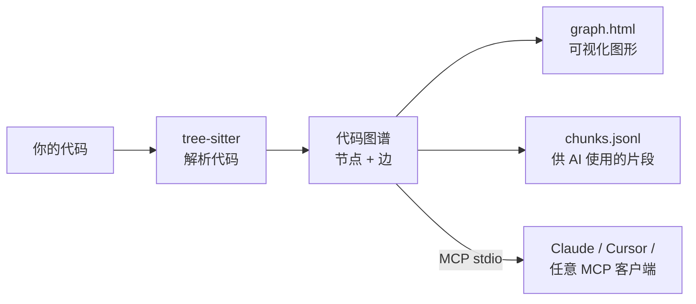

<div align="center">

# repo2graph

**让编程智能体对陌生代码库给出可信、可溯源的回答。**

向仓库提一个问题,拿回来的是真正回答它的那段源码——每一段都标着它出自哪个文件的哪几行。

<p align="center">
  <a href="../../README.md">English</a> ·
  <a href="README_zh-CN.md">简体中文</a> ·
  <a href="README_ja.md">日本語</a> ·
  <a href="README_fr.md">Français</a> ·
  <a href="README_es.md">Español</a> ·
  <a href="README_de.md">Deutsch</a>
</p>

<table align="center">
<tr>
<th align="center">📦&nbsp; 软件包</th>
<th align="center">🩺&nbsp; 健康状况</th>
<th align="center">🗂️&nbsp; 收录于</th>
</tr>
<tr>
<td align="center" valign="top">
<a href="https://pypi.org/project/repo2graph/"></a><br />
<a href="https://pypi.org/project/repo2graph/"></a><br />
<a href="../../LICENSE"></a>
</td>
<td align="center" valign="top">
<a href="https://github.com/Srinivasan-78/repo2graph/actions/workflows/ci.yml"></a><br />
<a href="https://github.com/Srinivasan-78/repo2graph/actions/workflows/dependency-audit.yml"></a><br />
<a href="https://github.com/Srinivasan-78/repo2graph/actions/workflows/provenance.yml"></a>
</td>
<td align="center" valign="top">
<a href="https://glama.ai/mcp/servers/Srinivasan-78/repo2graph"></a><br />
<a href="https://mcpservers.org/servers/srinivasan-78/repo2graph"></a><br />
<a href="https://registry.modelcontextprotocol.io/v0/servers?search=repo2graph"></a>
</td>
</tr>
</table>

<p align="center">
  <a href="https://github.com/Srinivasan-78/repo2graph/stargazers"></a>
</p>

<p align="center">
  
</p>

</div>

<!-- mcp-name: io.github.Srinivasan-78/repo2graph -->

> 本文档由英文原版 [README.md](../../README.md) 翻译而来。如有出入，以英文版为准。

---

## ⚡ repo2graph 是什么？

一个被丢进陌生代码库的智能体只有两条糟糕的路。用某个词去 grep,结果要么把整份整份的匹配文件灌进上下文,要么因为代码里的说法和你的说法不一样而一无所获。凭训练数据去猜,就会写出自信而错误的东西。更麻烦的是:你分不清刚才发生的是哪一种。

**repo2graph 用仓库自己的源码来回答关于这个仓库的问题。** 问一句「请求是在哪里通过认证的」,回来的是做这件事的那个函数,连同调用它的函数和它调用的函数——每一段都以 `[cite: 路径:起始行-结束行]` 开头,于是答案里的每一句主张,离它所依据的那一行都只有一次点击。如果答案是错的,引用会告诉你它在哪里错了。这正是它存在的意义。

它做到这一点,靠的是**读**代码而不是搜代码:一趟解析就记下谁调用谁、谁导入谁、哪个类继承哪个类,检索随后沿着这些关系走,而不是去匹配更多文本。结果可以直接送进 Claude Code、Cursor 或任何 **Model Context Protocol** 客户端,也可以打包成带硬性 token 上限的 Markdown 上下文,交给任意 LLM。



无需项目配置,无需语言服务器,无需构建步骤——指向一个文件夹即可工作。

<p align="center">
  
</p>

| 交互式画布(放大) | 筛选与检查器面板 |
| :---: | :---: |
|  |  |

`graph.html` 是单个自包含文件——无需服务器、无需联网,拖拽平移、滚轮缩放,点击节点即可查看其代码与邻居节点。

## 👥 它是为谁做的

| 你是 | 你的问题 | 第一步 |
|---|---|---|
| **🧭 刚接手一个陌生代码库的开发者** | 第一周都花在翻文件上,只为弄清哪些文件才重要。 | `uvx repo2graph build . -o .r2g`,打开 `.r2g/human/graph.html`,从枢纽文件而不是根目录开始读;然后用 `repo2graph rag "<你的问题>" -o .r2g` 整句地提问。 |
| **🤖 在用编程智能体的人** | 智能体 grep 一下,拉进三整份文件,最后还是改错了地方。 | `claude mcp add repo2graph -- uvx --from "repo2graph[mcp]" repo2graph-mcp .`。它拿到的是 12k token 硬上限内的带引用片段,而不是整份文件;敏感文件被无条件排除,没有任何开关能关掉这一点。 |
| **🔍 在评审 PR 的人** | 差异只有 40 行,影响范围却是未知数。 | `repo2graph build . -o .r2g --git-history 500`,再 `repo2graph explain node "sym:src/auth.py::verify" -o .r2g`:调用方、导入方、子类,外加 git 历史里总是一起改动的那些文件(`CO_CHANGE`)。 |
| **🌱 开源维护者** | 每个新贡献者都在问同一个「我该从哪儿看起」。 | 在 GitHub Action 里加上 `commit-branch: graph`,每次 push 都提交一份可浏览的新地图;任务摘要会列出枢纽文件、共同变更热点,以及相对上次构建的图谱增量。 |

## 🔎 为什么用 repo2graph,而不是 grep 或向量检索?

这两者都没有被排除在外——`repo2graph` 的每次查询都以 BM25 取种子,稠密向量是可选的融合项。区别在于:第一次命中*之后*发生了什么。

| | **grep / ripgrep** | **向量检索** | **repo2graph** |
|---|---|---|---|
| **找到的是** | 精确的字符串 | 读起来相似的文本 | 符号,以及与它相连的一切 |
| **提问用词与代码不同时** | 什么也返回不了 | 能处理 | 用 BM25 取种子,再靠图谱跳转够到查询从未提过的代码 |
| **「谁调用了它?」** | 答不了——注释里的匹配与定义同等排名 | 答不了——邻居关系不在向量里 | `CALLS` 边,带方向和 `confidence` |
| **「改了它会坏掉什么?」** | 只能逐条人工翻 | 没有被表示出来 | 一跳之内给出调用方、导入方、子类 |
| **返回什么** | 匹配行,或者整份文件(再由智能体灌进上下文) | 相似度前 k 个片段,调用方并未取回 | 回答问题的那段源码,每段都以 `[cite: 路径:起始-结束]` 开头 |
| **token 开销** | 无上限——读多少由智能体自己决定 | 无上限 | 对*整个* pack 设硬上限,返回前重新计量 |
| **「哪些文件总是一起改?」** | — | — | `CO_CHANGE`,从 git 历史中挖出 |
| **准备工作** | 无 | 建索引 + 一个约 90 MB 的向量模型 | 一趟解析,不要模型、不要 API key、不要语言服务器 |
| **排序是否可解释** | 不适用 | 一个余弦值 | `repo2graph explain retrieval "<问题>"` 会指名种子,以及把每一段拉进来的那条边 |

**该用 grep 的时候**:你要的是某个字面字符串的全部出现位置——一个配置键、一句错误信息、一条 TODO。repo2graph 对字符串字面量没有任何特殊认知,在这件事上不会比 grep 更好。
**该用 repo2graph 的时候**:问题是关于**关系**的——谁调用了它、改了它会坏掉什么、数据是怎么从 A 走到 B 的。详细版:**[docs/why-graph.md](../why-graph.md)**(英文)。

## 🚀 30 秒内快速开始

需要 Python 3.10 及以上版本。通过 [uv](https://docs.astral.sh/uv/) 运行,无需安装:

```bash
uvx repo2graph build . -o .r2g && open .r2g/human/graph.html
```

或正式安装:

```bash
pip install repo2graph
repo2graph build /path/to/project -o .r2g --git-history 200
repo2graph query "how does routing match a path" -o .r2g
```

## 🔌 MCP 客户端配置

`repo2graph-mcp` 是一个基于 stdio 的 **MCP 服务器**。如果索引尚不存在,首次调用时会自动构建——无需提前运行任何命令。

**Claude Code**

```bash
claude mcp add repo2graph -- uvx --from "repo2graph[mcp]" repo2graph-mcp /path/to/project
```

**Claude Desktop**(`claude_desktop_config.json`)与 **Cursor**(`.cursor/mcp.json`)——使用同一段配置:

```json
{
  "mcpServers": {
    "repo2graph": {
      "command": "uvx",
      "args": ["--from", "repo2graph[mcp]", "repo2graph-mcp", "/path/to/project"]
    }
  }
}
```

其他基于 stdio 的 MCP 客户端(Windsurf、Zed 及通用客户端)使用相同的 `command`/`args` 组合——各平台与客户端的配置文件路径详见 **[docs/mcp.md](../mcp.md)**(英文)。

## ✨ 核心特性

| | |
|---|---|
| **确定性图谱,而非纯向量检索** | 调用者、被调用者、导入关系与类继承关系均从真实 AST 解析得出——而非最近邻猜测。 |
| **混合检索** | 默认使用 BM25 + 图邻居扩展;可选的稠密向量融合(`repo2graph embed`)无需任何必装的额外依赖。 |
| **双重强制的 token 上限** | `pack_context()` 的预算约束的是*整份*渲染后的 Markdown,而不仅是片段文本;MCP 服务器还会二次裁剪并重新计量后再返回。 |
| **17 种文法,完整支持** | Python、JS、TS、TSX、Go、Rust、Java、Ruby、C、C++、C#、PHP、Kotlin、Swift、Scala、Bash、Lua 均支持函数/类/调用解析,共覆盖 29 种文件扩展名。其余语言的文件仍会出现在地图上。 |
| **原生支持 CI** | 已发布为 GitHub Action——每次 push 都能在代码旁提交最新图谱。 |
| **默认本地运行** | `build`、`query`、`rag` 与 MCP 服务器均不发起任何网络请求。唯一的可选例外(`rag --answer`)会在发送前打印所用的服务商与主机名。 |
| **导出至主流图谱工具** | 每次构建都会生成 `graph.graphml`(yEd、Gephi、NetworkX)与 `graph.cypher`(Neo4j、Memgraph),无需额外步骤。 |

## ⚖️ 它能做什么,不能做什么

一个把自己吹过头的检索工具,比没有检索工具更糟——因为你会停止核对它的答案。所以,直说:

**它能做到**

- 把**回答问题的那段源码**返回给你,带 `路径:起始-结束` 的引用,并且处在一个被**强制执行**而非仅仅建议的 token 预算之内。
- 从真实的解析结果中解出**调用方、被调用方、导入关系和类层次**,并允许你从任意符号双向游走。
- 从 git 历史中挖出 **`CO_CHANGE`**——哪些文件总是被一起改动,这是任何解析器都算不出来的。
- **完全在本地运行**:CLI、CI、MCP 三条路径都不需要模型、不需要账号、不发任何网络请求。
- **优雅降级**:未被深度解析的语言仍以文件节点出现,仍可作为文本被检索到;向量索引缺失时回退到 BM25,而不是报错。

**它做不到**

| 局限 | 实际意味着什么 |
|---|---|
| **按类型解析调用** | 调用是按**名字**匹配的,再用同类、同文件、导入等作用域来消歧。作用域仍无法锁定唯一目标时,该调用会扇出为至多 5 条候选边,各自 `confidence = 1/n`,并标记 `ambiguous`。若宁可牺牲召回也要确定性,请筛选 `confidence == 1.0`——在五个基准仓库中,`CALLS` 边有 4.6%–21.3% 是有歧义的。 |
| **看见动态分发** | 字符串键查表、插件注册表、`getattr` 式分发、运行时才确定的虚调用——这些都没有写成语法,因此不会画出边。**没有箭头,并不证明没有调用。** |
| **看见反射与计算出的导入** | `importlib.import_module(name)`、Java 反射、带计算标识符的动态 `import()`。没有可解析的字面量,也就没有可连的东西。 |
| **顺着依赖注入找到实现类** | DI 容器在运行时把接口绑定到具体类。调用点只写了接口方法名,因此边落在声明处,或者扇出到所有同名实现,永远落不到容器真正注入的那个类上。要枚举候选,请沿 `INHERITS` 游走。 |
| **区分生成代码** | `.pb.go`、打包后的 `.js`、代码生成的客户端——全部与手写代码同等索引,没有任何标记。它们可能占据大量符号数,却没有一行是有人在维护的。请用 `--exclude` 排除。 |
| **察觉你的文件已经变了** | 索引是构建那一刻的快照,没有任何东西在监视文件系统。你改了文件,图谱仍在描述旧的版本。请重新构建(`build --incremental` 只重解析变动过的文件),或交给 GitHub Action 在每次 push 时重建。`repo2graph doctor` 检查的是索引*完整性*与向量漂移,而不是你的工作区是否已经往前走了。 |
| **跨越语言边界** | Python 经由生成的绑定调用 C++,得到的是一条 `CALLS_EXTERNAL` 边,而不是指向那个 C++ 函数的链接。这是纯源码静态分析的结构性边界,不是匹配上的 bug。 |
| **干净地解析宏密集的 C/C++** | tree-sitter 会在未展开的宏周围产生 `ERROR` 节点,`cpp` 预处理器回退能挽回一部分。请预期 `stats.json` 里的 `parse_errors` 不会为零,并把它读作漏掉符号数的**下界**。 |

以上每一条都是实测,不是断言。测量值、所用仓库与复现命令见 **[docs/limitations.md](../limitations.md)**(英文)。

## 🆚 与其他图谱工具的对比

从代码库构建图谱的工具不止一个。真正的区别在于:当你提出问题时,*返回*的是什么——一张图、一个子图,还是代码本身。

| | repo2graph | [Graphify](https://github.com/Graphify-Labs/graphify) | [Code Graph](https://community.obsidian.md/plugins/code-graph)(Obsidian) | grep / 向量 RAG |
|---|---|---|---|---|
| **查询返回什么** | 打包好的源码——每段都以 `[cite: 路径:起始-结束]` 作为标题 | 一个限定范围的子图、一条路径,或供继续追溯的概念说明 | 一张力导向布局的图,供人阅读 | 匹配到的行,或最近邻片段 |
| **如何排序** | BM25 种子,再做 k 跳图扩展;可选稠密向量融合 | 图遍历(明确表示不是向量索引) | 不适用——它只是一个视图 | 仅词法,或仅向量 |
| **Token 预算** | 对*整份*打包内容的硬上限,返回前重新计量(经 MCP 时上限 12k) | 并非打包层 | 不适用 | 通常无上限 |
| **来自 git 历史的边** | `CO_CHANGE`,由 `--git-history` 生成 | — | — | — |
| **无需助手、模型与账号即可运行** | 是——CLI、MCP 或 GitHub Action | 代码分析在本地;文档/媒体分析需要模型 | 需要 Obsidian 桌面版 1.7.2+ | 视情况而定 |
| **语料范围** | 17 种已解析文法的代码,其余所有文件按文本处理 | 约 40 种语言的代码,外加文档、PDF、图片、视频 | 解析 TS/TSX/JS/Python,另外 8 种仅解析导入 | 任何内容 |

当图谱本身就是目的时,请选择 **[Graphify](https://github.com/Graphify-Labs/graphify)**:社区发现、两个概念之间的最短路径,以及把 PDF 和设计文档与代码放进同一张图。
当需要有人在笔记旁*阅读*这张图时,请选择 **[Obsidian 插件](https://community.obsidian.md/plugins/code-graph)**。
当智能体需要在固定 token 预算内获得带引用的源码、需要在没有模型和账号的 CI 中运行,或者「哪些文件总是一起改动」本身就是答案的一部分时,请选择 **repo2graph**。

包含各选项取舍的详细版本:**[docs/comparison.md](../comparison.md)**(英文)。

## 🛠️ 暴露的 MCP 工具

共五个工具:三个回答关于代码的问题,两个报告服务器自身的状态。

| 工具 | 参数 | 返回内容 |
|---|---|---|
| `repo_map` | 无 | 语言构成、核心文件与主要入口点。多次调用结果稳定,建议首先调用。 |
| `repo_search` | `query`,可选 `k`(默认 8,最大 50)、`hops`(默认 1,最大 4)、`budget_tokens`(默认 6000,最大 12000) | 检索到的种子片段及其图邻居,每段均带有 `[cite: 路径:起始-结束]` 头部。 |
| `repo_neighbours` | `node_id`,可选 `hops`(默认 1,最大 4)、`limit`(默认 20,最大 50) | 从某个符号/文件/目录节点出发的一跳邻居:调用者、被调用者、基类、所在文件。 |
| `repo_cache_stats` | 无 | 结果缓存的计数器:`hits`、`misses`、`size`、`max_size`、`ttl_s`、`evictions`、`hit_rate`。该工具自身永不被缓存。 |
| `repo_build_status` | `task_id` | `--async-build` 后台构建的进度:`building`、`ready`、`failed` 或 `unknown`,并附带 `progress_pct` 与 `eta_s`。 |

三个处理代码的工具会无条件排除疑似密钥的文件——没有任何开关可以关闭该行为;所有数值参数都在处理函数内被钳制,调用方无法通过请求放宽上限。完整协议、参数上限与客户端配置:**[docs/mcp.md](../mcp.md)**(英文)。以 HTTP 方式共享部署,并启用 Bearer 或 OIDC 认证与审计日志:**[docs/ENTERPRISE_DEPLOYMENT.md](../ENTERPRISE_DEPLOYMENT.md)**(英文)。

## 📐 架构与 Token 经济学

检索层是一条 **GraphRAG** 流水线:[tree-sitter](https://tree-sitter.github.io/tree-sitter/) 把源码解析成带类型的图谱,BM25 挑出种子片段,之后决定预算花在哪里的是**图谱**,而不是进一步的文本相似度。稠密向量(`repo2graph embed`)可以融合进种子排序,但下游没有任何环节依赖它。

- **节点类型**:`repo`(仓库)、`dir`(目录)、`file`(文件)、`symbol`(函数/方法/类/结构体/trait/接口/类型)、`module`(外部依赖)、`external`(未能解析的调用目标)。
- **边类型**:`CONTAINS`(包含)、`DEFINES`(定义)、`IMPORTS`(导入)、`CALLS`(调用,携带 `count` 与 `confidence`)、`CALLS_EXTERNAL`(外部调用)、`INHERITS`(继承)、`CO_CHANGE`(共同变更,来自 `--git-history`,需至少共同修改 3 次)。
- **调用解析基于名称而非类型**——这是刻意的取舍,使 repo2graph 保持语言无关、免配置。存在歧义的调用最多会展开为 5 条候选边,每条 `confidence = 1/n`;如需确定性而非召回率,请仅保留 `confidence == 1.0` 的边。
- **两套预算模型,刻意为之**:`Index.retrieve()` 的 `budget_chars` 只约束片段自身文本(向后兼容接口);`Index.pack_context()` 的 `budget_chars` 约束*整份*渲染后的 Markdown——引用头、分隔符,一切都算在内。新的检索代码应构建在 `pack_context()` 之上。
- **切片方式**:大致每个函数/类一个片段,约 4000 字符处切分,保留 8 行重叠以避免在接缝处丢失信息;每个片段的头部都列出了其调用者与被调用者,这正是图扩展检索优于纯 top-k 文本搜索的原因。

每种节点/边类型与片段格式的完整说明:**[docs/reference.md](../reference.md)**(英文)。完整流水线、Python API 与图谱的猜测边界(及其原因):**[TECHNICAL.md](../../TECHNICAL.md)**(英文)。

## 📊 在真实仓库上的表现

不是玩具级演示——五个真实、大型、公开的仓库,每个都在固定的提交点上被索引,生成的图谱已提交,复现命令也已记录。所有数字均来自 [`benchmarks/results.json`](../../benchmarks/results.json) 的实测结果,而非估算。

| 仓库 | 语言 | 范围 | 节点数 | 边数 |
|---|---|---|---:|---:|
| [Kubernetes](https://github.com/kubernetes/kubernetes) | Go | 限定范围(controllers、scheduler、API server) | 14,451 | 110,246 |
| [TensorFlow](https://github.com/tensorflow/tensorflow) | C++ / Python | 限定范围(Python/C++ 边界) | 21,380 | 115,984 |
| [Django](https://github.com/django/django) | Python | 完整仓库 | 55,810 | 303,339 |
| [VS Code](https://github.com/microsoft/vscode) | TypeScript | 限定范围(`src/vs/`) | 113,080 | 656,158 |
| [Linux kernel](https://github.com/torvalds/linux) | C | 限定范围(极大规模) | 136,219 | 256,413 |

完整列表与复现命令见 **[examples/README.md](../../examples/README.md)**,测试方法见 **[docs/benchmarks.md](../benchmarks.md)**,针对五个真实仓库运行后暴露出的实际问题(宏密集型 C/C++ 的解析错误率、调用名歧义、跨语言解析限制)见 **[docs/limitations.md](../limitations.md)**(均为英文)。

## 📖 CLI 与服务器参考

| 命令 | 作用 |
|---|---|
| `repo2graph build <path> -o .r2g [--git-history N]` | 解析本地仓库,生成图谱与片段。 |
| `repo2graph github <owner/repo> -o <dir>` | 拉取、构建并自动清理——无需本地克隆。 |
| `repo2graph query "<question>" -o .r2g` | 关键字检索 + 一跳图扩展。 |
| `repo2graph rag "<question>" -o .r2g [--vectors] [--answer]` | 带预算上限的 GraphRAG 打包;`--answer` 会将内容发送给 LLM(可选,涉及联网)。 |
| `repo2graph embed -o .r2g [--verify-rag]` | 计算/校验用于混合检索的稠密向量。 |
| `repo2graph map -o .r2g [--viz-nodes N]` | 以不同节点上限重新生成 `graph.html`。 |
| `repo2graph stats -o .r2g [--format text]` | 输出现有索引的节点/边/函数统计;`--format text` 给出便于阅读的质量摘要。 |
| `repo2graph doctor [path]` | 诊断运行环境、依赖、权限与索引完整性。 |
| `repo2graph explain-path <path> [-r <repo>]` | 说明某个路径是否会被索引,以及是哪条优先级规则决定的。 |
| `repo2graph-mcp <path> [--no-auto-build] [--async-build]` | 基于 `.r2g` 的 stdio MCP 服务器。 |

**环境变量**(仅被 `rag --answer` 读取,按以下优先级):`GEMINI_API_KEY` → `OPENAI_API_KEY` → `ANTHROPIC_API_KEY` → `OLLAMA_HOST`。其余命令均不读取这些变量,也不会发起网络请求。完整参数表与预算核算方式:**[docs/cli.md](../cli.md)**(英文)。

## 🔐 安全性

`build`、`query`、`rag` 与 MCP 服务器均不会发起任何网络请求。`rag --answer` 是唯一的可选例外——它会把打包好的内容发送给 LLM 服务商,并在发送前打印所用的服务商与主机名。MCP 服务器会无条件排除疑似密钥的文件,没有任何开关可以关闭该行为。详情见 **[SECURITY.md](../../.github/SECURITY.md)**(英文)。

## 🤝 贡献与社区

```bash
git clone https://github.com/Srinivasan-78/repo2graph
cd repo2graph
python3 -m venv .venv && .venv/bin/pip install -e ".[dev]"
make lint test   # 或者: ruff check . && pytest
```

- **[.github/CONTRIBUTING.md](../../.github/CONTRIBUTING.md)**(英文)——完整的本地开发环境搭建、代码风格与注册表/Glama 发布流程。
- **[docs/BACKLOG.md](../BACKLOG.md)**(英文)——被刻意推迟的工作及原因;最接近路线图的文档,其中也包含"适合新手的第一个 issue"部分。
- **[AGENTS.md](../../AGENTS.md)**(英文)——在修改 `repo2graph/` 之前,请先了解本代码库中不易察觉的约定(Windows 编码、文本切片、两套预算模型)。
- **[CODE_OF_CONDUCT.md](../../CODE_OF_CONDUCT.md)**(英文)——采用 Contributor Covenant v2.1 行为准则。
- 发现 bug 或有功能建议?[提交 issue](https://github.com/Srinivasan-78/repo2graph/issues/new/choose)。

## 许可证

MIT 许可证。详见 **[LICENSE](../../LICENSE)**。

---

<div align="center">

觉得 repo2graph 有用?[为仓库点个 star](https://github.com/Srinivasan-78/repo2graph)——这是帮助更多人发现它的最简单方式。

</div>
