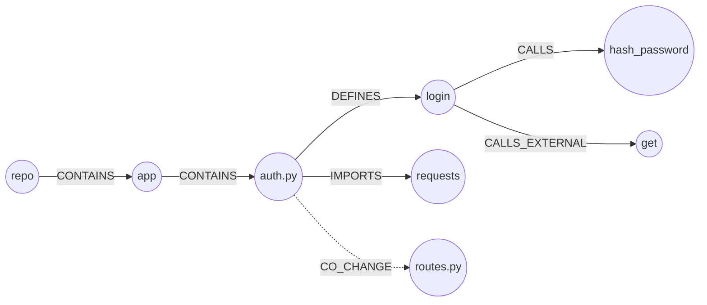

# Reference: what is in the index, and what it means

Every file a build writes, every node and edge kind it can contain, the chunk
schema, the languages it parses, and the places it is guessing rather than
knowing. This is the page to read when you are consuming `.r2g` from your own
code and need to know exactly what a field means. For how to *produce* it, see
[the CLI reference](cli.md); for how the pipeline works, see
[TECHNICAL.md](../TECHNICAL.md).

## The `.r2g` folder

The output is split in two, because people and programs want different things.

### `human/` — for you

| File | What it is |
|---|---|
| `overview.md` | the map written out in words. Read this first. |
| `graph.html` | the picture. One self-contained file; open it in a browser. |
| `graph.graphml` | the map in a format drawing programs understand (yEd, Gephi). It opens already laid out, so it does not look like a hairball. Also reads in NetworkX and igraph. |
| `CHANGELOG.md` | what changed against the previous build in this same `--out`, headed by the two commit SHAs and the build date: new and removed nodes, new and removed edges, and "new hotspots" — nodes that gained 3 or more in-degree since the last build. On a first build it says so instead. The GitHub Action condenses it into its job summary's "Graph delta" section. |

### `agent/` — for programs and AI helpers

| File | What it is |
|---|---|
| `overview.md` | the same words as above, so an AI can read the whole project summary cheaply |
| `manifest.json` | the instruction sheet: what every other file is, what the dots and arrows mean, how names are built, and where the code starts. A program needs nothing else to make sense of this folder. |
| `chunks.jsonl` | the small pieces of code, each with its "who calls me" header |
| `nodes.jsonl` | one line of data per dot |
| `edges.jsonl` | one line of data per arrow |
| `graph.cypher` | a script that loads the map into Neo4j or Memgraph. Running it twice is safe. |
| `stats.json` | the counts: dots, arrows, functions, reading errors, starting points |
| `index.state.json` | the sha256 of every file as it was read, so a later build can tell what actually changed |
| `index.json` | which project and commit was read. Only written by `repo2graph github`. |
| `vectors.npy` + `vectors.meta.json` | the chunk vectors and the model that made them. Only written by `repo2graph embed`. |

`graph.graphml` lives under `human/` because the layout it carries is there for a
person looking at a picture.

## What the dots and arrows mean

**Dots (nodes):**

| Kind | Colour on the picture | Meaning |
|---|---|---|
| `repo` | 🔴 red | the project itself |
| `dir` | 🟤 tan | a folder |
| `file` | 🟠 orange | a file |
| `symbol` | 🔵 blue | a function, method, class, struct, trait, interface, type or module |
| `module` | 🟢 green | something the project borrows that is not one of its own files |
| `external` | 🩷 pink | a name the project calls that could not be found anywhere in the project |

A dot is drawn bigger when more arrows touch it, so the busiest parts of the
project stand out without you looking for them.

**Arrows (edges):**

| Kind | Meaning |
|---|---|
| `CONTAINS` | project holds folder, folder holds file |
| `DEFINES` | a file creates a function or class, or one function creates another inside it |
| `IMPORTS` | a file borrows from another file (`internal: true`) or from an outside library |
| `CALLS` | one function uses another. Carries `count`, `confidence`, `ambiguous`, `resolution_kind`, `candidate_count`, `scope_distance` and `call_kind`. |
| `CALLS_EXTERNAL` | a function uses something from outside the project. Carries `count`, `resolution_kind`, `candidate_count` and `call_kind`. |
| `INHERITS` | inheritance or interface implementation. Carries `subtype` (`INHERITS`, `IMPLEMENTS`, `EXTENDS`, `MIXES_IN`) and `raw_base`. |
| `CO_CHANGE` | two files keep getting edited together (needs `--git-history`, 3 times or more) |

A small corner of a real map looks like this:



Names on the map are built the same way every time, so you can write one yourself:
`file:pkg/mod.py`, `sym:pkg/mod.py::Class.method`, `module:requests`, `dir:pkg`.

## What one piece of code looks like

One piece per function or class, cut at about 4000 characters with 8 lines of
overlap so nothing gets lost at the seam. Files also get a piece for whatever code
no function claimed, and documents and settings files get one piece each.

Every piece starts with a few lines describing its neighbourhood:

```
# file: repo2graph/graph.py
# function: resolve_import  (lines 66-99, python)
# called by: repo2graph/graph.py::build
# calls: repo2graph/graph.py::path_index
# calls (outside the repo): Path, replace, str, list, startswith, sub, append
# doc: Map an import target to an in-repo file path when possible.
def resolve_import(...):
    ...
```

Each piece carries these fields: `id`, `node_id`, `type`, `kind`, `path`, `lang`,
`name`, `qualname`, `start_line`, `end_line`, `entrypoint`, `callers`, `callees`,
`callees_external`, `text`.

`callees` lists functions inside the project, written as `path::qualname`.
`callees_external` lists plain names from outside it. If a call could not be
pinned to one place, the header says so, like `helper (confidence 0.5)`, so nobody
treats a guess as a fact.

## Where the code starts

Some functions are called by other functions. Some are called by nobody, because
they are the door into the project: the commands you type, the handlers that
answer web requests, the tests.

repo2graph marks those with `entrypoint: true`. To follow how the program actually
runs, start at one of those and follow the `CALLS` arrows forward.

For the 200 busiest ones it also counts `reach`: how many other functions that
door can eventually get to. A big `reach` means a main path through the project.
`agent/manifest.json` lists the top 25.

## Languages

Seventeen grammars get the full treatment — functions, classes and calls — across
29 file extensions:

| Grammar | Extensions |
|---|---|
| `python` | `.py` `.pyi` |
| `javascript` | `.js` `.jsx` `.mjs` `.cjs` |
| `typescript` | `.ts` `.mts` `.cts` |
| `tsx` | `.tsx` |
| `go` | `.go` |
| `rust` | `.rs` |
| `java` | `.java` |
| `ruby` | `.rb` |
| `c` | `.c` `.h` |
| `cpp` | `.cc` `.cpp` `.cxx` `.hh` `.hpp` |
| `csharp` | `.cs` |
| `php` | `.php` |
| `kotlin` | `.kt` |
| `swift` | `.swift` |
| `scala` | `.scala` |
| `bash` | `.sh` `.bash` |
| `lua` | `.lua` |

`.h` maps to `c`; a C++ header that uses `.h` rather than `.hpp` is parsed with
the C grammar, which is the usual reason a C++ project shows parse errors in
headers it considers perfectly valid.

Two more extension groups are recognised but not parsed for symbols — they become
file nodes carrying one chunk each: configuration (`.json` `.toml` `.yaml` `.yml`
`.ini` `.cfg`) and prose (`.md` `.mdx` `.rst` `.txt` `.adoc`).

Files in any other language still appear on the map as files in their folders, so
nothing goes missing. Teaching it a new language means adding one entry to
`LANG_CFG` in `repo2graph/parse.py`.

## Where it guesses

The map is very good, but it is not perfect. Worth knowing before you trust it:

- **Scoped call resolution, most specific tier first.** Instead of blind global
  name matching, repo2graph resolves a call target through these tiers in
  order, stopping at the first one that finds a candidate:

  | Tier | `resolution_kind` | `scope_distance` | Meaning |
  |---|---|---|---|
  | 0 | `self_recursive` | 0 | a top-level function calling its own name — unambiguously recursion |
  | 1 | `same_class` | 0 | another method of the enclosing class. Never the caller itself: see below. |
  | 2 | `same_file` | 1 | another function or class defined in the calling file |
  | 3 | `import_alias` | 2 | reached through an aliased import (`import X as Y`) |
  | 3 | `imported_symbol` | 2 | reached through the calling file's own imports, unaliased |
  | 4 | `same_module` | 3 | a definition in the same directory |
  | 5 | `unique_global_name` | 4 | exactly one candidate anywhere in the repo |
  | 6 | `ambiguous_global_name` | 5 | more than one candidate; confidence is split `1/n` across up to `--max-call-candidates` of them (default 5) |
  | 7 | `unresolved_external` | *(not set)* | no in-repo candidate at all; recorded on a `CALLS_EXTERNAL` edge, not `CALLS` |

  Every `CALLS` edge records `resolution_kind`, `scope_distance`, `candidate_count`,
  `ambiguous` (true once tier 6 splits confidence across candidates) and
  `call_kind` (`static`, `dynamic`, `decorator`, or `possible`).
  `CALLS_EXTERNAL` carries `resolution_kind` (always `unresolved_external`),
  `candidate_count` (always `0`), `count` and `call_kind` — but no
  `scope_distance`, `confidence` or `ambiguous`.

  **A method's own name is never resolved outright.** The receiver is not
  recorded, so inside `Report.to_dict` the calls `self.to_dict()` and
  `c.to_dict()` both arrive here as the bare name `to_dict` — recursion and a
  call to a sibling class's identically named method are the same input. Tier 1
  therefore declines a self-target and lets tier 2 answer, with the caller left
  in the candidate set: alone, that is one self-edge at confidence 1.0; next to
  a same-named sibling, both readings are emitted at `1/n`. Only tier 0, where
  a top-level function's bare call to its own name has no other reading, claims
  recursion outright.
- **Base class and interface resolution.** Class bases are mapped to in-repo
  definitions with relationship typing (`IMPLEMENTS`, `EXTENDS`, `INHERITS`,
  `MIXES_IN`). A same-named base defined in the same file, or in a file the
  calling file imports, always links. Only the last-resort, repo-wide fallback —
  used when neither of those finds anything — is guarded: a fixed set of base
  names common across languages (`object`, `Object`, `Exception`,
  `BaseException`, `Error`, `StandardError`, `Throwable`, `Record`, `Any`,
  `Interface`, `Model`, `Component`, `Base`) never falls back to an unrelated
  same-named class elsewhere in the repo.
- **It works out imports by path, one language at a time.** Python packages and
  relative imports, JavaScript and TypeScript relative paths (including `.js`
  standing in for `.ts`), Go through `go.mod`, Java package folders, C and C++
  include names. Anything it cannot place becomes an outside `module` dot.
- **Some files are skipped:** pictures and other non-text files, anything bigger
  than 1.5 MB, and the usual vendor and build folders. If the project is a git
  checkout, `.gitignore` is respected. Use `repo2graph explain-path <path>` to see
  exactly which rule included or excluded any one file — see the `explain-path`
  section in [`docs/cli.md`](cli.md).
- **No arrow does not prove no call.** Code that decides while running which
  function to call is invisible to a reader like this one.
